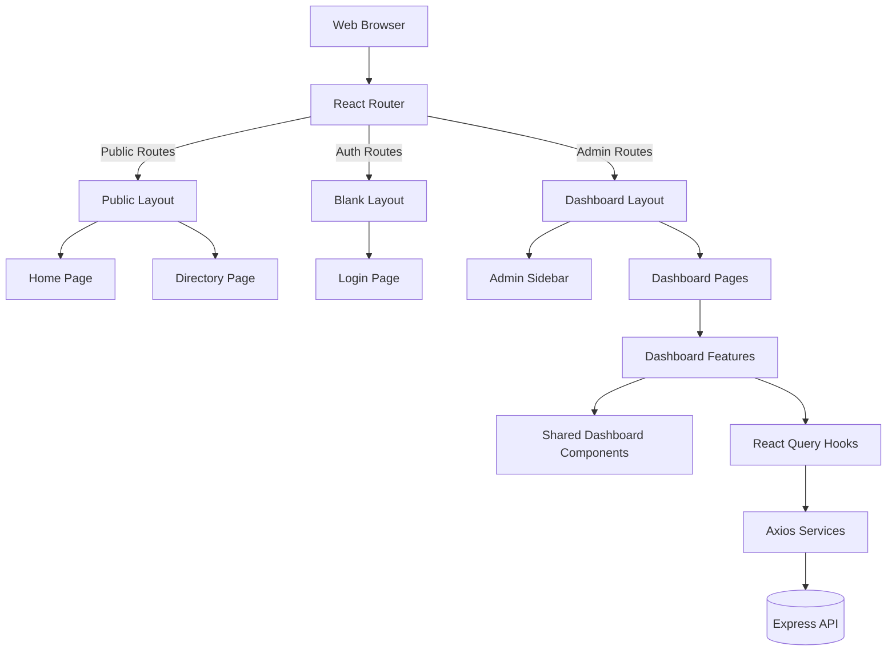

# Website Potensi Desa Karamatwangi

## 1. Project Overview

The project is structured as a modern web application separated into two primary functional areas:
- **Public Website**: A fast, visually rich, read-only interface for visitors to explore village potentials, categories, and statistics.
- **Dashboard CMS**: A protected administrative interface for content managers to perform CRUD operations on potentials, categories, and media.

**Technology Stack:**
- **Frontend**: React 19, Vite 8, Tailwind CSS v4, React Router v7, TanStack Query, Framer Motion, Lucide React.
- **Backend**: Express.js (Node.js) providing RESTful APIs via JWT authentication, Prisma ORM, PostgreSQL.

**Project Philosophy:**
The architecture enforces strict separation of concerns. Public components are completely decoupled from dashboard components to ensure the administrative panel does not bloat the public bundle, while maximizing reuse of low-level atoms and design tokens.

---

## 2. Repository Structure

```text
POTENSIDESA/
├── backend/            # Laravel backend application (APIs, Models, Controllers)
├── docs/               # Technical and engineering documentation
└── frontend/           # React SPA frontend (Vite)
    ├── public/         # Static public assets (images, icons)
    └── src/            # Frontend source code
```

---

## 3. Frontend Structure

The `frontend/src/` folder is strictly organized by responsibility:

- **`assets/`**: Static assets imported by bundler (images, vectors).
- **`components/`**: Public-facing UI components following atomic design (Atoms, Molecules, Organisms).
- **`constants/`**: Environment configurations and application-wide constants.
- **`dashboard/`**: The entire CMS module (isolated from the public site to prevent cross-contamination).
- **`hooks/`**: Global custom React hooks (e.g., `usePotentials`, `useStatistics`).
- **`layouts/`**: High-level page wrappers (e.g., `PublicLayout`, `BlankLayout`).
- **`lib/`**: Core utilities and style helpers (e.g., `glassStyles.js`, `utils.js`).
- **`pages/`**: Public-facing route components (e.g., `Home.jsx`, `MapExplorer.jsx`).
- **`providers/`**: Context providers wrapping the React tree (e.g., `QueryProvider`).
- **`routes/`**: Application routing configuration (`router.jsx`, `routeModules.jsx`).
- **`services/`**: API interaction layer handling data fetching and mutation.

---

## 4. Dashboard Module

The `src/dashboard/` folder encapsulates the entire CMS to ensure modularity.

- **`components/`**: Dashboard-specific UI primitives (tables, forms, buttons).
- **`features/`**: Domain-specific logic, queries, and complex widgets (e.g., `categories/CategoryManagement`).
- **`layouts/`**: Admin layout shells (e.g., `DashboardLayout` with sidebar and header).
- **`pages/`**: Dashboard route entry points.
- **`theme/`**: CMS-specific design tokens and style objects (`dashboardTheme.ts`, `dashboardStyles.ts`).

Relationship: `pages` compose `features` and `components`, wrapped within `layouts`, styled by `theme`.

---

## 5. Component Architecture

The frontend adopts a modified Atomic Design methodology:

- **Atoms**: Irreducible UI elements (Buttons, Inputs, Badges, Spinners).
- **Molecules**: Simple compositions of atoms (Search Bars, Field Labels, Empty States).
- **Organisms**: Complex, distinct sections of an interface (Data Tables, Hero Sections, Stat Grids).
- **Layouts**: Structural blueprints dictating page composition (Navigation + Content + Footer).
- **Pages**: Routable container components that inject state/data into Organisms and Layouts.

**Reuse Strategy:** Primitive components are rigorously reused. Public pages share `src/components/`, while the CMS exclusively uses `src/dashboard/components/` to prevent styling conflicts.

---

## 6. Routing Structure

Routing is managed via `react-router-dom` in `src/routes/router.tsx`.

- **Public Routes**: Routed through `<PublicLayout />` (`/`, `/potentials`, `/categories`).
- **Dashboard Routes**: Routed through `<DashboardLayout />` (`/dashboard/*`).
- **Standalone Routes**: Routed through `<BlankLayout />` (`/login`, `*` Not Found).
- **Lazy Loading**: All route-level components are lazily loaded via `React.lazy()` in `src/routes/routeModules.tsx` for optimal code splitting.

---

## 7. Services

The data access layer resides in `src/services/`.

- **API Layer**: `api.ts` provides an Axios singleton instance configured with interceptors, base URLs, and authentication headers.
- **Service Layer**: Domain-specific modules (`potential.service.ts`, `category.service.ts`) expose typed async functions wrapping API endpoints.
- **Data Flow**: Services are strictly invoked inside React Query hooks (found in `src/hooks/` and `src/dashboard/features/`) which provide caching, invalidation, and state management to the UI.

---

---

## 9. Dashboard Features

Current implementation status of Dashboard modules:

- **Overview**
  Status: Placeholder (UI built, relies on static `mockData.ts`)
- **Categories**
  Status: Implemented (Integrated with React Query and live API endpoints)
- **Potentials**
  Status: Partial (Complex UI Data Table built, but currently relies on static mocks)
- **Media**
  Status: Placeholder (UI built, relies on mock assets)
- **Statistics**
  Status: Placeholder
- **Settings**
  Status: Placeholder
- **Activity**
  Status: Placeholder

---

## 10. Shared Components

Dashboard primitives are highly reusable and grouped in `src/dashboard/components/`:

- **Navigation**: `Breadcrumb`, `Sidebar`, `SidebarNav`.
- **Tables**: `DashboardDataTable`, `TableFilters`, `TablePagination`, `TableSearch`, `TableToolbar`.
- **Forms**: `DashboardInput`, `PublishStatusToggle`.
- **Feedback**: `ToastWrapper`, `EmptyState`, `ErrorState`, `LoadingState`.
- **Buttons**: `DashboardButton`, `RowActionMenu`, `BulkActionBar`.
- **States**: `SkeletonTable`, `SkeletonCard`.
- **Cards**: `DashboardCard`, `DashboardKpiCard`, `QuickActionCard`.

---

## 11. Design System

The project uses Tailwind CSS supplemented by a custom Theme system.

- **Theme**: Unified variables in `src/dashboard/theme/dashboardTheme.ts`.
- **Colors**: Primary brand revolves around Teal (`#0f766e`), Slate for text, and subtle off-whites for surfaces.
- **Spacing**: Strict 4-point grid system (e.g., `p-4`, `gap-6`).
- **Radius**: Soft, modern corners. Dashboards use `rounded-xl` and `rounded-2xl`.
- **Shadows**: Very subtle elevation (`shadow-sm`, `shadow-md`) avoiding harsh borders.
- **Glassmorphism**: Public interfaces heavily utilize frosted glass effects via `src/lib/glassStyles.ts`.
- **Focus States**: Accessible, consistent focus rings utilizing `@apply focus-visible:ring-2`.

---

## 12. Current Architecture Diagram



---

## 13. Development Rules

- **Strict Separation**: Public components must never import dashboard components, and vice versa.
- **Feature-First Architecture**: Group complex state, hooks, and UI under `features/<feature-name>` rather than spreading them across the root directories.
- **No Inline Fetches**: All network requests must pass through Axios service layers and React Query hooks. No `fetch()` inside components.
- **Types Extraction**: Define entity schemas at the service layer.
- **Component Reusability**: Favor extending shared tables and forms (e.g. `DashboardDataTable`) over building custom ones per page.

---

## 14. Known Technical Debt

- **Current**: 
  - Multiple dashboard pages (`PotentialsPage`, `OverviewPage`, `MediaPage`) rely on static files (`mockData.ts`) rather than real backend services.
  - Public map endpoints might require pagination or clustering optimizations for large data sets.
- **Future Improvements**: 
  - Migration of `mockPotentials` to live `usePotentials()` queries.
  - Complete implementation of the authentication context (currently bypassable UI).

---

## 15. Project Statistics

*Approximate metrics derived from current repository scanning:*

- **Pages**: ~9 public pages, ~7 dashboard pages.
- **Components**: ~26 public components, ~62 dashboard components.
- **Services**: 4 core API services.
- **Hooks**: ~4 global hooks, multiple feature-bound hooks.
- **Types**: 5 domain-level model definitions.
- **Features**: 1 fully structured feature module (`categories`).

---

## 16. Maintenance Notes

- **Adding a Dashboard Feature**: 
  1. Define types in `src/dashboard/features/<feature>/types.ts`.
  2. Add service endpoints and queries in `src/dashboard/features/<feature>/api/`.
  3. Create the management view in the feature directory.
  4. Export it to a simple wrapper in `src/dashboard/pages/`.
  5. Add the route lazily in `src/routes/routeModules.tsx`.
- **Updating the Theme**: Dashboard colors are hard-bound in `dashboardTheme.ts`. Public styles heavily utilize Tailwind utility classes and local CSS custom properties in `index.css`.
- **Backend Sync**: When updating Prisma schema, ensure API response formats align with frontend expectations.
