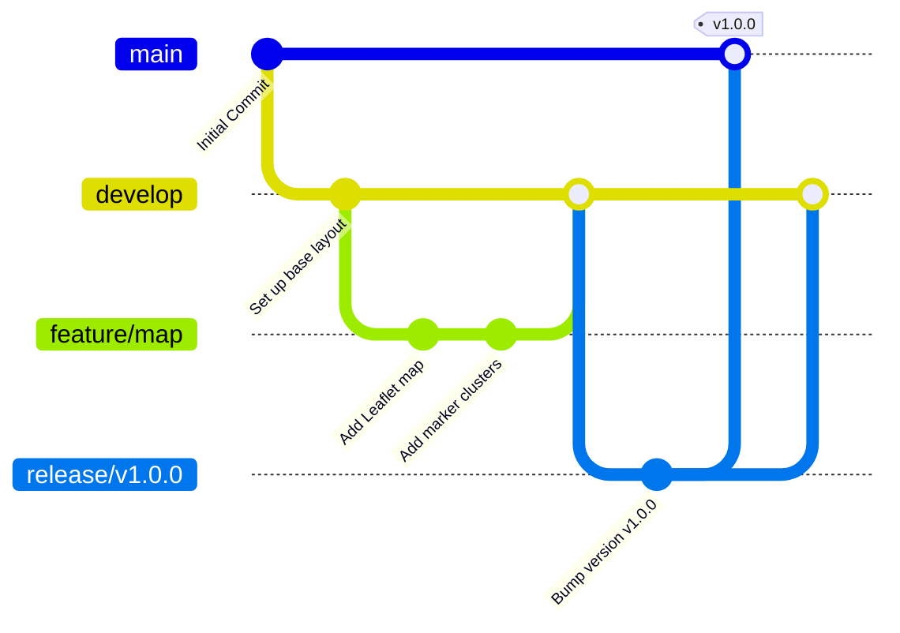
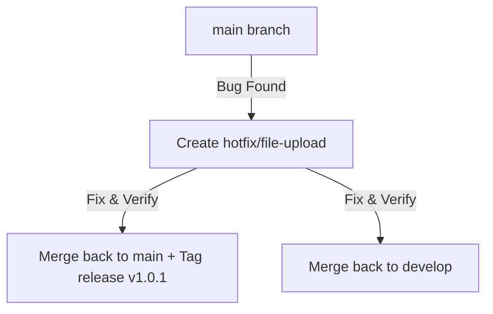

# Git Workflow Specification

## Project: Website Potensi Desa Karamatwangi
### Status: Approved
### Version: 1.0.0
### Date: 2026-07-10

---

## 1. Git Philosophy

This specification defines the version control, collaboration model, and release management rules for the project. Our Git philosophy focuses on three pillars:

- **Traceability:** Every code change must link back to a specific feature specification, bug report, or documentation task.
- **Rollback Safety:** The main branch must always remain in a clean, deployable state. In case of production failures, reverting the system to a previous state must be simple.
- **AI Collaboration Ready:** Standardized branch prefixes and commit messages allow AI coding tools (like Cursor or Claude Code) to create branches, staging pull requests, and commit logs without human intervention.

---

## 2. Branching Strategy

The repository follows a modified Git Flow model, utilizing permanent branches and temporary task branches:

### 2.1. Permanent Branches
- **`main`:** Contains production-ready code. Commits here represent live releases. Direct pushes are blocked.
- **`develop`:** The active integration branch. Feature branches merge here for system integration testing.

### 2.2. Temporary Task Branches
- **`feature/*`:** Used for implementing new features (e.g. `feature/interactive-map`). Merges into `develop`.
- **`bugfix/*`:** Used to resolve bugs discovered on staging (e.g. `bugfix/validation-fix`). Merges into `develop`.
- **`hotfix/*`:** Emergency patches for production bugs. Merges into both `main` and `develop`.
- **`release/*`:** Preparing a production release version (e.g. `release/v1.0.0`). Merges into `main` and `develop`.
- **`docs/*`:** Used exclusively for updating markdown documentation files.



---

## 3. Branch Naming Conventions

All task branch names must use lower-case letters and follow standard prefixes:

| Casing & Prefix | Target Use Case | Example |
| --- | --- | --- |
| **`feature/<name>`** | Implementing new product requirements. | `feature/admin-dashboard`, `feature/umkm-directory` |
| **`bugfix/<name>`** | Fixing non-critical bugs found in develop/staging. | `bugfix/login-rate-limiting` |
| **`hotfix/<name>`** | Critical bug fixes in production. | `hotfix/file-upload-validation` |
| **`docs/<name>`** | Updating specifications or guides. | `docs/api-specification` |
| **`refactor/<name>`** | Code cleanups without logic changes. | `refactor/search-service` |

---

## 4. Commit Message Conventions (Conventional Commits)

Commit messages must follow the Conventional Commits specification. This allows automated changelog generation and simplifies review history:

```
<type>(<scope>): <description>

[optional body]
```

### 4.1. Commit Types
- **`feat`:** A new user feature (e.g. `feat(map): add category pins filters`).
- **`fix`:** A bug fix (e.g. `fix(auth): resolve session timeout loop`).
- **`docs`:** Documentation updates (e.g. `docs(engineering): write API specs`).
- **`style`:** Code formatting changes (spaces, semicolons) that do not alter logic.
- **`refactor`:** Code changes that neither fix a bug nor add a feature.
- **`perf`:** Code changes that improve performance.
- **`test`:** Adding or correcting test cases.
- **`build` / `ci`:** Updates to compilation files or CI/CD pipelines.
- **`chore`:** Auxiliary tasks (e.g. package updates).

---

## 5. Pull Request & Merge Strategy

### 5.1. Pull Request Workflow
1. **Branch Out:** Create a task branch from `develop`.
2. **Implement & Test:** Write code, run local linters, and verify test suites pass.
3. **Self-Review:** Perform a self-audit using the Coding Rules checklist.
4. **Push & Open PR:** Push the branch to GitHub and open a Pull Request targeting `develop`.
5. **CI Gating:** Automated GitHub Actions build the React app and run PHPUnit tests.
6. **Peer Review:** Peer reviewer audits code.
7. **Squash and Merge:** Merge to `develop` once approved.

### 5.2. Chosen Merge Strategy: Squash and Merge
We use **Squash and Merge** for all feature branches merging into `develop` and `main`.

- **Why?** It keeps the commit history of the integration branches clean and readable. Individual development commits (e.g., "fix typo", "temp test") are consolidated into a single clean commit (e.g., `feat(map): implement interactive map search`).
- **Exceptions:** Revisions between `develop` and `main` (like release merges) use standard **Merge Commits** to preserve tag release history.

---

## 6. Versioning Strategy (Semantic Versioning)

The project adheres strictly to **Semantic Versioning (SemVer)**: `MAJOR.MINOR.PATCH`

- **MAJOR version:** Incremented when there are incompatible API changes or breaking features.
- **MINOR version:** Incremented when adding functionality in a backwards-compatible manner (e.g., adding a new ACA category display).
- **PATCH version:** Incremented for backwards-compatible bug fixes.

---

## 7. Hotfix Workflow

When a critical bug is identified on the live production server (e.g., image upload uploads broken files):

1. **Branch Out:** Create a `hotfix/` branch directly from `main`.
2. **Resolve & Test:** Fix the issue and verify tests pass.
3. **Emergency Review:** Review and approve the hotfix quickly.
4. **Double Merge:** Merge the hotfix branch back into **both** `main` and `develop`.
5. **Tag Release:** Increment the patch version (e.g., `v1.0.1`) and tag on `main`.



---

## 8. AI Collaboration Workflow

AI coding assistants must strictly adhere to the following git rules:
- **Feature Branch Isolation:** AI assistants must work inside dedicated task branches. AI must never push commits directly to `main` or `develop`.
- **Commit Formatting:** AI-generated commits must use the Conventional Commits specification.
- **Clear Commit Messages:** AI must write clear descriptions, specifying modified files and reasons.
- **Scope Limitations:** AI tools must focus commits on the current branch task, avoiding unrelated refactoring or modifications.

---

## 9. Conflict Resolution Strategy

- **Pull Frequently:** Developers and AI assistants must run `git pull origin develop` daily to minimize conflicts.
- **Documentation Conflicts:** If markdown files clash, manually review changes and merge to ensure all specifications are retained.
- **Migration Conflicts:** Never edit an existing migration file that has already been merged into `develop` or run on production. Instead, create a new sequential migration to apply modifications.

---

## 10. Git Workflow Checklist

Before merging a Pull Request, the reviewer must check:

- [ ] Does the branch name match the convention (e.g., `feature/dashboard-table`)?
- [ ] Are commits squashed into a clean, conventional commit message?
- [ ] Has the developer run the linter and testing commands locally?
- [ ] Have all automated GitHub Actions CI tests passed successfully?
- [ ] Has the branch target been set correctly (target: `develop` for features; `main` for releases)?
- [ ] Has the local branch been deleted from the server after a successful merge?
