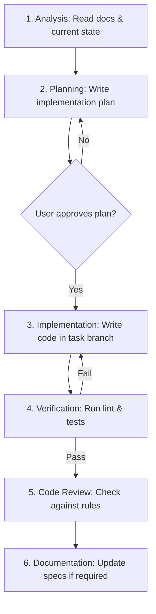

# AI Development Playbook (PROMPTS)

## Project: Website Potensi Desa Karamatwangi
### Status: Approved
### Version: 1.0.0
### Date: 2026-07-10

---

## 1. Purpose

This document establishes the official AI Development Playbook for Website Potensi Desa Karamatwangi. It defines how AI coding assistants (e.g., Cursor, Claude Code, GitHub Copilot, Gemini, ChatGPT) must behave when contributing to this repository.

By enforcing a **Documentation-First Development** and **AI-First Engineering** workflow, we eliminate context drift, prevent hallucinated parameters, and ensure that all AI contributions adhere strictly to the established Adaptive Content Architecture (ACA).

---

## 2. The AI Constitution

Every AI assistant working on this codebase must adhere to the following mandatory rules:

### 2.1. The AI MUST:
- **Read Documentation First:** Always load and read the specifications for the target feature before writing code.
- **Respect Existing Code:** Search the codebase for existing helper classes, custom hooks, and layout templates before creating new files.
- **Follow Naming Conventions:** Adopt the casing and suffix rules defined in `NAMING_CONVENTION.md`.
- **Explain Assumptions:** Clearly list any logical assumptions in the chat output before writing code blocks.
- **Preserve Clean Architecture:** Maintain the separation of concerns (thin controllers, isolated business service classes, dynamic form requests).

### 2.2. The AI MUST NOT:
- ❌ **Invent Requirements:** Do not add fields, pages, or features not defined in the `PRD.md` or `SRS.md`.
- ❌ **Invent API Routes:** Do not create endpoint paths that deviate from `API_SPEC.md`.
- ❌ **Hardcode Category Logic:** Never write conditional loops checking for specific categories by name or ID (e.g. `if (category === 'UMKM')`). All listing data must route through the ACA schema.
- ❌ **Duplicate Components:** Never rewrite buttons, inputs, or card patterns. Import existing atomic elements.

---

## 3. Documentation Reading Order

Before proposing modifications or generating source files, the AI assistant must read project specifications in this exact order:

```
[ 1. Product Layer ] ──> PRD.md / BUSINESS_RULES.md (What to build & constraints)
         ↓
[ 2. Design Layer ] ──> DESIGN_SYSTEM.md / COMPONENT_LIBRARY.md (Visual tokens)
         ↓
[ 3. Engineering Layer ] ──> ACA.md / API_SPEC.md / BACKEND_ARCHITECTURE.md (Code structure)
         ↓
[ 4. Development Layer ] ──> CODING_RULES.md / NAMING_CONVENTION.md (Implementation syntax)
         ↓
[ 5. Active Task Context ] ──> Read active file state + task instructions
```

---

## 4. AI-First Collaboration Workflow

The lifecycle of an AI-assisted development task follows six strict execution phases:



### 4.1. Analysis & Planning
- **Read Context:** Load files matching the reading order.
- **Draft Plan:** Outline the target files to modify, the code blocks to write, and list any open design questions. **Stop and wait for user approval** before writing code.

### 4.2. Implementation & Verification
- **Write Code:** Generate clean, typed code matching `CODING_RULES.md`.
- **Run Checks:** Proactively run local lint formatters and test commands (`npm run lint`, `php artisan test`). Fix warnings immediately.

---

## 5. Standard Prompt Templates

AI assistants should use these templates to frame feature generations:

### 5.1. Template: Backend Service Implementation
```
Context: We are implementing the [Service Name] service layer.
Objective: Write a clean, modular service class matching BACKEND_ARCHITECTURE.md.
File Target: backend/app/Services/[ServiceName]Service.php
Constraints:
- Must use UUID v4.
- All database operations modifying multiple tables must run inside transactional blocks.
- No direct SQL queries (use Eloquent ORM).
- Form validation is handled prior by Request classes; service accepts validated arrays.
References:
- read file:///c:/KKN/POTENSIDESA/docs/engineering/BACKEND_ARCHITECTURE.md
- read file:///c:/KKN/POTENSIDESA/docs/development/CODING_RULES.md
Please write the code shell structure first, and list your implementation assumptions.
```

### 5.2. Template: Frontend Dynamic Component
```
Context: We are building the [Component Name] component.
Objective: Write a functional React component in TypeScript.
File Target: frontend/src/components/[atoms|molecules|organisms]/[ComponentName].tsx
Constraints:
- Must be ACA-compliant (no hardcoded category name parameters).
- Styled exclusively using Tailwind CSS (no inline style objects).
- Implement loading, empty, and error state layouts.
- Follow WCAG 2.1 AA (min touch targets 44px, keyboard focus rings, alt text).
References:
- read file:///c:/KKN/POTENSIDESA/docs/design/COMPONENT_LIBRARY.md
- read file:///c:/KKN/POTENSIDESA/docs/development/NAMING_CONVENTION.md
Please write the component.
```

---

## 6. AI Context Strategy

To prevent context memory loss during long chat sessions, the assistant must track project states dynamically:

- **Sprint Context:** Reference the current sprint file inside the workspace to check milestone targets.
- **Handoff Logs:** When session limits are reached, the AI assistant must write a summary containing:
  1. Work accomplished (list of files modified and created).
  2. Current compiler/testing status (any active errors).
  3. Next steps for the incoming session.
- **Context Refresh:** Re-load the `README.md` and `ACA.md` context files on starting any new thread.

---

## 7. AI Error Recovery Protocols

When constraints conflict or requirements appear ambiguous:

```
[ Conflict Detected ]
         ↓
[ Check Docs Hierarchy ]
  - Business Rules override Design specs
  - API Spec overrides frontend requests
         ↓
[ Undefined Scenario? ] ──> STOP ──> [ Ask User for Rationale ]
```

- **Documentation Overrides Code:** If the active codebase contains legacy blocks that contradict the approved specifications, the AI assistant must point out the discrepancy and ask to align the code to the specifications first.
- **No Assumptions on Errors:** If an API endpoint fails, do not write bypass filters. Log the request payload and inspect the backend controller validation blocks.

---

## 8. AI Definition of Done (DoD)

Before declaring an implementation task complete, the AI assistant must run this automated verification checklist:

- [ ] **Specs Check:** Verify code does not contain hardcoded category checks.
- [ ] **Linter check:** Confirm TypeScript compile check (`tsc --noEmit`) and ESLint return zero warnings.
- [ ] **Laravel Pint check:** Confirm backend PHP code formats cleanly.
- [ ] **Tests status:** Confirm unit tests run successfully with coverage targets satisfied.
- [ ] **No debug code:** Verify `console.log()`, `dd()`, and `dump()` helpers are completely removed.
- [ ] **Documentation updated:** Add any structural updates to the markdown files.
