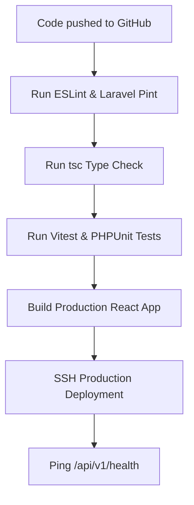

# Testing Strategy & Quality Assurance Specification

## Project: Website Potensi Desa Karamatwangi
### Status: Approved
### Version: 1.0.0
### Date: 2026-07-10

---

## 1. Testing Philosophy

The Quality Assurance framework for Website Potensi Desa Karamatwangi ensures that every feature deployed is reliable, secure, and compliant with business guidelines.

- **Shift Left Testing:** We write tests concurrently with code implementation. Bugs caught during local test execution are significantly cheaper to fix than issues identified post-deployment.
- **Automation First:** Regression tests for backend services, API contracts, and core frontend logic are automated.
- **Regression Prevention:** Every resolved bug must include an accompanying unit or integration test to prevent recurrence.
- **Documentation-Driven Testing:** Test cases are derived directly from the `BUSINESS_RULES.md` and `ACCEPTANCE_CRITERIA.md` specifications.
- **AI-Assisted Verification:** Testing guidelines, schemas, and assertions are structured to enable AI coding assistants to write unit and feature tests.

---

## 2. The Testing Pyramid

The testing strategy divides testing workloads across five layers of the standard testing pyramid:

```
      [ Manual QA / UAT ]       <-- 5% Effort
     [ E2E / Visual Regression ]  <-- 15% Effort
    [ API / Integration Tests ]    <-- 30% Effort
   [ Component Unit Tests (React) ] <-- 20% Effort
  [ Service / Model Unit Tests (PHP) ] <-- 30% Effort
```

### Layer Responsibilities
1. **Service / Model Unit Tests (PHPUnit):** Validates isolated backend calculations, slug generations, image conversions, and state checks.
2. **Component Unit Tests (Vitest / RTL):** Validates React components, UI states (loading, empty, success), and accessibility parameters.
3. **API & Integration Tests:** Validates controller route validation rules, token lifecycles, and database transactional updates.
4. **E2E / Visual Regression (Playwright):** Simulates user paths (e.g. login, importing Excel sheets, navigating maps) across multiple browser configurations.
5. **Manual QA / UAT:** Exploratory testing performed by developers and village administrators to confirm usability.

---

## 3. Frontend Testing Specifications (React + Vitest)

- **Component Mocking:** Mock map canvases (Leaflet) and chart objects (Chart.js) during unit testing to avoid rendering crashes.
- **Dynamic States:** Component tests must assert layout transformations under four core states:
  - *Loading:* Display of `LoadingSkeleton` placeholder.
  - *Empty:* Display of friendly `EmptyState` graphic.
  - *Success:* Correct grid rendering of listing cards.
  - *Error:* Fail-safe display of the error banner.
- **Accessibility Checks:** Use `axe-core` wrappers to automatically flag WCAG AA contrast or ARIA mismatches during component builds.

---

## 4. Backend Testing Specifications (PHPUnit)

- **Form Request Testing:** Directly instantiate Request classes to pass mock array data and verify validation rule compliance.
- **WebP Image pipeline:** Mock the upload files using `UploadedFile::fake()` to verify that the `ImageProcessingService`:
  - Successfully converts the image to WebP format.
  - Limits output width to a maximum of 1200px.
  - Logs the optimized file under `storage/app/public/uploads`.
- **Database Transactions:** Test that bulk imports containing single-row anomalies trigger a full rollback, leaving the database clean.

---

## 5. REST API Testing Specifications

API test suites must verify endpoint behaviors against the JSON schemas defined in the `API_SPEC.md`:

| Method | Target Route | Assertion Requirements |
| --- | --- | --- |
| **GET** | `/api/v1/potentials` | Asserts standard response structure, validation of pagination limits, and active status query checks. |
| **POST** | `/api/v1/admin/potentials` | Asserts that unauthorized inputs receive a 401/403 status, invalid formats receive 422, and successful writes return 201. |
| **DELETE** | `/api/v1/admin/potentials/:id` | Asserts that soft deletion is applied (`deleted_at` column populated) and public listings immediately exclude the item. |

---

## 6. ACA & Business Rules Testing

### 6.1. ACA Polymorphism Testing
- **Dynamic Schema Fetching:** Assert that the API `/api/v1/categories/:id/schema` successfully returns schema mapping definitions.
- **Polymorphic Metadata Save:** Assert that saving potentials with new custom category metadata successfully writes parameters to the dynamic JSON column, rejecting fields not registered in the category schema.

### 6.2. Business Rules Validations
- **Adaptive Contact Fallback:** Verify that the frontend maps the CTA contact link using the fallback order (WhatsApp $\rightarrow$ Phone $\rightarrow$ Email $\rightarrow$ Web $\rightarrow$ Village Contact).
- **Draft Isolation:** Assert that queries from public visitors filter out draft items: `WHERE status = 'published'`.

---

## 7. QA Quality Gates & Bug Severity Matrix

To ensure development progress is not stalled by minor issues, bugs are categorized using this severity matrix:

| Severity Level | Definition | Impact | Action Required |
| --- | --- | --- | --- |
| **Critical** | Major crash, data loss, security breach, login failure. | System unusable. | Block deployment, hotfix immediately. |
| **High** | Broken core flow (e.g. map pins not loading, images failing to upload). | Core feature disabled. | Resolve before merge to staging. |
| **Medium** | Minor UI misalignment, validation warning typos, non-blocking errors. | Usability warning. | Schedule for next patch release. |
| **Low** | Aesthetic adjustments, layout text typos. | Cosmetic only. | Address during standard backlog grooming. |

---

## 8. Automated CI/CD Testing Pipeline



### CI/CD Gate Requirements
- If any check in the pipeline fails, the build is blocked.
- Unit tests must maintain a minimum test coverage of **80%** before code merges are permitted on the integration branches.

---

## 9. Manual QA Checklist (Staging Verification)

Before declaring a release candidate ready for production deployment, the QA lead must manually verify:

- [ ] **Homepage Layout:** Carousel sliders and featured grids render correctly on mobile and desktop viewports.
- [ ] **Interactive Map:** Category filter chips toggle pin markers, and clicking pins opens detail popup cards.
- [ ] **Dynamic Forms:** Creating a potential dynamically generates metadata inputs matching the selected category.
- [ ] **Bulk Import:** Uploading a invalid Excel template returns precise row-level error logs and triggers a database rollback.
- [ ] **Fallback Verification:** Clearing merchant WhatsApp configurations successfully redirects users to the village contact.
- [ ] **Health Endpoint:** Pinging `https://staging.karamatwangi.desa.id/api/v1/health` returns `200 OK` with database and storage marked healthy.
