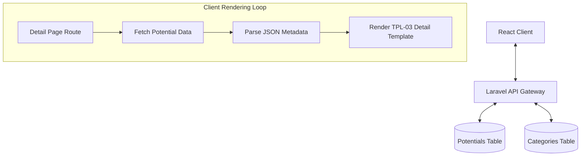
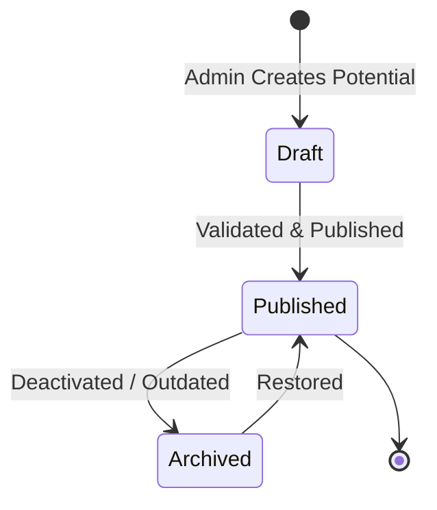
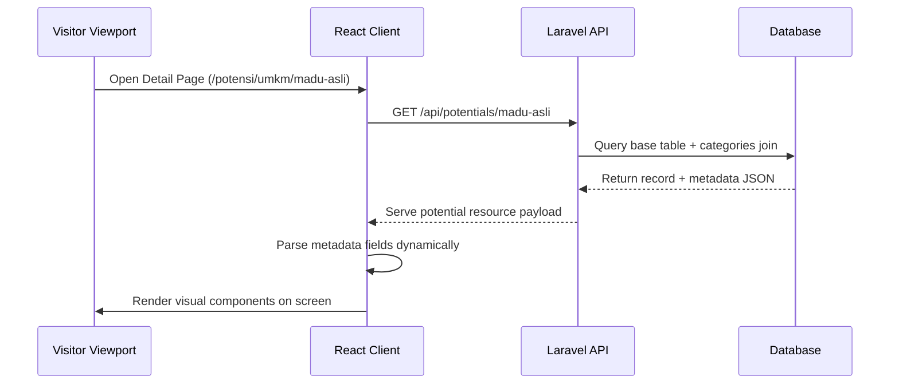
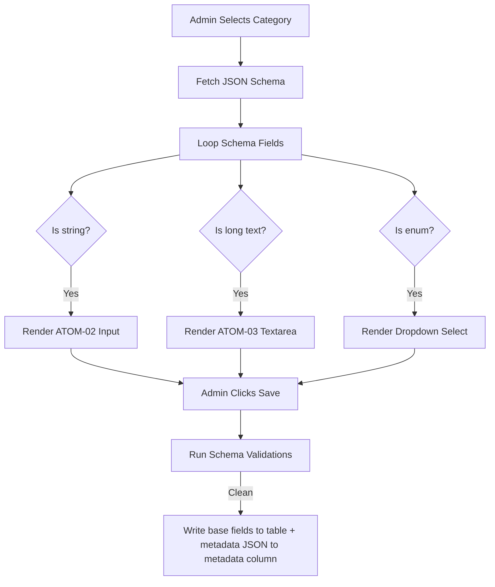
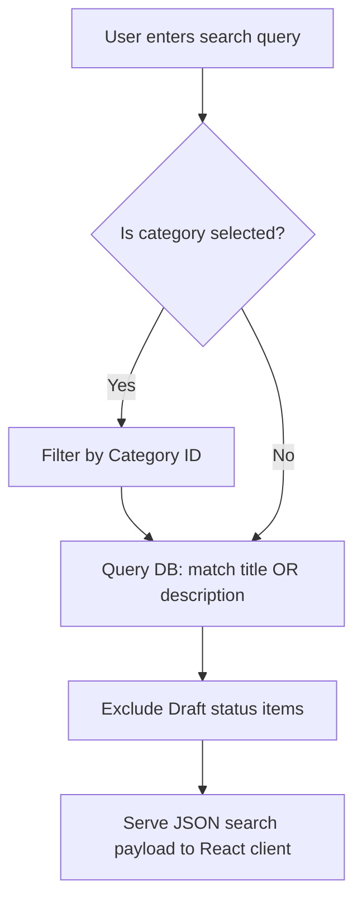
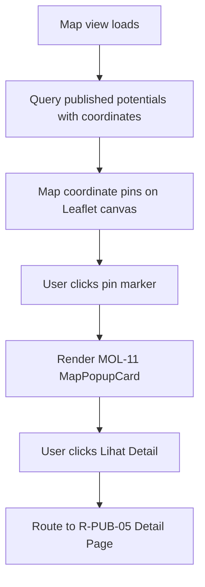
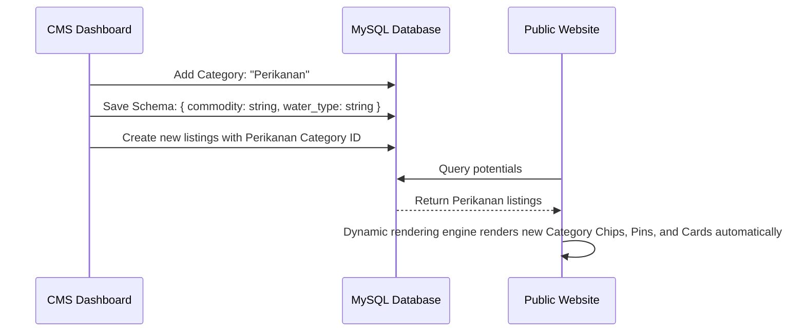

# Adaptive Content Architecture (ACA) Specification

## Project: Website Potensi Desa Karamatwangi
### Status: Approved
### Version: 1.0.0
### Date: 2026-07-10

---

## 1. Architectural Philosophy & The Monolith Problem

### 1.1. The Traditional Monolithic Approach
In traditional web applications, adding a new type of content (e.g., transitioning from a directory of UMKMs to a directory of Tourism spots) involves building isolated data pipelines:
1. Creating a new database table (e.g., `tourism_spots`).
2. Writing a new backend model, controller, and repository layer.
3. Defining new API resource endpoints.
4. Designing specific UI components, detail pages, forms, and search routes.

This approach creates severe **maintenance problems**:
- **Code Duplication:** Controllers, validators, and layout components are duplicated with minor structural differences.
- **Database Bloat:** The database accumulates schemas that are 80% identical (sharing fields like titles, descriptions, images, coordinates, and contact details).
- **Deployment Overhead:** Releasing a category requires a full deployment (database migration, backend redeployment, frontend rebuild).
- **Brittle Codebase:** Any global adjustment (e.g., modifying how phone numbers format) requires updating multiple codebases and components.

### 1.2. The ACA Unified Solution
The **Adaptive Content Architecture (ACA)** replaces this monolithic pattern with a unified polymorphic architecture. Instead of treating UMKMs, Tourism spots, and Agricultural yields as distinct database entities, ACA models them as variations of a single base entity: the **Village Potential**.

All potentials share common base properties (Title, Description, Coordinates, Cover Image). Category-specific fields are offloaded to a dynamic, schema-driven metadata container. Adding a new category becomes a configuration task inside the database, allowing the entire application (frontend, backend, CMS, search, and map) to adapt instantly.

---

## 2. Core Architectural Principles

- **Single Source of Truth:** All core assets are managed in a single table structure.
- **Configuration over Hardcoding:** Category types, validation schemas, and input fields are driven by database configurations, not conditional frontend code.
- **Data-Driven UI:** UI page elements, search forms, and map markers adapt dynamically based on the active category schema.
- **Metadata-Driven Rendering:** Detail templates iterate over metadata key-values, decoupling layout design from content category.
- **Reusable API:** The backend serves generalized endpoints that return potential resources, regardless of type.
- **Future Scalability:** Adding a category requires zero source code edits.
- **Separation of Concerns:** The backend handles storage, validation schemas, and database transactions; the frontend client parses schema JSON configurations to render visual forms and listings.
- **AI-First Engineering:** Decoupling logic into clean schema parsers allows AI coding assistants to build robust, predictable data-handling loops.

---

## 3. High-Level Architecture Flow

The conceptual flow of data from creation to user consumption is organized into five distinct layers:

```
[ Village Potential ] (Core Entity Data)
         ↓
[ Category Schema ] (Dynamic Fields Definition)
         ↓
[ Polymorphic Metadata ] (JSON Attribute Store)
         ↓
[ Dynamic Renderer ] (Frontend Parsing Engine)
         ↓
[ UI Component Library ] (Reusable Visual Elements)
         ↓
[ Visitor Viewport ] (Interactive Exploration)
```

1. **Potential (Core Entity):** Holds standard attributes (Title, Description, Lat/Long, Category ID, Cover Image).
2. **Category (Schema Def):** Holds the database record defining the category label, tag configurations, and JSON-Schema form fields.
3. **Polymorphic Metadata:** Key-value pairs containing category-specific metrics (e.g., ticket prices for Tourism, harvest months for Agriculture) stored inside a JSON attribute.
4. **Dynamic Renderer:** Frontend component parsing the metadata JSON against the category's template rule definitions.
5. **UI Components:** Reusable atomic structures (badges, chips, cards) rendering the output.

---

## 4. Core Domain Model (Conceptual Responsibilities)

*Note: This is a conceptual domain map, not a database schema.*

- **Village Potential:** Represents the primary catalog entry. Responsible for holding universal metadata, geolocation coordinates, publishing status, and referencing the category model.
- **Category:** Defines category labels, visual marker colors, and the JSON-Schema detailing metadata parameters.
- **Media:** Manages image paths, alt-text references, and processing targets (WebP optimization).
- **Location:** Maps geographical data (Latitude/Longitude coordinates and textual address).
- **Metadata:** Key-value map holding category-specific custom attributes.
- **Statistic:** Aggregates totals of active published potentials grouped by category.
- **Contact:** Handles merchant telephone, email, social links, and evaluates fallback pathways.
- **Content Status:** Manages lifecycles (Draft, Published, Archived).
- **Administrator:** Manages back-office access tokens.

---

## 5. Adaptive Metadata Modeling

Every potential category inherits the same base attributes while providing its own custom parameters inside a metadata schema:

```
Base Village Potential (Core Entity)
 ├── id: UUID
 ├── title: String
 ├── description: String
 ├── location: Coordinate (Lat/Long)
 ├── cover_image: String
 └── category_id: UUID
        │
        ├── Category: UMKM (Metadata Schema)
        │    ├── owner_name: String
        │    ├── product_type: String
        │    └── price_range: String
        │
        ├── Category: Tourism (Metadata Schema)
        │    ├── ticket_price: Number
        │    ├── facilities: Array
        │    └── opening_hours: String
        │
        └── Category: Agriculture (Metadata Schema)
             ├── commodity_type: String
             ├── harvest_season: Array
             └── yield_volume: String
```

By isolating these custom fields into a flexible metadata container, the core database structure remains clean, stable, and decoupled from business sector variations.

---

## 6. Dynamic Rendering & Form Engines

### 6.1. Dynamic Rendering Engine
Instead of writing conditional logic such as:
```javascript
if (potential.category === 'UMKM') {
  return <UmkmDetail data={potential} />;
}
```
The frontend implements a configuration-driven loop:
1. Fetch potential details from `/api/v1/potentials/:slug`.
2. Map standard fields to page positions (Title, Gallery, Map location).
3. Read the `metadata` JSON object.
4. Iterate over the keys, fetching label names and formatting values according to the category's attribute definitions (e.g., rendering array lists as bullet tags, price numbers as currency strings).

### 6.2. Dynamic Form Engine
The CMS auto-generates forms based on the category's schema definition:
1. Admin selects a category (e.g. "UMKM").
2. Form component retrieves the category's `schema_definition` JSON.
3. Form engine maps schema fields to input components:
   - `type: string` $\rightarrow$ ATOM-02 (Input text).
   - `type: text` $\rightarrow$ ATOM-03 (Textarea).
   - `type: enum` $\rightarrow$ dropdown select.
   - `type: array` $\rightarrow$ tag inputs.
4. On submit, form inputs are bundled into a single JSON payload and written to the database `metadata` column.

---

## 7. Search & Filter Architecture

Search operations evaluate both core fields and metadata elements dynamically:
- **Keyword Search:** Queries match against the core `title` and `description` fields.
- **Category Filtering:** Matches the core `category_id`.
- **Dynamic Filters:** If the visitor is browsing "Tourism", the catalog pulls the active category metadata schema and automatically builds sidebar filters for properties marked as filterable (e.g., filtering Tourism spots that match the facility "Tempat Parkir").

---

## 8. Adaptive Contact Flow
The contact CTA relies on the fallback business rule logic (BR-CON-01) defined in the product layer. The system evaluates the fields in order:

```
[ Click 'Hubungi Penjual' ]
           ↓
[ Check Merchant WhatsApp ] ── (Found) ──> [ Redirect to Merchant WA ]
           ↓ (Missing)
[ Check Merchant Phone ] ── (Found) ──> [ Open Phone Dialer ]
           ↓ (Missing)
[ Check Merchant Email ] ── (Found) ──> [ Open Mail Client ]
           ↓ (Missing)
[ Check Merchant Website ] ── (Found) ──> [ Open External URL ]
           ↓ (Missing)
[ Check Village Fallback ] ── (Found) ──> [ Redirect to Village WA ]
           ↓ (Missing)
[ Disable Button + Tooltip ]
```

---

## 9. Mermaid Visualizations

### 9.1. Overall ACA Architecture Flow


### 9.2. Content Lifecycle


### 9.3. Dynamic Rendering Flow


### 9.4. Dynamic Form Generation


### 9.5. Search Flow


### 9.6. Map Flow


### 9.7. Future Category Expansion (E.g., Adding Fisheries)


---

## 10. Extensibility & Scalability Case Study

### Case Study: Adding the "Fisheries" (Perikanan) module
Under traditional architectures, adding this module requires code deployment. Under the **Adaptive Content Architecture (ACA)**, the process is configuration-only:

1. **Define Category (CMS):** The administrator navigates to `/admin/kategori` and creates a new entry:
   - **Label:** `Perikanan`
   - **Color:** `#0EA5E9` (blue marker context)
   - **Schema Definition:**
     ```json
     {
       "commodity_type": "string",
       "pond_type": "string",
       "harvest_capacity": "string"
     }
     ```
2. **Data Ingestion:** The administrator begins writing listings under "Perikanan". The CMS form dynamically displays fields for `Commodity Type`, `Pond Type`, and `Harvest Capacity`.
3. **Public Activation:**
   - The navigation bar category filters automatically add a "Perikanan" chip.
   - The map reads the category's blue color mapping and renders fisheries pins.
   - Clicking a pin opens a popup card, routing to `/potensi/perikanan/:slug`.
   - The detail page parses the metadata and renders `Commodity Type` and other fields without code changes.

---

## 11. Advantages, Limitations, & Mitigations

### 11.1. Advantages
- **Zero Schema Migrations:** Database structure stays stable.
- **Minimized Codebase:** Reduced size, clean code, no duplicate views or controllers.
- **Fast Deployments:** Features launch instantly via database configuration.
- **AI-Friendly:** Clear schema parsers are highly predictable for AI coding helpers.

### 11.2. Limitations & Mitigations
- **Metadata Validation Complexity:** JSON columns lack standard database table checks.
  - *Mitigation:* Implement backend validation schemas (e.g., JSON-Schema validator library in Laravel) before saving the metadata column.
- **Search Performance:** Querying JSON columns is slower than indexed text columns.
  - *Mitigation:* Ensure key search terms map to core table columns (Title, Description). Keep metadata columns reserved for detail page displays and non-indexed properties.
- **Dynamic UI Complexity:** Custom layouts are restricted.
  - *Mitigation:* Keep visual layouts consistent (using TPL-03) and use metadata iteration for detail grids.
