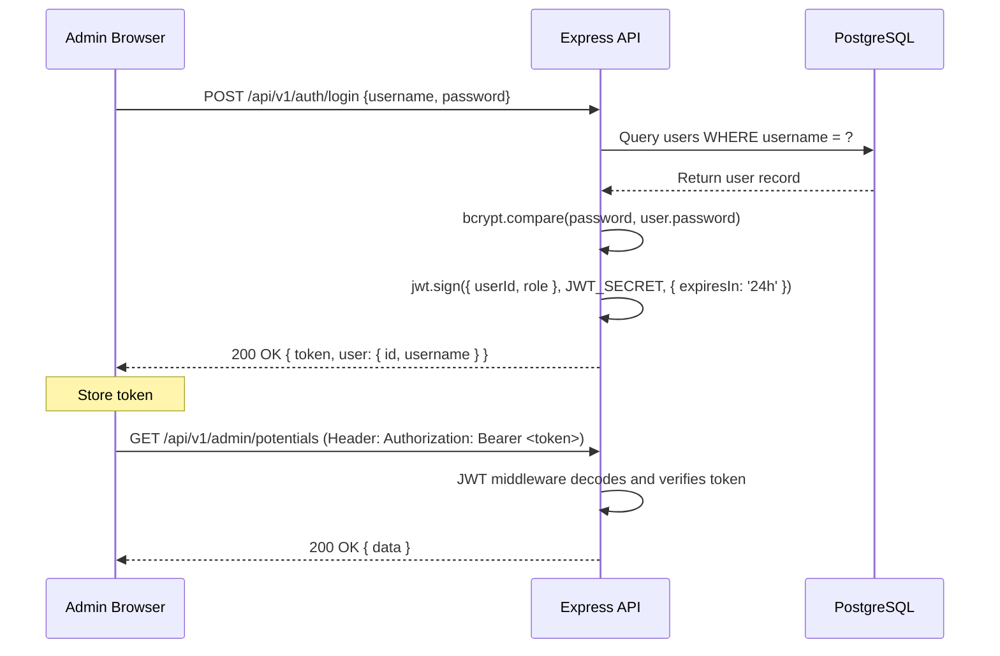

# Authentication Specification

## Project: Website Potensi Desa Karamatwangi
### Status: Approved
### Version: 2.0.0
### Date: 2026-07-25

---

## 1. Authentication Philosophy

The system uses **stateless JWT (JSON Web Token)** authentication for the admin CMS. This approach eliminates server-side session storage, simplifies horizontal scaling, and keeps the API fully RESTful.

---

## 2. JWT Token Flow

---

## 3. Token Details

- **Algorithm:** HS256 (HMAC with SHA-256)
- **Payload:** `{ userId: string, role: string, iat: number, exp: number }`
- **Expiration:** 24 hours from issuance
- **Storage (Client):** Stored in `localStorage` or `httpOnly` cookie depending on deployment security requirements
- **Storage (Server):** Not stored. Tokens are stateless.

---

## 4. Route Protection

| Route Pattern | Auth Required | Middleware |
|---|---|---|
| `/api/v1/auth/login` | No | Rate limiter only |
| `/api/v1/potentials` | No | None |
| `/api/v1/categories` | No | None |
| `/api/v1/statistics` | No | None |
| `/api/v1/health` | No | None |
| `/api/v1/admin/*` | Yes | JWT verification middleware |
| `/api/v1/media/*` | Yes | JWT verification middleware (write) |

---

## 5. Middleware Implementation

The JWT middleware:
1. Extracts the token from the `Authorization: Bearer <token>` header.
2. Verifies the token using `jwt.verify(token, JWT_SECRET)`.
3. If valid, attaches decoded payload to `req.user` and calls `next()`.
4. If invalid/expired, returns `401 { error: UNAUTHENTICATED, message: "Token tidak valid atau kadaluarsa" }`.

---

## 6. Future Role Expansion

The current architecture authenticates a single Administrator role. The system is prepared for:
- **Super Admin:** Full system access
- **Editor:** Content management only
- **UMKM Owner:** Self-service profile management

Adding roles requires updating the JWT payload to include role information and adding role-checking middleware — no architectural changes.
