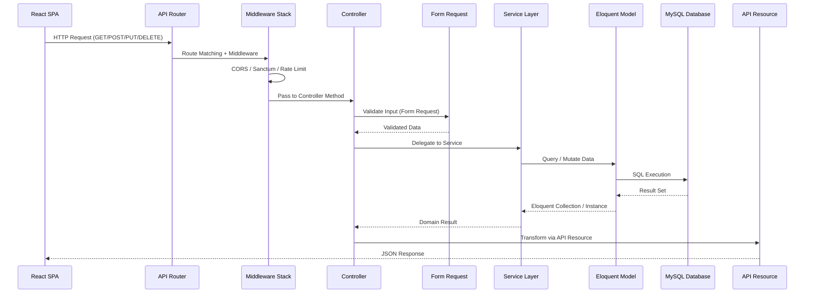
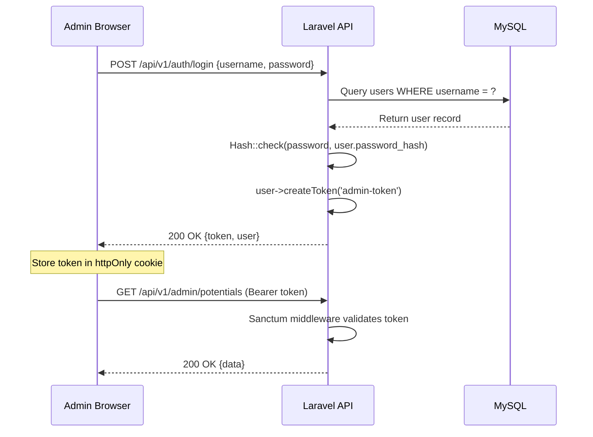
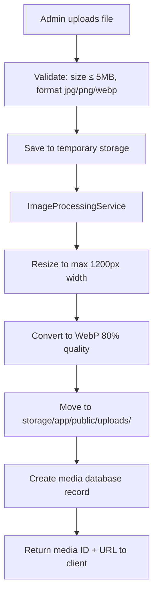
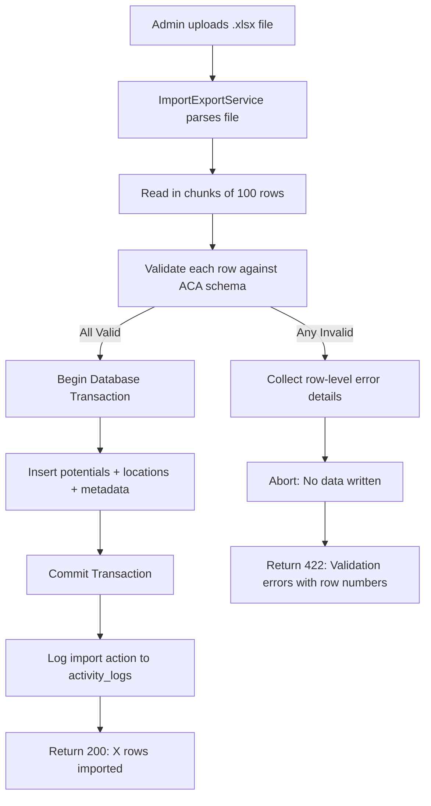
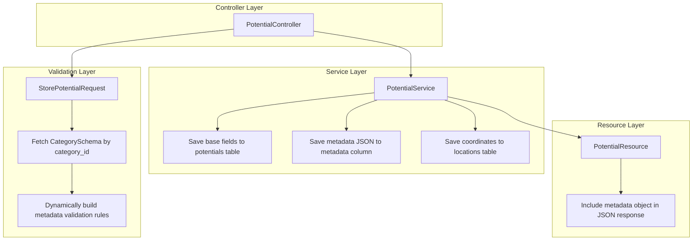

# Backend Architecture Specification

## Project: Website Potensi Desa Karamatwangi
### Status: Approved
### Version: 1.0.0
### Date: 2026-07-10

---

## 1. Backend Philosophy

### 1.1. Architectural Approach
The Laravel 12 backend is designed as a **stateless JSON API service** powering the React SPA frontend. The architecture follows these principles:

- **Clean Architecture:** Business logic is isolated in Service classes, never in Controllers or Models. Controllers handle HTTP request/response orchestration. Models handle data persistence. Services handle domain rules.
- **Modular Architecture:** Each feature domain (Potentials, Categories, Media, Statistics) is organized into self-contained layers (Controller → Request → Service → Model → Resource) that can be maintained independently.
- **Separation of Concerns:** No single class handles more than one responsibility. Validation lives in Form Requests. Business logic lives in Services. Data transformation lives in Resources. Query scoping lives in Models.
- **Service-Oriented Architecture:** Complex operations (image processing, Excel import, statistics aggregation) are encapsulated in dedicated Service classes that can be composed, tested, and replaced independently.
- **Documentation-First Development:** Every service, controller, and model is designed from this specification before code is written. The specification serves as the implementation contract.
- **AI-First Architecture:** Clean, predictable patterns with consistent naming conventions allow AI coding assistants to generate implementation code accurately from this document alone.

### 1.2. Why These Approaches Were Selected
Traditional Laravel projects often place business logic directly inside controllers (fat controllers) or models (fat models), creating tightly coupled code that is difficult to test and maintain. By enforcing thin controllers and a dedicated service layer, the codebase remains modular, testable, and comprehensible to both human developers and AI assistants.

---

## 2. High-Level Request Lifecycle

Every HTTP request follows a predictable, layered execution path:



**Layer Responsibilities:**
1. **API Router:** Maps HTTP verbs and URL paths to controller methods. Groups routes by auth requirements.
2. **Middleware Stack:** Executes cross-cutting checks (CORS headers, Sanctum token verification, rate limiting, JSON content enforcement).
3. **Controller:** Receives the validated request, delegates to the appropriate service, and returns the transformed response. Contains zero business logic.
4. **Form Request:** Validates and sanitizes all incoming data before it reaches the controller method. Handles authorization checks.
5. **Service Layer:** Executes business rules, coordinates database transactions, triggers side effects (image processing, logging).
6. **Eloquent Model:** Maps to database tables. Defines relationships, scopes, accessors, mutators, and casts.
7. **API Resource:** Transforms Eloquent models into clean, consistent JSON structures for the frontend.

---

## 3. Folder Responsibilities

### 3.1. `app/Http/Controllers/Api/V1/`
Houses all versioned API controllers. Each controller maps to one domain entity and contains only CRUD-style action methods (`index`, `show`, `store`, `update`, `destroy`).

| Controller | Responsibility |
| --- | --- |
| `AuthController` | Login, logout, current user retrieval |
| `PotentialController` | CRUD operations for all village potentials |
| `CategoryController` | List and show category records |
| `MediaController` | Image upload and deletion |
| `SettingsController` | Read and update site-wide configurations |
| `StatisticsController` | Aggregate counts and chart data |
| `ImportController` | Excel bulk import and template download |
| `ActivityLogController` | List audit log entries |

### 3.2. `app/Http/Requests/`
Form Request classes containing validation rules, authorization checks, and custom error messages. One request class per controller action that accepts input (e.g., `StorePotentialRequest`, `UpdatePotentialRequest`, `LoginRequest`, `UploadMediaRequest`).

### 3.3. `app/Services/`
Domain-specific business logic classes. Services are injected into controllers via constructor dependency injection.

| Service | Responsibility |
| --- | --- |
| `PotentialService` | Create, update, delete, search, filter, and feature-toggle potentials. Coordinates ACA metadata validation. |
| `CategoryService` | Retrieve categories and their schema definitions. |
| `MediaService` | Handle file upload, WebP conversion delegation, and deletion. |
| `ImageProcessingService` | Resize images to max 1200px width, convert to WebP format at 80% quality (BR-MED-01). |
| `StatisticsService` | Aggregate published potential counts by category, compute monthly growth, and format chart datasets. |
| `ImportExportService` | Parse Excel files, validate rows against ACA schemas, execute transactional bulk inserts, and generate downloadable templates. |
| `SettingsService` | Read and update key-value pairs from the settings table. |
| `ActivityLogService` | Record administrator actions with timestamps, IP addresses, and target entity references. |
| `SearchService` | Execute keyword search across title and description fields with category and status filters. |

### 3.4. `app/Models/`
Eloquent model classes. Each model maps to one database table and defines relationships, query scopes, attribute casts, and soft delete behavior.

| Model | Table | Key Relationships |
| --- | --- | --- |
| `User` | `users` | hasMany Potentials, hasMany ActivityLogs |
| `Category` | `categories` | hasOne CategorySchema, hasMany Potentials |
| `CategorySchema` | `category_schemas` | belongsTo Category |
| `Potential` | `potentials` | belongsTo Category, belongsTo User, hasOne Location, belongsTo Media (cover), belongsToMany Media (gallery) |
| `Location` | `locations` | belongsTo Potential |
| `Media` | `media` | belongsToMany Potentials |
| `Setting` | `settings` | standalone key-value |
| `ActivityLog` | `activity_logs` | belongsTo User |

### 3.5. `app/Http/Resources/`
API Resource transformation classes that format Eloquent models into standardized JSON responses.

| Resource | Responsibility |
| --- | --- |
| `PotentialResource` | Transforms potential with nested category, location, contact, and metadata |
| `PotentialCollection` | Wraps paginated potential lists with meta and links |
| `CategoryResource` | Transforms category with icon and color |
| `MediaResource` | Transforms media with full URL path |
| `StatisticsResource` | Formats aggregate data for chart consumption |

### 3.6. `app/Policies/`
Authorization policy classes. `PotentialPolicy` ensures only authenticated administrators can create, update, or delete potentials.

### 3.7. `app/Enums/`
PHP enums for type-safe status values.

| Enum | Values |
| --- | --- |
| `PotentialStatus` | `Draft`, `Published`, `Archived` |

### 3.8. `app/Exceptions/`
Custom exception classes and the global exception handler (`Handler.php`) that catches all exceptions and returns consistent JSON error responses.

### 3.9. `app/Observers/`
Eloquent model observers that trigger side effects on lifecycle events (e.g., `PotentialObserver` logs creation/update/deletion events to the activity log).

### 3.10. `app/Traits/`
Reusable model traits (e.g., `HasUuid` for automatic UUID generation on model creation, `Filterable` for applying dynamic query filters).

---

## 4. Controller Layer Design

Controllers are deliberately **thin**. Their sole responsibility is to:
1. Accept the validated request.
2. Call the appropriate service method.
3. Return the formatted resource response.

**Example pattern (conceptual):**
```
PotentialController@index:
  1. Receive validated query parameters (search, category, page).
  2. Call PotentialService->list(filters, pagination).
  3. Return PotentialCollection::make(results).
```

No controller method should exceed 10–15 lines of code. Any method growing beyond this threshold indicates that business logic has leaked into the controller and must be extracted to a service.

---

## 5. Form Request & Validation Layer

### 5.1. Static Validation
Standard Laravel validation rules enforce base field constraints:
- `title`: required, string, max 150 characters.
- `slug`: auto-generated, unique in potentials table.
- `description`: required, string.
- `category_id`: required, must exist in categories table.
- `latitude`: required, numeric, between -90 and 90.
- `longitude`: required, numeric, between -180 and 180.
- `status`: required, must be one of `draft`, `published`, `archived`.
- `cover_image_id`: nullable, must exist in media table.

### 5.2. Dynamic ACA Validation
When a potential is created or updated, the `StorePotentialRequest` fetches the selected category's `schema_definition` JSON and dynamically builds validation rules for the `metadata` payload:
1. Retrieve `CategorySchema` by `category_id`.
2. Parse the `schema_definition` JSON fields.
3. For each field marked `required: true`, add a `required` validation rule under `metadata.{field_name}`.
4. For each field, apply type-specific rules (`string`, `numeric`, `array`).

This allows validation to adapt automatically when new categories or fields are added via the CMS.

---

## 6. Service Layer Design

### 6.1. PotentialService
The central business service. Responsibilities:
- **list():** Build filtered, searchable, paginated queries using dynamic scopes.
- **show():** Fetch a single potential by slug with eager-loaded relationships (category, location, media, gallery).
- **create():** Validate ACA metadata, create location record, link cover image, save potential within a database transaction.
- **update():** Same as create with existing record hydration.
- **delete():** Soft-delete the potential. Log the action via ActivityLogService.
- **toggleFeatured():** Flip the `is_featured` boolean.

### 6.2. ImageProcessingService
Isolated image processing pipeline:
1. Receive uploaded file from MediaService.
2. Validate dimensions and file size (max 5MB).
3. Resize to max 1200px width (maintain aspect ratio).
4. Convert to WebP format at 80% quality.
5. Store processed file in `storage/app/public/uploads/`.
6. Return file path and metadata for database record creation.

### 6.3. ImportExportService
Excel bulk operations:
1. Receive uploaded `.xlsx` file.
2. Parse rows using chunk reading (100 rows per chunk) to manage memory.
3. Validate each row against the target category's ACA schema.
4. If any row fails validation, abort the entire transaction (rollback per BR-CMS-01).
5. If all rows pass, commit the bulk insert transaction.
6. Return success message with imported row count, or error details with failing row numbers and reasons.

---

## 7. Model Layer Design

### 7.1. UUID Strategy
All models use UUID primary keys instead of auto-incrementing integers. The `HasUuid` trait automatically generates a UUID v4 on the `creating` event. This prevents ID enumeration attacks and simplifies future data migrations.

### 7.2. Query Scopes
Models define reusable query scopes for common filters:
- `Potential::published()` → `WHERE status = 'published' AND deleted_at IS NULL`
- `Potential::featured()` → `WHERE is_featured = true`
- `Potential::inCategory($slug)` → `WHERE category_id = (SELECT id FROM categories WHERE slug = $slug)`
- `Potential::search($keyword)` → `WHERE title LIKE %keyword% OR description LIKE %keyword%`

### 7.3. Attribute Casting
- `metadata` → cast to `array` (automatic JSON encode/decode).
- `is_featured` → cast to `boolean`.
- `status` → cast to `PotentialStatus` enum.
- `latitude` / `longitude` → cast to `float`.

### 7.4. Soft Deletes
The `Potential` model uses Laravel's `SoftDeletes` trait. Deleted records retain their database rows with a populated `deleted_at` timestamp. All default queries automatically exclude soft-deleted records.

---

## 8. Resource Layer Design

API Resources control the exact JSON shape returned to the frontend. Key transformation rules:
- **Conditional Metadata:** The `metadata` field is only included in detail responses (`show`), never in list responses (`index`) to reduce payload size.
- **Nested Resources:** Category, location, and media are transformed via their own Resource classes when included.
- **URL Generation:** Media file paths are transformed into full URLs using Laravel's `Storage::url()` helper.
- **Pagination Formatting:** Collection resources wrap paginated results with `meta` (current_page, last_page, per_page, total) and `links` (prev, next) keys matching the API standard.

---

## 9. Authentication Architecture

### 9.1. Sanctum Token Flow


### 9.2. Route Protection
- **Public routes** (`/api/v1/potentials`, `/api/v1/categories`, `/api/v1/statistics`) require no authentication.
- **Admin routes** (`/api/v1/admin/*`) are wrapped in `auth:sanctum` middleware. Unauthorized requests receive a `401` response.

### 9.3. Future Role Expansion
The current architecture authenticates a single Administrator role. The `User` model is prepared for a future `role` column and policy-based authorization checks. Adding roles (Super Admin, Editor, UMKM Owner) requires adding the column, updating policies, and registering new middleware — no architectural changes.

---

## 10. File Storage Architecture



- **Symbolic Link:** `php artisan storage:link` creates `public/storage → storage/app/public` for direct browser access.
- **Deletion:** When a media record is deleted, the service removes both the database row and the physical file from disk.
- **Future Cloud Storage:** The architecture uses Laravel's `Storage` facade with configurable disk drivers. Switching from local to S3 or Google Cloud Storage requires only a configuration change in `config/filesystems.php`.

---

## 11. Import Architecture



---

## 12. Search Architecture

The `SearchService` builds Eloquent queries dynamically:
1. Start with `Potential::published()` scope (only published, non-deleted).
2. If `search` parameter exists, apply `->search($keyword)` scope.
3. If `category` parameter exists, apply `->inCategory($categorySlug)` scope.
4. If `featured` parameter is true, apply `->featured()` scope.
5. Apply sorting (default: `created_at` descending).
6. Apply pagination (default: 12 items per page).

Future enhancement: Replace `LIKE` queries with Laravel Scout + Meilisearch for full-text search with typo tolerance.

---

## 13. ACA Backend Integration



**Key integration points:**
- **Controllers** remain generic — no category-specific conditional logic.
- **Form Requests** dynamically load validation schemas from the database.
- **Services** write metadata as a JSON blob without category-specific code paths.
- **Resources** pass the metadata object directly to the frontend for client-side rendering.
- **Models** cast the `metadata` column to an array, enabling direct PHP array access.

---

## 14. Error Handling Strategy

All exceptions pass through a centralized exception handler that returns consistent JSON:

| Exception Type | HTTP Code | Error Code | Example |
| --- | --- | --- | --- |
| Validation failure | 422 | `VALIDATION_FAILED` | Missing required title field |
| Authentication failure | 401 | `UNAUTHENTICATED` | Invalid or expired Sanctum token |
| Authorization failure | 403 | `FORBIDDEN` | Non-admin accessing admin route |
| Model not found | 404 | `NOT_FOUND` | Invalid potential slug |
| Import validation failure | 422 | `IMPORT_VALIDATION_FAILED` | Row-level spreadsheet errors |
| Upload size exceeded | 422 | `FILE_TOO_LARGE` | Image exceeds 5MB |
| Server error | 500 | `SERVER_ERROR` | Database connection failure |

---

## 15. Performance Strategy

- **Eager Loading:** All controller queries eager-load required relationships (`category`, `location`, `coverImage`) to prevent N+1 query problems.
- **Database Indexing:** Indexes on `slug`, `category_id`, `status`, `is_featured`, `deleted_at`, and `(latitude, longitude)` composite.
- **Pagination:** All list endpoints default to 12 items per page, preventing unbounded result sets.
- **Image Optimization:** Uploaded images are compressed and converted before storage, reducing bandwidth on every subsequent request.
- **Query Optimization:** JSON `metadata` column is never included in `WHERE` clauses for search. Keyword searches target indexed `title` and `description` columns only.

---

## 16. Security Architecture

- **Input Validation:** Every write endpoint validates input through Form Request classes before data reaches the service layer.
- **SQL Injection Prevention:** All database queries use Eloquent's parameterized bindings. Raw SQL is never used.
- **XSS Prevention:** Output is JSON-only (no HTML rendering). The React frontend handles escaping.
- **CSRF Protection:** Sanctum's cookie-based token includes CSRF verification for SPA requests.
- **Upload Security:** File uploads are restricted by MIME type whitelist (jpg, jpeg, png, webp) and size limit (5MB). Files are renamed with UUIDs to prevent path traversal.
- **Rate Limiting:** Login endpoint is rate-limited to 5 attempts per minute per IP. API endpoints are rate-limited to 60 requests per minute.
- **Audit Logging:** Every admin write action (create, update, delete, import) is recorded in the `activity_logs` table with user ID, action type, target ID, IP address, and timestamp.

---

## 17. Future Scalability

Adding new ACA categories (Tourism, Agriculture, Livestock, Infrastructure, News, Gallery) requires **zero backend code changes**:
- **Controllers:** The `PotentialController` already handles all categories through generic CRUD methods.
- **Services:** The `PotentialService` stores metadata as JSON without category-specific branching.
- **Validation:** The `StorePotentialRequest` dynamically loads schema rules from the new category's `category_schemas` record.
- **Resources:** The `PotentialResource` passes the metadata object to the frontend regardless of category type.
- **Search:** The `SearchService` filters by `category_id` without hardcoded category references.
- **Statistics:** The `StatisticsService` aggregates by `GROUP BY category_id`, automatically including new categories.

The only action required is inserting a new row into the `categories` table and its corresponding `category_schemas` definition via the CMS admin panel.
