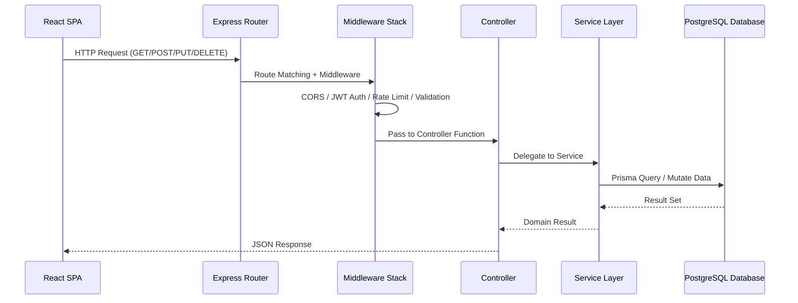
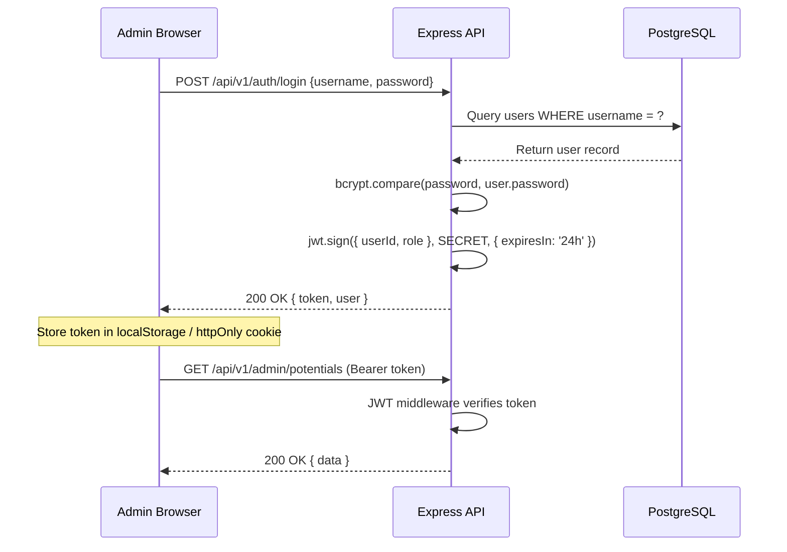
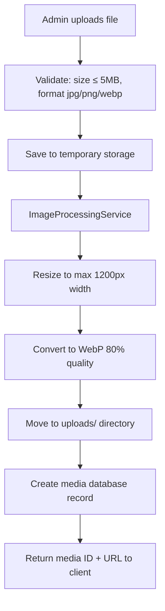
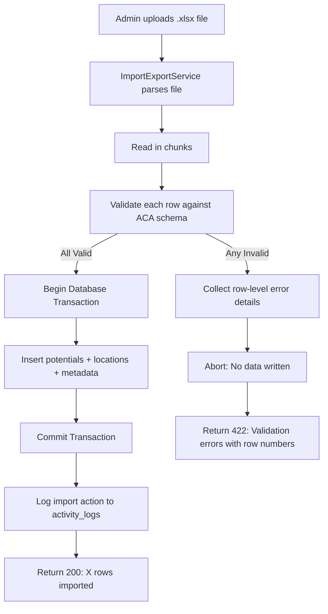
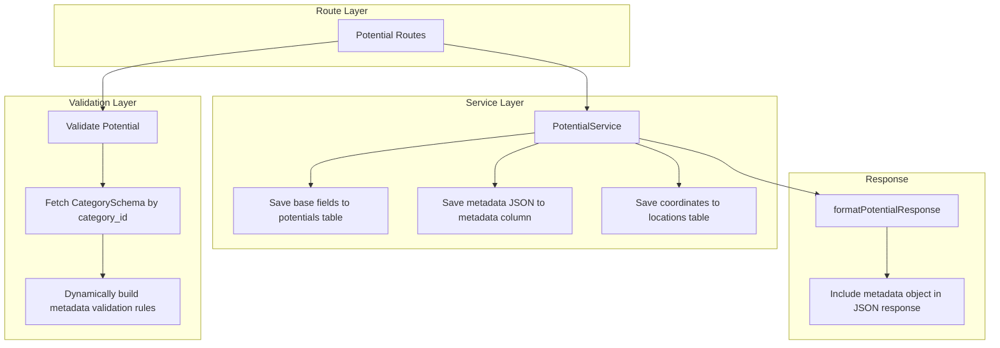

# Backend Architecture Specification

## Project: Website Potensi Desa Karamatwangi
### Status: Approved
### Version: 2.0.0
### Date: 2026-07-25

---

## 1. Backend Philosophy

### 1.1. Architectural Approach
The Express.js backend is designed as a **stateless JSON API service** powering the React SPA frontend. The architecture follows these principles:

- **Clean Architecture:** Business logic is isolated in Service modules, never in route handlers or Prisma schema files. Route handlers manage HTTP request/response orchestration. Prisma manages data persistence. Services handle domain rules.
- **Modular Architecture:** Each feature domain (Potentials, Categories, Media, Statistics) is organized into self-contained layers (Router → Middleware → Controller → Service → Prisma) that can be maintained independently.
- **Separation of Concerns:** No single module handles more than one responsibility. Validation happens in middleware. Business logic lives in Services. Data transformation happens in response formatters.
- **Service-Oriented Architecture:** Complex operations (image processing, Excel import, statistics aggregation) are encapsulated in dedicated Service modules that can be composed, tested, and replaced independently.
- **Documentation-First Development:** Every service, controller, and model is designed from this specification before code is written. The specification serves as the implementation contract.

### 1.2. Why These Approaches Were Selected
Traditional Express projects often place business logic directly inside route handlers (fat routes), creating tightly coupled code that is difficult to test and maintain. By enforcing thin controllers and a dedicated service layer, the codebase remains modular, testable, and comprehensible to both human developers and AI assistants.

---

## 2. High-Level Request Lifecycle

Every HTTP request follows a predictable, layered execution path:



**Layer Responsibilities:**
1. **Express Router:** Maps HTTP verbs and URL paths to controller functions. Groups routes by auth requirements.
2. **Middleware Stack:** Executes cross-cutting checks (CORS headers, JWT token verification, rate limiting, JSON content enforcement, input validation).
3. **Controller:** Receives the validated request, delegates to the appropriate service, and returns the transformed response. Contains zero business logic.
4. **Service Layer:** Executes business rules, coordinates database transactions, triggers side effects (image processing, logging).
5. **Prisma Client:** Maps to database tables. Defines models, relations, and query methods.
6. **Response Formatter:** Transforms Prisma results into clean, consistent JSON structures for the frontend.

---

## 3. Folder Responsibilities

### 3.1. `backend/src/middleware/`
Custom Express middleware for cross-cutting concerns:

| Middleware | Responsibility |
| --- | --- |
| `auth.js` | JWT token verification, attaches user to request |
| `upload.js` | Multer configuration for file uploads |
| `validate.js` | Generic request validation helpers |
| `errorHandler.js` | Global error handling and consistent JSON error responses |

### 3.2. `backend/src/controllers/`
Controller functions handling request/response for each domain. Each controller maps to one domain entity and contains only CRUD-style action methods.

| Controller | Responsibility |
| --- | --- |
| `auth.js` | Login, logout (token invalidation), current user retrieval |
| `potential.js` | CRUD operations for all village potentials |
| `category.js` | List and show category records |
| `media.js` | Image upload and deletion |
| `setting.js` | Read and update site-wide configurations |
| `statistic.js` | Aggregate counts and chart data |
| `import.js` | Excel bulk import and template download |
| `activityLog.js` | List audit log entries |

### 3.3. `backend/src/services/`
Domain-specific business logic modules. Services are imported by controllers.

| Service | Responsibility |
| --- | --- |
| `PotentialService` | Create, update, delete, search, filter, and feature-toggle potentials. Coordinates ACA metadata validation. |
| `CategoryService` | Retrieve categories and their schema definitions. |
| `MediaService` | Handle file upload, WebP conversion delegation, and deletion. |
| `ImageProcessingService` | Resize images to max 1200px width, convert to WebP format at 80% quality. |
| `StatisticsService` | Aggregate published potential counts by category, compute monthly growth, and format chart datasets. |
| `ImportExportService` | Parse Excel files, validate rows against ACA schemas, execute transactional bulk inserts, and generate downloadable templates. |
| `SettingsService` | Read and update key-value pairs from the settings table. |
| `ActivityLogService` | Record administrator actions with timestamps, IP addresses, and target entity references. |
| `SearchService` | Execute keyword search across title and description fields with category and status filters. |

### 3.4. `backend/prisma/schema.prisma`
Prisma schema defining all database models, relations, and data types.

| Model | Table | Key Relationships |
| --- | --- | --- |
| `User` | `users` | hasMany Potentials, hasMany ActivityLogs |
| `Category` | `categories` | hasOne CategorySchema, hasMany Potentials |
| `CategorySchema` | `category_schemas` | belongsTo Category |
| `Potential` | `potentials` | belongsTo Category, belongsTo User, hasOne Location, belongsTo Media (cover), belongsToMany Media (gallery) |
| `Location` | `locations` | belongsTo Potential |
| `Media` | `media` | belongsToMany Potentials via `potential_media` |
| `Setting` | `settings` | standalone key-value |
| `ActivityLog` | `activity_logs` | belongsTo User |

### 3.5. `backend/src/routes/`
Express route definitions grouping related endpoints.

| Route File | Responsibility |
| --- | --- |
| `auth.js` | POST /login, POST /logout, GET /me |
| `potentials.js` | Full CRUD for potentials |
| `categories.js` | GET categories list and detail |
| `media.js` | POST upload, DELETE media |
| `settings.js` | GET/PUT settings |
| `statistics.js` | GET aggregated stats |
| `import.js` | POST import Excel, GET export Excel |
| `activityLogs.js` | GET audit logs |

### 3.6. `backend/src/validators/`
Request validation schemas and middleware for input sanitization.

| Validator | Responsibility |
| --- | --- |
| `potential.js` | Validates potential create/update payloads against ACA schemas |
| `auth.js` | Validates login credentials format |
| `media.js` | Validates file type and size constraints |

---

## 4. Controller Layer Design

Controllers are deliberately **thin**. Their sole responsibility is to:
1. Extract parameters from `req.params`, `req.query`, `req.body`.
2. Call the appropriate service method.
3. Return the formatted JSON response.

**Example pattern (conceptual):**
```
PotentialController.index:
  1. Receive validated query parameters (search, category, page).
  2. Call PotentialService.list(filters, pagination).
  3. Return { data: results, meta: { page, total, ... } }
```

No controller function should exceed 10–15 lines of code. Any function growing beyond this threshold indicates that business logic has leaked into the controller and must be extracted to a service.

---

## 5. Validation Layer

### 5.1. Static Validation
Express middleware validates base field constraints:
- `title`: required, string, max 150 characters.
- `slug`: auto-generated, unique in potentials table.
- `description`: required, string.
- `category_id`: required, must exist in categories table.
- `latitude`: required, numeric, between -90 and 90.
- `longitude`: required, numeric, between -180 and 180.
- `status`: required, must be one of `draft`, `published`, `archived`.
- `cover_image_id`: nullable, must exist in media table.

### 5.2. Dynamic ACA Validation
When a potential is created or updated, the validation middleware fetches the selected category's `schema_definition` JSON and dynamically builds validation rules for the `metadata` payload:
1. Retrieve `CategorySchema` by `category_id`.
2. Parse the `schema_definition` JSON fields.
3. For each field marked `required: true`, add a required validation rule under `metadata.{field_name}`.
4. For each field, apply type-specific rules (`string`, `numeric`, `array`).

This allows validation to adapt automatically when new categories or fields are added via the CMS.

---

## 6. Service Layer Design

### 6.1. PotentialService
The central business service. Responsibilities:
- **list():** Build filtered, searchable, paginated queries using Prisma dynamic filters.
- **show():** Fetch a single potential by slug with eager-loaded relations (category, location, media, gallery).
- **create():** Validate ACA metadata, create location record, link cover image, save potential within a database transaction.
- **update():** Same as create with existing record hydration.
- **delete():** Soft-delete the potential. Log the action via ActivityLogService.
- **toggleFeatured():** Flip the `is_featured` boolean.

### 6.2. ImageProcessingService
Isolated image processing pipeline:
1. Receive uploaded file from MediaService.
2. Validate dimensions and file size (max 5MB).
3. Resize to max 1200px width (maintain aspect ratio).
4. Convert to WebP format at 80% quality.
5. Store processed file in `uploads/` directory.
6. Return file path and metadata for database record creation.

### 6.3. ImportExportService
Excel bulk operations:
1. Receive uploaded `.xlsx` file.
2. Parse rows using streaming (manage memory).
3. Validate each row against the target category's ACA schema.
4. If any row fails validation, abort the entire transaction (rollback).
5. If all rows pass, commit the bulk insert transaction.
6. Return success message with imported row count, or error details with failing row numbers and reasons.

---

## 7. Authentication Architecture

### 7.1. JWT Token Flow


### 7.2. Route Protection
- **Public routes** (`/api/v1/potentials`, `/api/v1/categories`, `/api/v1/statistics`) require no authentication.
- **Admin routes** (`/api/v1/admin/*`) are wrapped in JWT auth middleware. Unauthorized requests receive a `401` response.

### 7.3. Future Role Expansion
The current architecture authenticates a single Administrator role. The `User` model is prepared for a future `role` column. Adding roles (Super Admin, Editor, UMKM Owner) requires adding the column and updating JWT claims — no architectural changes.

---

## 8. File Storage Architecture



- **Static Serving:** Express serves the `uploads/` directory as static files.
- **Deletion:** When a media record is deleted, the service removes both the database row and the physical file from disk.
- **Future Cloud Storage:** Switching from local to S3 or Cloudflare R2 requires only replacing the file storage logic in MediaService.

---

## 9. Import Architecture



---

## 10. Search Architecture

The `SearchService` builds Prisma queries dynamically:
1. Start with `where: { status: 'published', deleted_at: null }`.
2. If `search` parameter exists, apply `title: { contains: keyword, mode: 'insensitive' }` or `description: { contains: keyword, mode: 'insensitive' }`.
3. If `category` parameter exists, apply `category: { slug: categorySlug }`.
4. If `featured` parameter is true, apply `is_featured: true`.
5. Apply sorting (default: `created_at` descending).
6. Apply pagination (default: 12 items per page).

---

## 11. ACA Backend Integration



**Key integration points:**
- **Controllers** remain generic — no category-specific conditional logic.
- **Validation** dynamically loads schemas from the database.
- **Services** write metadata as a JSON blob without category-specific code paths.
- **Response formatters** pass the metadata object directly to the frontend for client-side rendering.

---

## 12. Error Handling Strategy

All errors pass through a centralized error handler middleware that returns consistent JSON:

| Error Type | HTTP Code | Error Code | Example |
| --- | --- | --- | --- |
| Validation failure | 422 | `VALIDATION_FAILED` | Missing required title field |
| Authentication failure | 401 | `UNAUTHENTICATED` | Invalid or expired JWT token |
| Authorization failure | 403 | `FORBIDDEN` | Non-admin accessing admin route |
| Model not found | 404 | `NOT_FOUND` | Invalid potential slug |
| Import validation failure | 422 | `IMPORT_VALIDATION_FAILED` | Row-level spreadsheet errors |
| Upload size exceeded | 422 | `FILE_TOO_LARGE` | Image exceeds 5MB |
| Server error | 500 | `SERVER_ERROR` | Database connection failure |

---

## 13. Performance Strategy

- **Eager Loading:** All controller queries include required relations (`category`, `location`, `coverImage`) via Prisma `include` to prevent N+1 query problems.
- **Database Indexing:** Indexes on `slug`, `category_id`, `status`, `is_featured`, `deleted_at`, and `(latitude, longitude)` composite.
- **Pagination:** All list endpoints default to 12 items per page, preventing unbounded result sets.
- **Image Optimization:** Uploaded images are compressed and converted before storage, reducing bandwidth on every subsequent request.

---

## 14. Security Architecture

- **Input Validation:** Every write endpoint validates input through validation middleware before data reaches the service layer.
- **SQL Injection Prevention:** All database queries use Prisma's parameterized queries. Raw SQL is never used unless absolutely necessary.
- **XSS Prevention:** Output is JSON-only (no HTML rendering). The React frontend handles escaping.
- **Authentication:** JWT tokens with 24-hour expiration. Tokens are verified on every admin request.
- **Upload Security:** File uploads are restricted by MIME type whitelist (jpg, jpeg, png, webp) and size limit (5MB). Files are renamed with UUIDs to prevent path traversal.
- **Rate Limiting:** Login endpoint is rate-limited to 5 attempts per minute per IP. API endpoints are rate-limited to 60 requests per minute.
- **Audit Logging:** Every admin write action (create, update, delete, import) is recorded in the `activity_logs` table with user ID, action type, target ID, IP address, and timestamp.

---

## 15. Future Scalability

Adding new ACA categories (Tourism, Agriculture, Livestock, Infrastructure, News, Gallery) requires **zero backend code changes**:
- **Controllers:** The potential controller already handles all categories through generic CRUD methods.
- **Services:** The PotentialService stores metadata as JSON without category-specific branching.
- **Validation:** Validation middleware dynamically loads schema rules from the new category's `category_schemas` record.
- **Response Formatters:** Pass the metadata object to the frontend regardless of category type.
- **Search:** The SearchService filters by `category_id` without hardcoded category references.
- **Statistics:** The StatisticsService aggregates by `GROUP BY category_id`, automatically including new categories.

The only action required is inserting a new row into the `categories` table and its corresponding `category_schemas` definition via the CMS admin panel.
