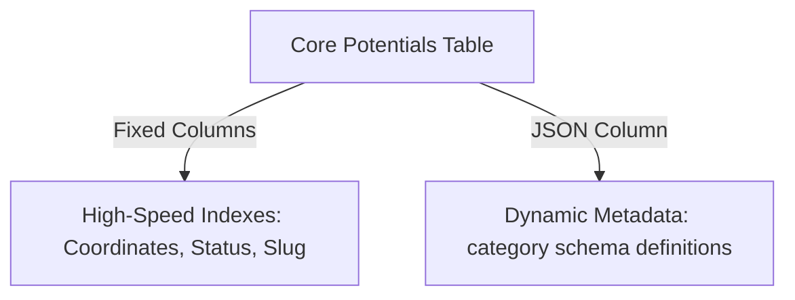
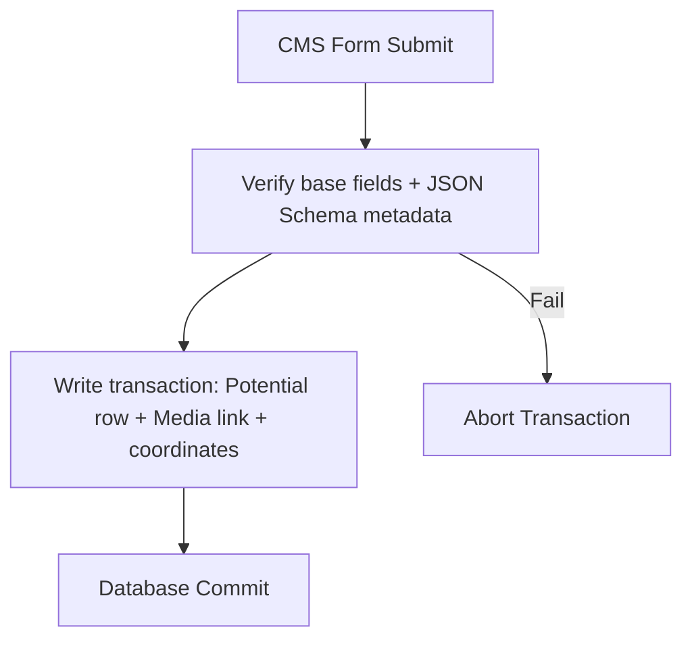
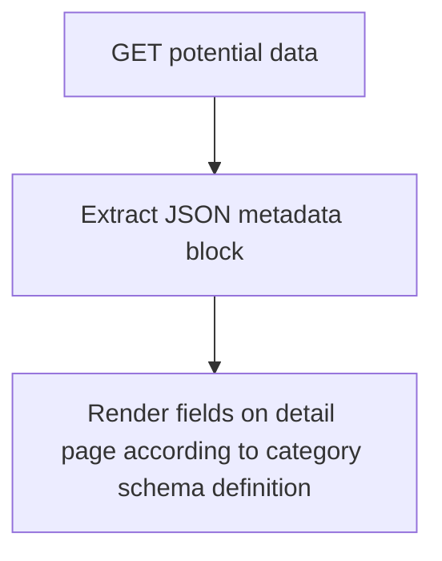
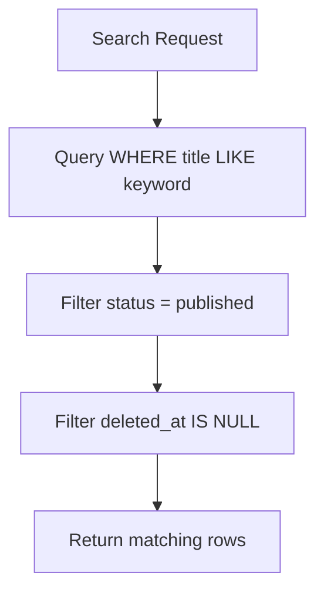
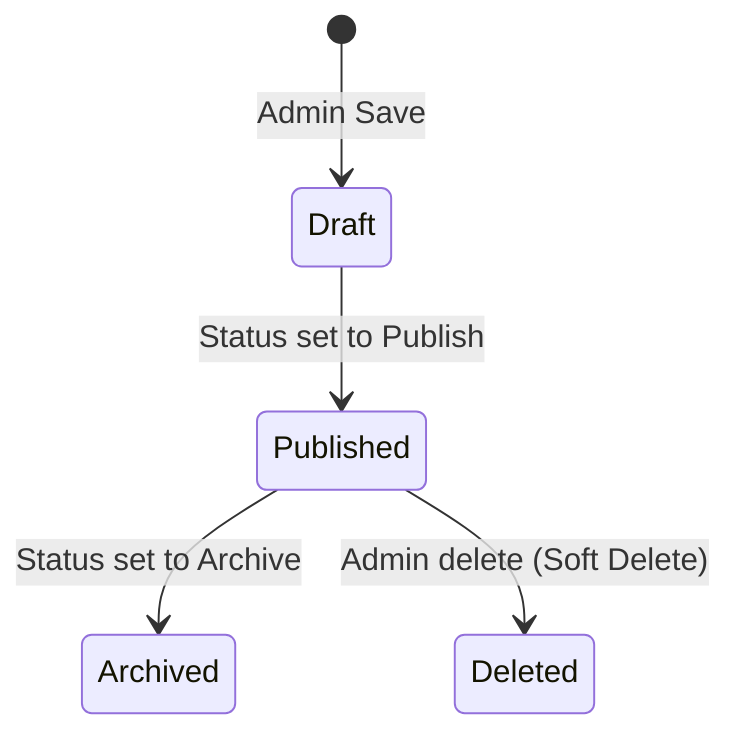
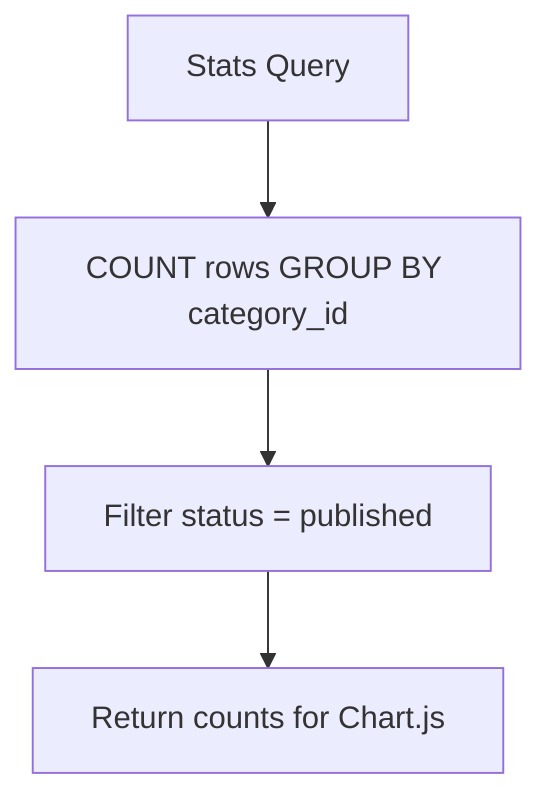
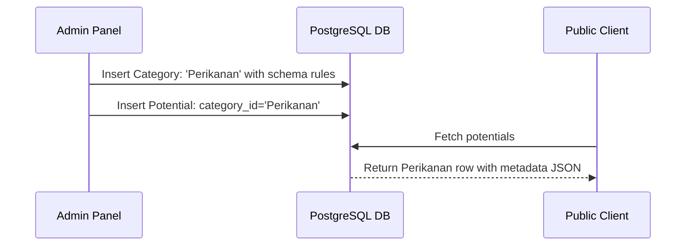

# Database Design Specification

## Project: Website Potensi Desa Karamatwangi
### Status: Approved
### Version: 1.0.0
### Date: 2026-07-10

---

## 1. Database Philosophy & Technology Choice

### 1.1. Why Relational & PostgreSQL
The platform uses **PostgreSQL** as its relational database management system (RDBMS) for three reasons:
- **Data Integrity:** Enforces foreign keys, transaction ACID compliance, and unique constraints.
- **Advanced JSON Support:** PostgreSQL offers native `JSONB` columns with indexing, allowing us to combine structured relational indexing with polymorphic JSON document storage.
- **Rich Extension Ecosystem:** PostGIS for spatial queries, plus robust indexing capabilities for full-text search.

### 1.2. The Normalization vs. Flex Balance
To avoid over-normalization (which introduces hundreds of joins and slow query loops) and under-normalization (which causes table bloat), the database separates:
1. **Base Relational Columns:** Fixed, shared columns that are queried frequently (Title, Slug, Coordinates, Status, Category ID).
2. **Polymorphic Metadata Document:** A JSON column storing dynamic attributes unique to each category (e.g. products list for UMKMs, harvest months for Agriculture).

```mermaid
graph TD
    subgraph Structured Columns (Indexed)
        id[UUID]
        title[Title]
        category[Category ID]
        coords[Latitude/Longitude]
    end
    subgraph Polymorphic JSON Column
        meta[JSON metadata: custom fields]
    end
    id --> meta
    title --> meta
    category --> meta
    coords --> meta
```

---

## 2. Design Principles

- **Single Source of Truth:** Core potential data is saved in one central place.
- **Data Integrity:** Strict foreign key constraint links on categories and media.
- **Scalability:** Columns are designed to expand from V1 (UMKM) to all future phases.
- **Performance:** Indexes are applied to search keywords, geocordinates, and status flags.
- **Soft Delete:** Retains historical records when content is deleted.
- **Audit Trail:** Records timestamps and administrator identifiers on every write operation.

---

## 3. Core Database Concepts

- **Potential:** The main catalog entity. Holds base fields and metadata JSON documents.
- **Category:** Registers category types (e.g. UMKM, Tourism) and color markers.
- **Category Schema:** Defines the validation constraints and input types for each dynamic field.
- **Media:** Logs file path, MIME format, and image dimensions.
- **Location:** Maps address details and latitude/longitude coordinates.
- **Contact:** Houses merchant communication parameters.
- **Statistic:** Tracks count aggregates of published potentials.
- **Administrator:** Stores credentials and access tokens.
- **Content Status:** An enum field (Draft, Published, Archived) controlling visibility.

---

## 4. Base Entity & Metadata Strategy

### 4.1. Base Entity Strategy
Every potential, regardless of category, must share these base columns in the main table:
- `id` (UUID, Primary Key)
- `category_id` (UUID, Foreign Key)
- `title` (VARCHAR, Indexed)
- `slug` (VARCHAR, Unique, Indexed)
- `description` (TEXT)
- `status` (VARCHAR(20), Default: 'draft', Indexed)
- `latitude` (DECIMAL(10,8), Indexed)
- `longitude` (DECIMAL(11,8), Indexed)
- `cover_image_id` (UUID, Foreign Key)
- `created_by_id` (UUID, Foreign Key)
- `created_at` (TIMESTAMP)
- `updated_at` (TIMESTAMP)
- `deleted_at` (TIMESTAMP, Soft Delete)

### 4.2. Metadata Strategy
The category-specific fields reside in a `metadata` JSON column. The backend runs validations against the category's schema definition before permitting database writes.

```
Category: UMKM ──> Metadata JSON:
 {
   "owner_name": "Sugeng",
   "product_list": ["Kopi Robusta", "Kopi Arabika"],
   "price_range": "Rp 15.000 - Rp 50.000"
 }

Category: Tourism ──> Metadata JSON:
 {
   "ticket_price": 10000,
   "opening_hours": "08:00 - 17:00",
   "facilities": ["Tempat Parkir", "Toilet", "Spot Foto"]
 }
```

---

## 5. Category Schema & Validation Strategy

The `categories` table stores a `schema_definition` JSON column that acts as a blueprint:
- **Keys:** Define field name (e.g., `harvest_season`).
- **Values:** JSON object defining `type` (string, number, array), `required` (boolean), `label` (UI display), and `validation_rules` (max length, range).

When the CMS submits a save request:
1. Fetch the selected category's `schema_definition`.
2. Express validation middleware validates the incoming `metadata` keys against the schema parameters.
3. If clean, writes `metadata` JSON directly to the database.

---

## 6. Location, Contact, and Media Strategy

### 6.1. Location mapping
- Geolocation uses separate `latitude` and `longitude` decimal fields to permit high-speed bounding box queries without demanding heavy PostGIS geographical extensions.
- Maps to OpenStreetMap markers on Leaflet initialization.

### 6.2. Contact Mapping
- Stores WhatsApp, phone, email, and website handles.
- **Redirection logic:** The frontend executes the fallback evaluation (BR-CON-01) reading these columns. If the phone columns are null, it queries the `website_settings` table fallback row.

### 6.3. Media Storage
- Visual assets are logged in the `media` table (id, filename, filepath, filetype, size).
- Linked to potentials through `cover_image_id` (one-to-one) and a polymorphic gallery pivot table (one-to-many).

---

## 7. Publication Workflow & Audit Trail

### 7.1. Workflow Lifecycle
Visibility queries must execute status-based checks:
- **Public queries:** `WHERE status = 'published' AND deleted_at IS NULL`.
- **Admin queries:** Bypass status checks, including `Draft` items.

### 7.2. Audit Trail
To track data changes and facilitate recoveries:
- Tracks `created_by_id` and `updated_by` admin IDs.
- Implements Laravel soft delete (`deleted_at`). Database queries omit soft-deleted records unless explicitly requested.

---

## 8. Performance & Security Strategies

### 8.1. Indexing Strategy
To ensure sub-second query execution, indexes are placed on:
- `slug` (Unique Index)
- `category_id` (Foreign Key Index)
- `status` (B-tree Index)
- `(latitude, longitude)` (Composite Index for spatial distance bounds)
- `deleted_at` (B-tree Index for Soft Deletes filtering)

### 8.2. JSON Query Constraints
JSON columns are excluded from text search queries. Keywords are evaluated against indexed core columns (`title`, `description`) to prevent full-table scans.

### 8.3. Security Constraints
- All database writes use SQL parameter binding (preventing SQL injection).
- Cascade rules: Deleting a category is blocked if active potential listings refer to it.

---

## 9. Mermaid Visualizations

### 9.1. Database Philosophy Block


### 9.2. Content Storage Flow


### 9.3. Metadata Strategy


### 9.4. Search Flow


### 9.5. Publication Workflow


### 9.6. Statistics Flow


### 9.7. Future Expansion Flow (No DB migrations)


---

## 10. Relationship to Other Documents

- **ACA:** This design serves as the storage mapping of the polymorphic content architecture.
- **System Architecture:** Defines the data layer consumed by Express services.
- **ERD:** Guides the visual relationships and foreign keys defined in the entity-relationship map.
