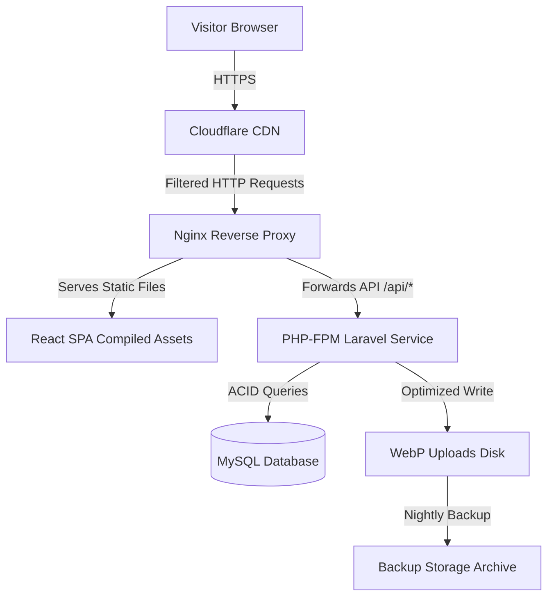
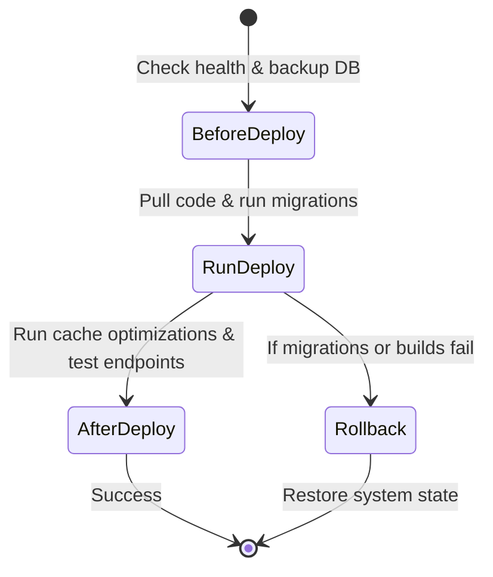

# Deployment & Production Specification

## Project: Website Potensi Desa Karamatwangi
### Status: Approved
### Version: 1.0.0
### Date: 2026-07-10

---

## 1. Deployment Philosophy

- **Production-First Mindset:** The deployment architecture is engineered for immediate real-world reliability. Every operational constraint is established prior to writing code.
- **Reliability:** Ensure 99.9% uptime by using stable, long-term support (LTS) software runtimes and automated health monitoring.
- **Security:** Strict separation of environment keys, automatic SSL enforcement, rate limit overrides, and database transaction protection.
- **Simplicity:** Avoid over-engineered cluster setups (e.g. Kubernetes, multiple database mirrors) for V1. A clean, single-VPS architecture minimizes overhead for village administration.
- **Maintainability:** Standardized, scripted deployment flows ensure that local developers or student groups can manage updates without manual configuration errors.
- **AI-Friendly Workflow:** Infrastructure deployment checklists, script locations, and environment variables are documented explicitly to enable AI tools to assist in server configuration scripting.

---

## 2. Environment Strategy

The project implements three distinct, isolated environments:

| Environment | Purpose | Database | Storage Disk | Domain | Access Restrictions |
| --- | --- | --- | --- | --- | --- |
| **Local / Dev** | Active development, feature implementation, and local testing. | Local SQLite or Docker MySQL | Local filesystem (`storage/`) | `localhost` / `*.test` | Developer local machine only. |
| **Staging** | Validation of features, final UI reviews, and import testing before release. | Staging MySQL instance | Staging disk folder | `staging.karamatwangi.desa.id` | Restricted to village staff and development team (IP-whitelisted). |
| **Production** | Live site serving public visitors and active CMS administration. | Production MySQL (ACID compliant) | Optimized local disk linked to WebP processor | `karamatwangi.desa.id` | Publicly accessible; write actions limited to auth administrators. |

---

## 3. Production Infrastructure Overview

The production system operates on a single Virtual Private Server (VPS) protected by a global CDN edge layer:



### Layer Responsibilities
1. **Cloudflare CDN:** Acts as the DNS resolver, forces HTTPS encryption, mitigates DDoS attacks, manages edge caching of static resources, and filters malicious requests.
2. **Nginx Server:** Serves compiled React assets (HTML, JS, CSS) directly, compresses output with Gzip/Brotli, and proxies backend queries (`/api/*`) to PHP-FPM.
3. **Laravel API Service:** Handles business logic, session validations, and coordinates media processing.
4. **MySQL Database:** Stores core potentials, user accounts, location coordinates, and category schemas.

---

## 4. Server Specification Recommendations

### 4.1. Minimum Specifications (Staging / Low-Traffic Production)
- **VCPU:** 1 Core
- **RAM:** 1 GB
- **Storage:** 20 GB SSD
- **Bandwidth:** 1 TB/month
- **Operating System:** Ubuntu Linux 22.04 LTS

### 4.2. Recommended Specifications (Production)
- **VCPU:** 2 Cores
- **RAM:** 2 GB
- **Storage:** 40 GB NVMe SSD
- **Bandwidth:** 2 TB/month
- **Operating System:** Ubuntu Linux 24.04 LTS

### 4.3. Runtime Software Stack
- **Web Server:** Nginx v1.24+
- **PHP Engine:** PHP v8.3+
- **Node Runtime (for builds):** Node.js v20+
- **Database Engine:** MySQL v8.0+

---

## 5. Frontend Build & CDN Delivery

1. **Vite Compilation:** During deployment, assets are compiled via `npm run build`.
2. **Optimization Pass:** Vite minifies JS/CSS codes, shakes out unused code blocks, and splits the bundle by router paths to optimize first-contentful paint speeds on mobile.
3. **Cache Policy:**
   - Compiled JS/CSS files are generated with unique hash names (e.g. `index-a1b2c3d4.js`) and cached permanently on browsers.
   - The entry file `index.html` is marked with `Cache-Control: no-store, must-revalidate` to ensure browsers check for updates on reload.
4. **Cloudflare Edge Rules:** Static assets (images, icons, fonts) are cached at Cloudflare edge nodes, reducing server load.

---

## 6. Backend Deployment & Optimization

When updating the Laravel backend on production, the deployment script executes the following optimizations:

1. **Composer Production Install:** `composer install --no-dev --optimize-autoloader`
2. **Config Caching:** `php artisan config:cache` (compiles all config files into a single array).
3. **Route Caching:** `php artisan route:cache` (compiles routes mapping for fast processing).
4. **View Caching:** `php artisan view:cache` (pre-compiles Blade templates).
5. **Storage Symlink:** `php artisan storage:link` (restores public-to-private storage links).
6. **Task Scheduler:** Configured via a system crontab entry running `php artisan schedule:run` every minute.

---

## 7. Database Migration & Integrity

- **Automatic Migrations:** Migrations run during deployment: `php artisan migrate --force`.
- **Transactions Protection:** Bulk data operations, especially Excel imports, run in database transactions.
- **Rollback Preparedness:** If a migration fails mid-deployment, the script stops execution, rollbacks the current step, and alerts the administrator.
- **Data Seeders:** Standard categories, schemas, and setting keys are inserted via seeders only on first system boot.

---

## 8. Storage & Optimization Strategy

- **Public Media Uploads:** Standard photos are written to `storage/app/public/uploads/`.
- **WebP Processor:** The `ImageProcessingService` acts as a storage gateway. Every uploaded image is automatically:
  - Compressed to 80% quality.
  - Converted to WebP format.
  - Scaled to a maximum width of 1200px.
- **Backup Retention:** Local files are backed up nightly. The backup strategy retains daily copies for 7 days, weekly copies for 4 weeks, and monthly copies for 12 months.

---

## 9. Environment Variables Configuration

The `.env` file on the production server contains the following configurations:

```ini
APP_NAME="Website Potensi Karamatwangi"
APP_ENV=production
APP_KEY=base64:generated_key_here
APP_DEBUG=false
APP_URL=https://karamatwangi.desa.id

DB_CONNECTION=mysql
DB_HOST=127.0.0.1
DB_PORT=3306
DB_DATABASE=karamatwangi_prod
DB_USERNAME=db_user
DB_PASSWORD=secure_password

SANCTUM_STATEFUL_DOMAINS=karamatwangi.desa.id
SESSION_DRIVER=database
FILESYSTEM_DISK=public
QUEUE_CONNECTION=database
CACHE_DRIVER=file
```

---

## 10. CI/CD Deployment Flow

```mermaid
graph LR
    Dev[Developer Push] -->|Git Push| GitHub[GitHub Main Branch]
    GitHub -->|Trigger Actions| Build[Compile React & Lint PHP]
    Build -->|Run Tests| Test[Run Vitest & PHPUnit]
    Test -->|SSH Script Run| Deploy[Pull Code to VPS]
    Deploy -->|Run Migrations| Migrate[Run php artisan migrate --force]
    Migrate -->|Clear Cache| Clean[Cache configs & routes]
    Clean -->|Live Check| Health[Ping /api/v1/health]
```



### CI/CD Steps
1. **Commit Hook:** Code linting runs locally.
2. **Code Integration:** Code merged to `main` branch triggers automated tests on GitHub Actions.
3. **Execution Script:** On test success, GitHub Actions executes a deployment script on the production server via SSH.
4. **Cache Clears:** Config caches refresh.
5. **Live Verification:** A curl request calls the health check endpoint.

---

## 11. System Health Check Endpoint

The API includes a public `/api/v1/health` endpoint monitoring system state:
- **Database Connection Check:** Verifies database availability by executing a simple `SELECT 1` query.
- **Storage Availability Check:** Writes a temp file to public storage and immediately deletes it to verify write/delete permissions.
- **Disk Space Check:** Warns if disk utilization exceeds 85%.
- **Response Shape:** Returns a `200 OK` JSON resource detailing the health status.

---

## 12. Logging & Audit Strategy

- **Application Logs:** Laravel writes error logs to `storage/logs/laravel.log`.
- **Log Rotation:** Configured in `config/logging.php` to use the `daily` channel, keeping 14 days of logs.
- **Web Server Logs:** Nginx writes access and error logs to `/var/log/nginx/`.
- **CMS Audit Trail:** All administrator actions (create, edit, delete, import) write records to the `activity_logs` table (includes admin ID, IP address, and task description).

---

## 13. System Monitoring Metrics

To maintain target performance:
- **Server Health:** Monitor RAM and CPU load using simple system utilities (e.g. `htop`, cloud metrics monitors).
- **Latency Monitoring:** Monitor response times for `/api/v1/potentials` to ensure it stays below 300ms.
- **Error Tracking:** Check application logs daily for `500 Server Errors`.
- **Database Load:** Check MySQL slow query logs (queries taking longer than 1 second).

---

## 14. Backup & Disaster Recovery Plan

- **Backup Schedule:** Nightly cron jobs execute database dumps and media backups.
- **Backup Locations:** Backups are compressed into `.tar.gz` files and copied to a separate storage bucket or secure server.
- **Recovery Point Objective (RPO):** Maximum 24 hours of data loss (nightly backups).
- **Recovery Time Objective (RTO):** Maximum 2 hours to restore service on server failure.
- **Restore Verification:** Backups are periodically restored on a staging instance to verify data integrity.

---

## 15. Security Hardening

- **Forced SSL:** Nginx redirects all HTTP traffic to HTTPS.
- **Rate Limiting:** API requests are limited to 60 requests per minute per IP address. Login routes are limited to 5 attempts per minute.
- **File Upload Security:** Uploaded files are renamed, limited to a 5MB size limit, and validated using MIME type checks.
- **Directory Permissions:**
  - Standard folders: `755` permissions, owned by user.
  - Laravel storage and cache directories: `775` permissions, writable by `www-data` user group.

---

## 16. Performance Optimization

- **Nginx Gzip Compression:** Compresses HTML, JS, CSS, and SVG files during transit.
- **HTTP Cache Control:** Instructs browsers to cache static assets locally for up to 1 year.
- **Browser Loading:** Dynamic images load lazily via native HTML rendering rules (`loading="lazy"`).
- **Eager Loading DB Queries:** Eliminates N+1 query loops.

---

## 17. Operational Scalability

The application scales efficiently by using resource caching and decoupled asset storage:
- **ACA Category Scaling:** Adding new categories (Tourism, Agriculture, Livestock) requires no database changes and uses existing API and detail layouts.
- **Caching Layer:** The caching driver defaults to `file`, but can easily be upgraded to `redis` in the `.env` file.
- **Horizontal Scaling:** Nginx can load-balance traffic across multiple application servers.

---

## 18. Deployment Checklist



### 18.1. Before Deployment
- [ ] Verify that staging tests pass.
- [ ] Confirm a database backup has been generated.
- [ ] Announce minor maintenance windows to administrative users.

### 18.2. During Deployment
- [ ] Pull latest code.
- [ ] Run database migrations.
- [ ] Compile frontend assets.
- [ ] Refresh config caches.

### 18.3. After Deployment
- [ ] Call the `/api/v1/health` endpoint to verify database and storage states.
- [ ] Test the admin login portal.
- [ ] Verify map pins are rendering correctly.

### 18.4. Rollback Plan
- [ ] Revert git HEAD to previous release tag.
- [ ] Run `php artisan migrate:rollback` if database changes occurred.
- [ ] Clear application caches.

---

## 19. Future Improvements

Future optimizations to support higher traffic:
- **Docker Containerization:** Package frontend, backend, and database layers into container setups.
- **Blue-Green Deployments:** Route traffic dynamically to avoid downtime.
- **External Object Storage:** Link uploads to Amazon S3 or Cloudflare R2 to save disk space on the primary server.
