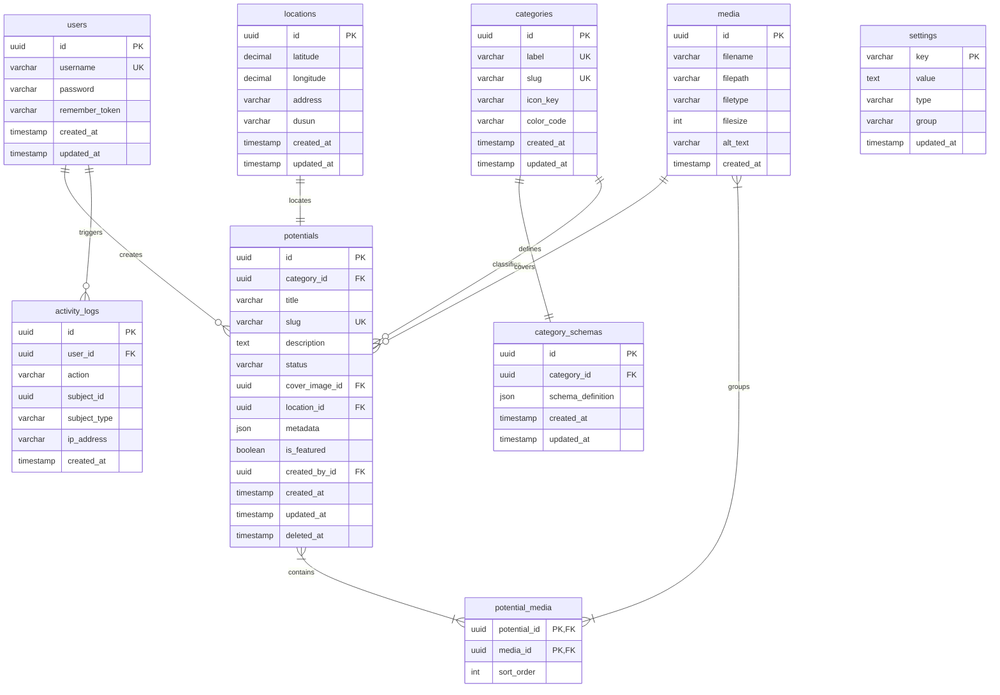

# Entity Relationship Diagram (ERD) Specification

## Project: Website Potensi Desa Karamatwangi
### Status: Approved
### Version: 1.0.0
### Date: 2026-07-10

---

## 1. Introduction

### 1.1. Purpose
This document defines the logical relationship structure of the **Website Potensi Desa Karamatwangi** database. It translates the design rules of the Adaptive Content Architecture (ACA) and System Architecture into concrete, implementation-ready database relations.

### 1.2. Relationship with ACA
The ERD is built to support the polymorphic nature of the ACA. Instead of creating new tables for each content category (e.g. separate tables for UMKM, Tourism, Agriculture), the database models potential items as one standard entity (`potentials`) containing polymorphic `metadata` and linked to schema validations (`category_schemas`).

---

## 2. Core Entities

The system contains eight core database tables:
- `users`: Stores administrator authentication data.
- `categories`: Registers potential categories and mapping properties.
- `category_schemas`: Houses validation rules for dynamic content attributes.
- `potentials`: Holds the core coordinates, status, and JSON metadata.
- `media`: Registers uploaded visual files.
- `locations`: Stores address details associated with potentials.
- `settings`: Configures site-wide variables (e.g. fallback WhatsApp contact).
- `activity_logs`: Logs administrative operations for audit reviews.

---

## 3. Entity Attributes & Fields Mapping

### 3.1. Entity: `users`
- **Purpose:** Admin authentication.
- **Attributes:**
  - `id` (UUID, PK): Unique identifier.
  - `username` (VARCHAR(50), Unique, Indexed): Log identity.
  - `password` (VARCHAR(255)): Cryptographic password string.
  - `remember_token` (VARCHAR(100), Nullable): Token for persistent sessions.
  - `created_at`, `updated_at` (TIMESTAMP): Creation and update tracking.

### 3.2. Entity: `categories`
- **Purpose:** Classification types.
- **Attributes:**
  - `id` (UUID, PK): Unique identifier.
  - `label` (VARCHAR(50), Unique, Indexed): User-friendly category name (e.g., "UMKM", "Wisata").
  - `slug` (VARCHAR(50), Unique, Indexed): URL slug.
  - `icon_key` (VARCHAR(50)): Code indicator for Lucide icons.
  - `color_code` (VARCHAR(7)): Hex color for Leaflet map pin render.
  - `created_at`, `updated_at` (TIMESTAMP).

### 3.3. Entity: `category_schemas`
- **Purpose:** Defines validation and layout rules for metadata fields.
- **Attributes:**
  - `id` (UUID, PK): Unique identifier.
  - `category_id` (UUID, FK, Indexed): References `categories.id` (cascade delete blocked).
  - `schema_definition` (JSON): JSON-Schema detailing properties, types, labels, filterability, and requirements.
  - `created_at`, `updated_at` (TIMESTAMP).

### 3.4. Entity: `potentials`
- **Purpose:** Core catalog entry.
- **Attributes:**
  - `id` (UUID, PK): Unique identifier.
  - `category_id` (UUID, FK, Indexed): References `categories.id`.
  - `title` (VARCHAR(150), Indexed): Name of the business or destination.
  - `slug` (VARCHAR(150), Unique, Indexed): URL slug.
  - `description` (TEXT): Core text body.
  - `status` (VARCHAR(20), Default: 'draft', Indexed): Publication status (validated at app level).
  - `cover_image_id` (UUID, FK, Nullable): References `media.id` (set null on delete).
  - `location_id` (UUID, FK, Unique): References `locations.id` (cascade delete).
  - `metadata` (JSON, Nullable): Polymorphic parameters (validates against category schema).
  - `is_featured` (BOOLEAN, Default: false, Indexed): Homepage highlight toggle.
  - `created_by_id` (UUID, FK, Indexed): References `users.id`.
  - `created_at`, `updated_at` (TIMESTAMP).
  - `deleted_at` (TIMESTAMP, Nullable, Indexed): Soft delete tracker.

### 3.5. Entity: `media`
- **Purpose:** Track file assets.
- **Attributes:**
  - `id` (UUID, PK): Unique identifier.
  - `filename` (VARCHAR(255)): Storage file name.
  - `filepath` (VARCHAR(255)): Relative storage path.
  - `filetype` (VARCHAR(50)): MIME file type.
  - `filesize` (INT): File size in bytes.
  - `alt_text` (VARCHAR(255), Nullable): Accessibility description.
  - `created_at` (TIMESTAMP).

### 3.6. Entity: `locations`
- **Purpose:** Geolocation coordinates and address details.
- **Attributes:**
  - `id` (UUID, PK): Unique identifier.
  - `latitude` (DECIMAL(10,8), Indexed): Latitude decimal.
  - `longitude` (DECIMAL(11,8), Indexed): Longitude decimal.
  - `address` (VARCHAR(255)): Full street/neighborhood address.
  - `dusun` (VARCHAR(100), Nullable): Specific village section (neighborhood cluster).
  - `created_at`, `updated_at` (TIMESTAMP).

### 3.7. Entity: `settings`
- **Purpose:** Global application configuration key-values.
- **Attributes:**
  - `key` (VARCHAR(50), PK): Setting identifier (e.g. `fallback_whatsapp`).
  - `value` (TEXT, Nullable): Configuration value.
  - `type` (VARCHAR(20)): Cast type of configuration.
  - `group` (VARCHAR(50), Indexed): Classification category group.
  - `updated_at` (TIMESTAMP).

### 3.8. Entity: `activity_logs`
- **Purpose:** Audit tracking.
- **Attributes:**
  - `id` (UUID, PK): Unique identifier.
  - `user_id` (UUID, FK, Indexed): References `users.id`.
  - `action` (VARCHAR(100)): Performed task details (e.g., "created_potential").
  - `subject_id` (UUID, Nullable, Indexed): ID of polymorphic subject.
  - `subject_type` (VARCHAR(100), Nullable, Indexed): Model type of polymorphic subject.
  - `ip_address` (VARCHAR(45)): Client IP.
  - `created_at` (TIMESTAMP).

---

## 4. Relationship Specifications

- **One-to-One:**
  - `potentials` $\leftrightarrow$ `locations`: Each potential maps to exactly one location coordinate. Deleting a potential cascade-deletes the location.
- **One-to-Many:**
  - `categories` $\leftrightarrow$ `potentials`: A category contains many potentials. Deleting a category with active potentials is blocked (protects integrity).
  - `categories` $\leftrightarrow$ `category_schemas`: A category has one schema definition detailing its custom attributes.
  - `users` $\leftrightarrow$ `potentials`: An administrator creates many potentials.
  - `users` $\leftrightarrow$ `activity_logs`: An administrator generates many audit logs.
- **Polymorphic Gallery Many-to-Many:**
  - `potentials` $\leftrightarrow$ `media`: Potentials map to multiple gallery images via a pivot table (`potential_media`).

---

## 5. Mermaid ER Diagram



---

## 6. Dynamic Scaling Example (Fisheries Addition)

Adding a new module like **Fisheries** (Perikanan) requires zero database updates or schema modifications:
1. Insert category row: `label: 'Perikanan'`, `slug: 'perikanan'`, `color_code: '#0EA5E9'`.
2. Insert schema row linking to the category, mapping the fields:
   ```json
   {
     "fish_type": "string",
     "pool_type": "string"
   }
   ```
3. Insert potentials row: maps category ID to Perikanan, inserts parameters in `metadata` column:
   ```json
   {
     "fish_type": "Gurame",
     "pool_type": "Kolam Terpal"
   }
   ```
The database layers, REST queries, map pins, and CMS tables accommodate this new structure dynamically.
