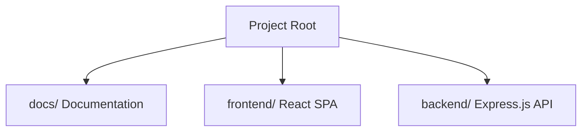
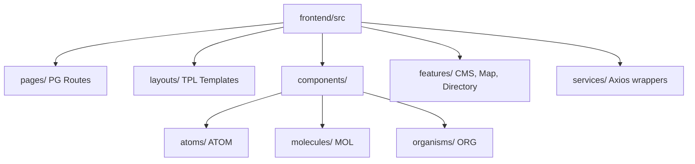
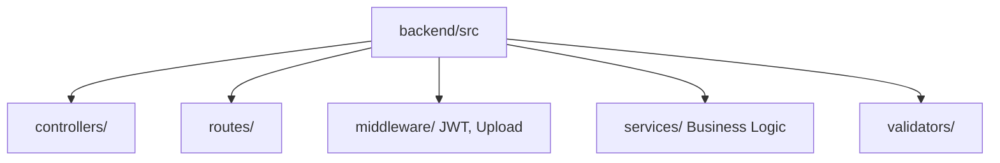
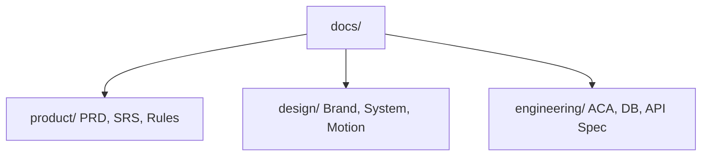

# Folder Structure Specification

## Project: Website Potensi Desa Karamatwangi
### Status: Approved
### Version: 1.0.0
### Date: 2026-07-10

---

## 1. Folder Structure Philosophy

The project directory is designed to maintain logical isolation, speed up onboarding, and optimize automated code compilation:

- **Feature-First Organization:** Frontend components and backend services are grouped by their domain features (e.g. Map, Directory, CMS) rather than raw generic file types.
- **Separation of Concerns:** Clear boundary lines separate UI presentation (frontend SPA), business logic orchestration (backend API), and configuration parameters.
- **Documentation-First Development:** Comprehensive specs are kept in a dedicated, root-level `docs/` directory to serve as a shared blueprint.
- **AI-First Project Organization:** Workspace files, prompt checklists, and context logs are grouped under a visible `.ai/` directory to guide AI coding assistants safely.
- **Scalability & Maintainability:** The structure is prepared to support future ACA category additions without restructuring existing folder trees.

---

## 2. Project Root Structure

The root directory isolates frontend, backend, and documentation into distinct workspaces:

```
webdesa/
 ├── docs/                 # Product, design, and engineering specifications
 ├── frontend/             # React SPA client code (Vite-backed)
 ├── backend/              # Express.js API service code
 ├── assets/               # Production graphic assets (logos, icons, illustrations)
 └── scripts/              # Automation and deployment utility scripts
```

### Folder Interaction Strategy
- The **Frontend** queries endpoints defined in the **Backend** API specification.
- The **Backend** maps model parameters directly to database structures defined in the **Database** directory.
- **AI assistants** read blueprints in the **Docs** and **.ai** directories to write code within the **Frontend** and **Backend** folders.

---

## 3. Frontend Workspace Structure (`frontend/src/`)

The React workspace uses standard Atomic Design patterns to separate UI components from business services:

```
frontend/src/
 ├── assets/               # Client-side local images and system icons
 ├── components/           # Reusable Atomic UI components
 │    ├── atoms/           # Buttons, inputs, badges
 │    ├── molecules/       # SearchBar, stat card, alert
 │    └── organisms/       # Navbar, map frame, potential grid
 ├── constants/            # Environment configurations and constants
 ├── dashboard/            # Isolated CMS module (components, features, layouts, pages, theme)
 ├── hooks/                # Custom React hook utilities (e.g. usePotentials)
 ├── layouts/              # Route templates
 ├── lib/                  # Core utilities and style helpers
 ├── pages/                # Final view routes
 ├── providers/            # Context providers (QueryProvider, etc.)
 ├── routes/               # Routing configuration (router.jsx, routeModules.jsx)
 ├── services/             # Axios API layer and service modules
 └── styles/               # Global tailwind and CSS configurations
```

### ACA Impact on Frontend Structure
Because of the Adaptive Content Architecture, the frontend features no category-specific folders (e.g., no `features/umkm/`). Instead, directory listings, dynamic forms, and popups live under generic component structures (like `features/directory/` or `components/organisms/UnifiedPotentialCard`) that process dynamic category inputs.

---

## 4. Backend Workspace Structure (`backend/`)

The Express directory maintains a strict Service-Oriented pattern:

```
backend/
 ├── prisma/
 │    └── schema.prisma              # Database schema and model definitions
 ├── src/
 │    ├── controllers/               # API endpoint controllers (auth.js, potential.js, etc.)
 │    ├── middleware/                 # JWT auth filters, upload config, error handler
 │    ├── routes/                    # Express route definitions
 │    ├── services/                  # Services: ImageProcessing, ImportExport, etc.
 │    ├── validators/                # Request validation schemas
 │    ├── utils/                     # Helper functions
 │    └── server.js                  # Express app entry point
 ├── uploads/                        # Uploaded media files
 ├── prisma/                         # Prisma migrations and seed
 └── package.json
```

---

## 5. Database Workspace

Database schema and migrations live inside `backend/prisma/`:
- `schema.prisma`: Model definitions and data source configuration.
- `migrations/`: Prisma migration history.
- `seed.js`: Seed script for setting up categories, admin profiles, and demo potentials.

---

## 6. Documentation Workspace Structure (`docs/`)

The documentation is organized into clear domains to maintain a clean record:

```
docs/
 ├── product/              # PRD, SRS, Features, User Stories, Business Rules
 ├── design/               # UI/UX Spec, Design System, Brand/Content Guidelines
 ├── engineering/          # ACA, System Architecture, Database Design, ERD, API Spec
 └── project/              # Timeline, milestones, and status walkthroughs
```

---

---

---

## 8. Asset Organization (`assets/`)

Visual assets are isolated from the code directory to keep the repository lightweight:
- `logos/`: Branding marks.
- `icons/`: Site indicators.
- `images/`: Local background pictures and hero placeholders.
- `mockups/`: High-fidelity UI page frames.
- `illustrations/`: Vector art for empty states.

---

## 9. Naming Conventions

Consistency in file and directory naming is strictly enforced:

| Target | Convention | Example |
| --- | --- | --- |
| **Directories** | `kebab-case` | `components/organisms`, `activity-logs` |
| **React Components** | `PascalCase` | `UnifiedPotentialCard.jsx`, `Button.jsx` |
| **React Hooks** | `camelCase` starting with `use` | `usePotentialFilter.js` |
| **Express Controllers**| `camelCase` | `potentialController.js` |
| **Express Services** | `PascalCase` with `Service` suffix | `ImageProcessingService.js` |
| **API Routes** | `kebab-case` plural | `/api/v1/potential-items` |
| **Database Tables** | `snake_case` plural | `potentials`, `category_schemas` |

---

## 10. Dependency Flow Direction

To avoid circular dependencies, the frontend import structure follows a strict downwards dependency flow:

```
Pages (PG) ──> Layouts (TPL) ──> Organisms (ORG) ──> Molecules (MOL) ──> Atoms (ATOM)
  │
  ▼
Features ──> Custom Hooks ──> Contexts ──> Services & API Wrapper (Axios)
```

**Rule:** A component can only import elements from the same level or lower. For example, an Atom cannot import a Molecule, and a Molecule cannot import an Organism.

---

## 11. Mermaid Visualizations

### 11.1. Overall Project Structure


### 11.2. Frontend Folder Hierarchy


### 11.3. Backend Folder Hierarchy


### 11.4. Documentation Hierarchy



