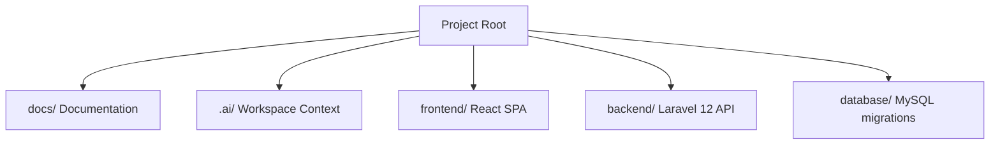
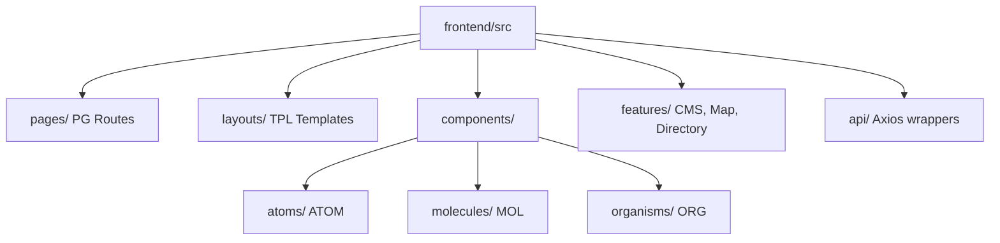
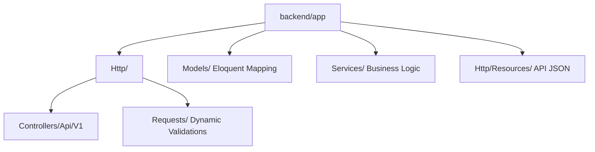
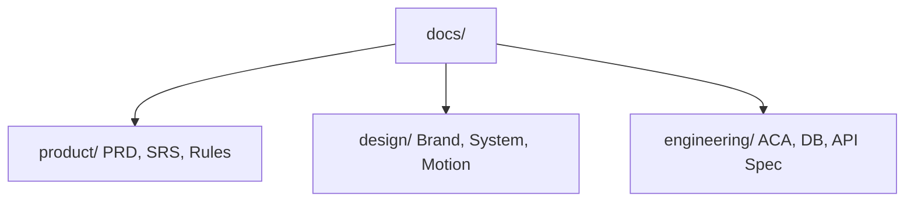
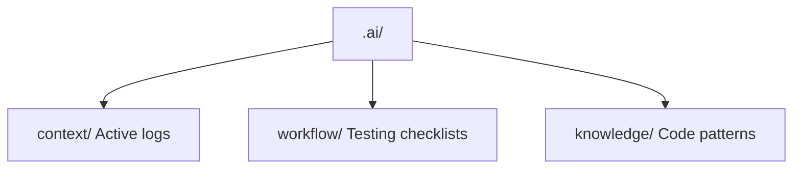

# Folder Structure Specification

## Project: Website Potensi Desa Karamatwangi
### Status: Approved
### Version: 1.0.0
### Date: 2026-07-10

---

## 1. Folder Structure Philosophy

The project directory is designed to maintain logical isolation, speed up onboarding, and optimize automated code compilation:

- **Feature-First Organization:** Frontend components and backend services are grouped by their domain features (e.g. Map, Directory, CMS) rather than raw generic file types.
- **Separation of Concerns:** Clear boundary lines separate UI presentation (frontend SPA), business logic orchestration (backend API), and configuration parameters.
- **Documentation-First Development:** Comprehensive specs are kept in a dedicated, root-level `docs/` directory to serve as a shared blueprint.
- **AI-First Project Organization:** Workspace files, prompt checklists, and context logs are grouped under a visible `.ai/` directory to guide AI coding assistants safely.
- **Scalability & Maintainability:** The structure is prepared to support future ACA category additions without restructuring existing folder trees.

---

## 2. Project Root Structure

The root directory isolates frontend, backend, and documentation into distinct workspaces:

```
karamatwangi-portal/
 ├── docs/                 # Product, design, and engineering specifications
 ├── .ai/                  # Context schemas and prompt guidelines for AI assistants
 ├── frontend/             # React SPA client code (Vite-backed)
 ├── backend/              # Laravel 12 API service code
 ├── database/             # Raw SQL schemas, exports, and backup files
 ├── assets/               # Production graphic assets (logos, icons, illustrations)
 ├── scripts/              # Automation and deployment utility scripts
 └── references/           # External guides and mapping documentation
```

### Folder Interaction Strategy
- The **Frontend** queries endpoints defined in the **Backend** API specification.
- The **Backend** maps model parameters directly to database structures defined in the **Database** directory.
- **AI assistants** read blueprints in the **Docs** and **.ai** directories to write code within the **Frontend** and **Backend** folders.

---

## 3. Frontend Workspace Structure (`frontend/src/`)

The React workspace uses standard Atomic Design patterns to separate UI components from business services:

```
frontend/src/
 ├── api/                  # Axios wrappers and API response interface typings
 ├── assets/               # Client-side local images and system icons
 ├── components/           # Reusable Atomic UI components
 │    ├── atoms/           # Buttons, inputs, badges (ATOM-01 to ATOM-15)
 │    ├── molecules/       # SearchBar, stat card, alert (MOL-01 to MOL-12)
 │    └── organisms/       # Navbar, map frame, potential grid (ORG-01 to ORG-18)
 ├── contexts/             # React authentication and configuration contexts
 ├── features/             # Feature-specific components and state loops
 │    ├── map/             # Map-specific layers and logic
 │    ├── directory/       # Potential grid directories and filter workflows
 │    └── cms/             # Admin forms, data tables, and media managers
 ├── hooks/                # Custom React hook utilities (e.g. useMap, useAuth)
 ├── layouts/              # Route templates (TPL-01 to TPL-08)
 ├── pages/                # Final view routes (PG-01 to PG-14)
 ├── styles/               # Global tailwind and CSS configurations
 ├── types/                # TypeScript interface type definitions
 └── utils/                # Date formatting and currency helper scripts
```

### ACA Impact on Frontend Structure
Because of the Adaptive Content Architecture, the frontend features no category-specific folders (e.g., no `features/umkm/`). Instead, directory listings, dynamic forms, and popups live under generic component structures (like `features/directory/` or `components/organisms/UnifiedPotentialCard`) that process dynamic category inputs.

---

## 4. Backend Workspace Structure (`backend/`)

The Laravel directory maintains a strict Service-Oriented pattern:

```
backend/
 ├── app/
 │    ├── Http/
 │    │    ├── Controllers/Api/V1/   # API Endpoint controllers (AuthController, etc.)
 │    │    ├── Middleware/           # Sanctum auth filters and rate limiters
 │    │    └── Requests/             # Input Form Requests and dynamic ACA validators
 │    ├── Models/                    # Eloquent database mapping models
 │    ├── Policies/                  # Admin CRUD action authorization rules
 │    ├── Providers/                 # Boot settings (App, Auth, Route)
 │    ├── Http/Resources/            # Data output transformations (PotentialResource, etc.)
 │    ├── Services/                  # Services: ImageProcessing, ImportExport, etc.
 │    ├── Observers/                 # Database log trigger hooks
 │    ├── Traits/                    # Reusable helper codes (e.g. HasUuid)
 │    └── Enums/                     # Status and type-safe enums (PotentialStatus)
 ├── config/                         # Laravel system configuration files
 ├── routes/                         # Route files (api.php, console.php)
 └── tests/                          # Automated backend feature and unit test suites
```

---

## 5. Database Workspace Structure (`database/`)

- `migrations/`: Laravel database schema migrations.
- `seeders/`: Seeders for setting up categories, admin profiles, and demo potentials.
- `factories/`: Eloquent factories for writing automated testing records.
- `schema/`: Raw visual relational ERD models.
- `backup/`: Dump files of production and staging database states.

---

## 6. Documentation Workspace Structure (`docs/`)

The documentation is organized into clear domains to maintain a clean record:

```
docs/
 ├── product/              # PRD, SRS, Features, User Stories, Business Rules
 ├── design/               # UI/UX Spec, Design System, Brand/Content Guidelines
 ├── engineering/          # ACA, System Architecture, Database Design, ERD, API Spec
 └── project/              # Timeline, milestones, and status walkthroughs
```

---

## 7. AI Workspace Structure (`.ai/`)

Guidelines helping AI coding assistants parse the codebase without confusion:
- `context/`: Text files mapping current project status.
- `workflow/`: Guides detailing testing steps and lint validation tasks.
- `knowledge/`: Architectural guidelines mapping ACA patterns.
- `prompts/`: Standard prompt structures for code generation.

---

## 8. Asset Organization (`assets/`)

Visual assets are isolated from the code directory to keep the repository lightweight:
- `logos/`: Branding marks.
- `icons/`: Site indicators.
- `images/`: Local background pictures and hero placeholders.
- `mockups/`: High-fidelity UI page frames.
- `illustrations/`: Vector art for empty states.

---

## 9. Naming Conventions

Consistency in file and directory naming is strictly enforced:

| Target | Convention | Example |
| --- | --- | --- |
| **Directories** | `kebab-case` | `components/organisms`, `activity-logs` |
| **React Components** | `PascalCase` | `UnifiedPotentialCard.tsx`, `Button.tsx` |
| **React Hooks** | `camelCase` starting with `use` | `usePotentialFilter.ts` |
| **Laravel Controllers**| `PascalCase` with `Controller` suffix | `PotentialController.php` |
| **Laravel Models** | `PascalCase` Singular | `Potential.php`, `Category.php` |
| **Laravel Services** | `PascalCase` with `Service` suffix | `ImageProcessingService.php` |
| **API Routes** | `kebab-case` plural | `/api/v1/potential-items` |
| **Database Tables** | `snake_case` plural | `potentials`, `category_schemas` |

---

## 10. Dependency Flow Direction

To avoid circular dependencies, the frontend import structure follows a strict downwards dependency flow:

```
Pages (PG) ──> Layouts (TPL) ──> Organisms (ORG) ──> Molecules (MOL) ──> Atoms (ATOM)
  │
  ▼
Features ──> Custom Hooks ──> Contexts ──> Services & API Wrapper (Axios)
```

**Rule:** A component can only import elements from the same level or lower. For example, an Atom cannot import a Molecule, and a Molecule cannot import an Organism.

---

## 11. Mermaid Visualizations

### 11.1. Overall Project Structure


### 11.2. Frontend Folder Hierarchy


### 11.3. Backend Folder Hierarchy


### 11.4. Documentation Hierarchy


### 11.5. AI Workspace Layout

