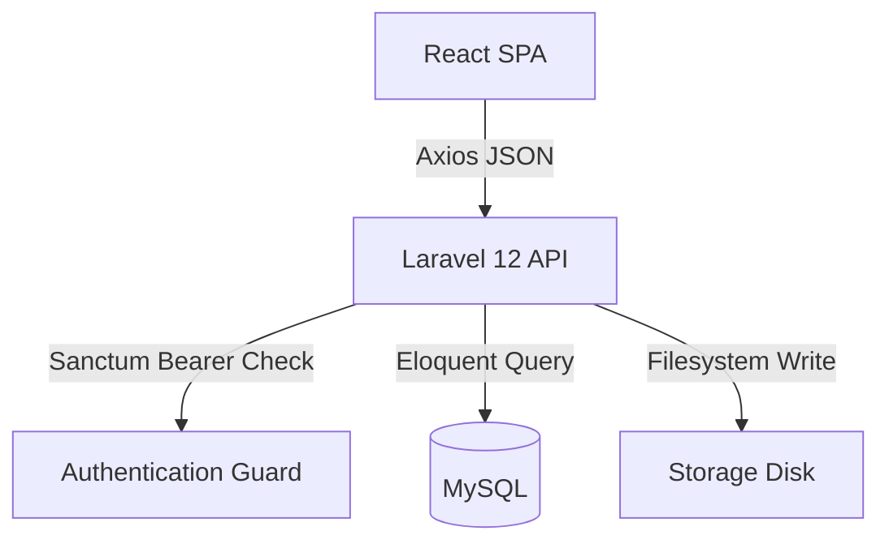
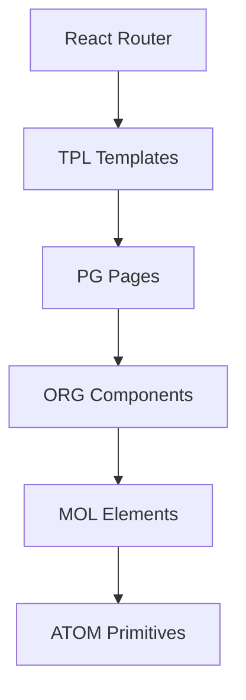
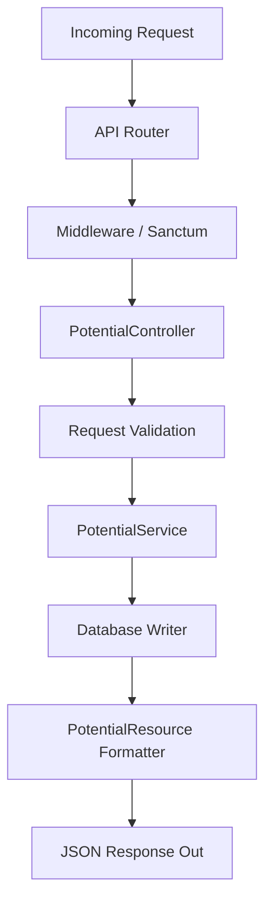
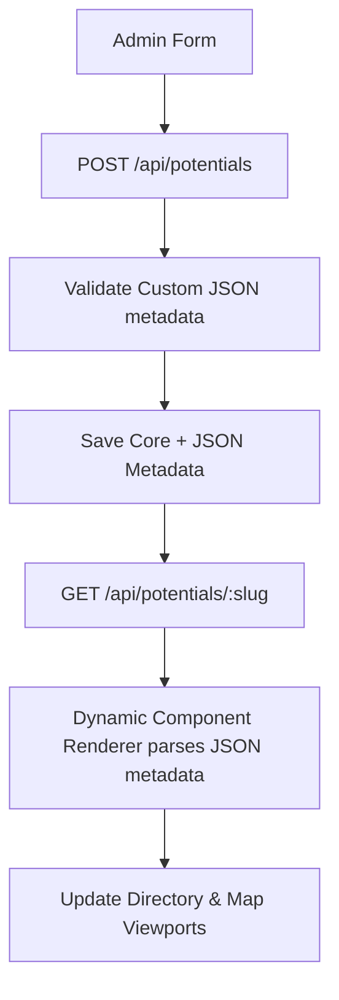
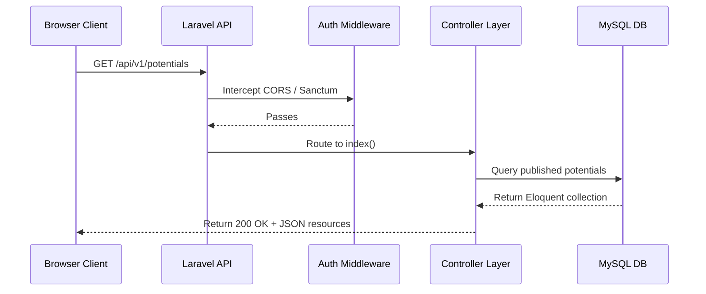
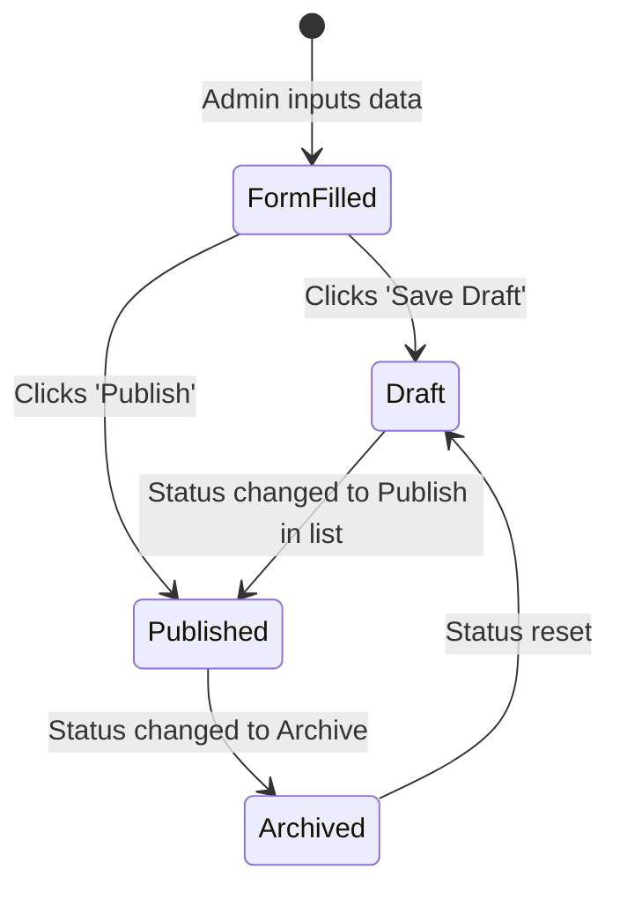
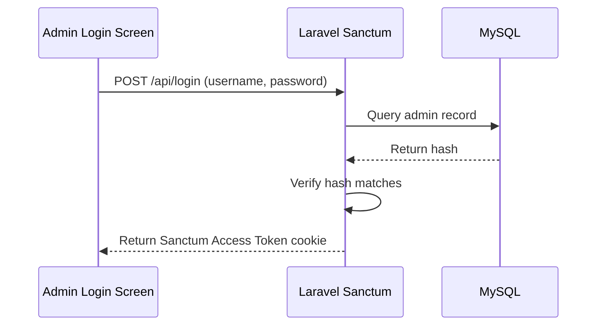
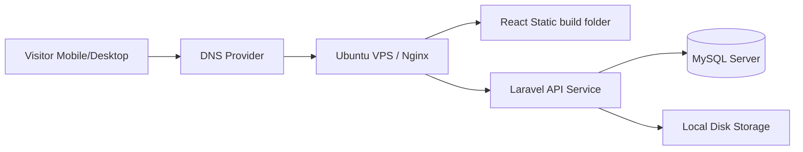

# System Architecture Document

## Project: Website Potensi Desa Karamatwangi
### Status: Approved
### Version: 1.0.0
### Date: 2026-07-10

---

## 1. System Overview & Data Flow

This application is designed as a decoupled, client-server web application. The conceptual flow of a user request from the browser to the database, and back, follows this execution path:

```
[ Visitor / Browser ]
        ↓
[ React SPA Client (Vite-backed) ]
        ↓
[ Axios API Client ]
        ↓
[ Laravel 12 API Backend ]
        ↓
[ Middleware (Sanctum/CORS) ]
        ↓
[ Controllers ] (Request Handling)
        ↓
[ Business Services ] (Logic Execution)
        ↓
[ ACA Schema Engine ] (Polymorphic JSON Mapping)
        ↓
[ Database (MySQL) ] & [ Local Storage (WebP Assets) ]
        ↓
[ JSON API Response ]
        ↓
[ React Dynamic Renderer ]
        ↓
[ Tailwind UI Viewport ]
```

---

## 2. Architectural Styles

- **Client-Server Architecture:** Decouples the user interface (React SPA) from the data manager (Laravel API), allowing independent maintenance and updates.
- **RESTful API:** Leverages standard stateless HTTP protocols (`GET`, `POST`, `PUT`, `DELETE`) with JSON payloads to ease communication.
- **Layered Architecture:** Employs clear separation of concerns (Presentation, Business Logic, and Data layers) on both client and server sides.
- **Service-Oriented Backend:** Encapsulates business actions (e.g., Image Processing, Excel Parsing) inside isolated Service classes.
- **Adaptive Content Architecture (ACA):** Powers metadata validation, dynamic form fields, and search queries dynamically.

---

## 3. High-Level Architectural Blocks

```mermaid
graph TD
    subgraph Presentation Layer (Client)
        React[React Client SPA]
        Leaflet[Leaflet Maps]
        Charts[Chart.js Visuals]
    end

    subgraph Service Gateway
        Sanctum[Laravel Sanctum Auth]
    end

    subgraph Business Logic Layer (Server)
        Controller[API Controllers]
        Service[Business Services]
        ACA[ACA Schema Engine]
    end

    subgraph Data Store Layer
        DB[(MySQL Database)]
        Storage[Laravel Storage File System]
    end

    React <--> Sanctum
    React <--> Controller
    Controller <--> Service
    Service <--> ACA
    ACA <--> DB
    Service <--> Storage
    Leaflet <--> React
    Charts <--> React
```

---

## 4. Frontend Architecture (React Client)

- **Engine:** React + Vite (ESBuild packaging for fast compilation and module loading).
- **Routing:** React Router (client-side declarative routing).
- **Layouts & Templates:** TPL layout wrappers (e.g. TPL-01 Homepage, TPL-02 Explorer) injecting page-specific components.
- **Dynamic Renderer:** Client-side parser reading `metadata` JSON objects from the API and dynamically mapping key-value attributes to listing detail templates (TPL-03).
- **State Management:** React Context API for global settings and authentication states. Local page states manage catalog filters, search parameters, and map pins.
- **API Layer:** Axios instance with base URL parameters, handling stateless bearer tokens in headers.
- **Error Handling:** React Error Boundaries catching render crashes, displaying MOL-07 (EmptyState, error variant).

---

## 5. Backend Architecture (Laravel API)

- **Engine:** Laravel 12 (configured as a stateless API service).
- **Controllers:** Intercept incoming requests, validate input arrays, delegate business rules, and return unified JSON resources.
- **Services:** Execute core business flows:
  - `PotentialService`: Handles CRUD and links dynamic ACA metadata mapping.
  - `ImageProcessingService`: Validates uploads, converts images to WebP format, and handles dimension scaling (BR-MED-01).
  - `ExcelService`: Handles batch spreadsheet import database transactions (BR-CMS-01) and exports.
- **Policies:** Restrict write and delete actions to the authenticated Administrator.
- **Middleware:** Sanctum guards, CORS policies, rate limiters, and request JSON sanitizers.

---

## 6. Authentication & Storage Architecture

### 6.1. Authentication Architecture
- Admin authentication is handled via **Laravel Sanctum**.
- Login verification issues a token stored client-side in secure httpOnly cookies.
- Admin route guards verify token active status on all `/admin/*` operations.
- Prepared to support future roles (Super Admin, Staff, Editor) by mapping roles to middleware permissions.

### 6.2. Storage Architecture
- Asset storage relies on standard **Laravel Local Storage** directories.
- Public images link via a symbolic link (`public/storage` $\rightarrow$ `storage/app/public`).
- Automatic compression: All uploaded photos convert to WebP, scaling width to 1200px (retaining aspect ratio) to optimize load speed on rural networks (BR-MED-01).

---

## 7. Cross-Cutting Concerns

- **Security:** CSRF tokens for form validation, SQL injection mitigation via Eloquent parameters, input XSS sanitization, password hashing via bcrypt.
- **Performance:** Dynamic image optimization, Leaflet marker clustering, lazy-loading routes, and db query indexing on coordinates and category IDs.
- **Logging:** Timestamped traceback logs generated automatically under `storage/logs/laravel.log` on backend exceptions.
- **SEO:** Metadata properties dynamically injected in React page templates for clean browser indexation.

---

## 8. Deployment View

```
[ Browser / Client Device ] ── (HTTPS) ──> [ Nginx Web Server ]
                                                   │
                                                   ▼
                                         [ PHP-FPM / Laravel API ]
                                            │             │
                                            ▼             ▼
                                     [ MySQL DB ]   [ Disk Storage ]
```

---

## 9. Mermaid Visualizations

### 9.1. Overall System Architecture


### 9.2. Frontend Architecture Detail


### 9.3. Backend Architecture Detail


### 9.4. ACA Integration


### 9.5. Request Lifecycle


### 9.6. CMS Content Publication Workflow


### 9.7. Authentication Flow


### 9.8. Deployment Topology


---

## 10. Relationship to Other Documents

- **ACA:** This document inherits the dynamic JSON data architecture, using it as the target for controller and database operations.
- **Database Design & ERD:** Maps out how the client-server layers interface with MySQL schemas.
- **API Specification:** Outlines the REST endpoints consumed by the Axios API Client.
- **Folder Structure:** Dictates where controllers, layout views, components, and media libraries reside in the code directories.
