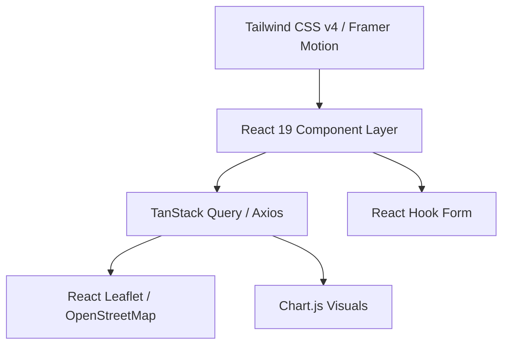
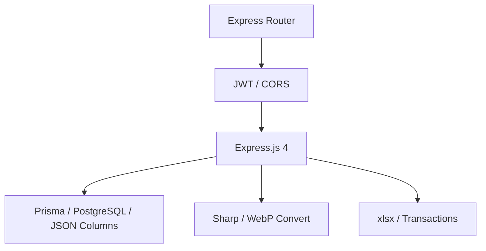
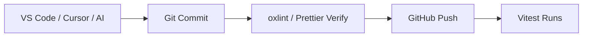
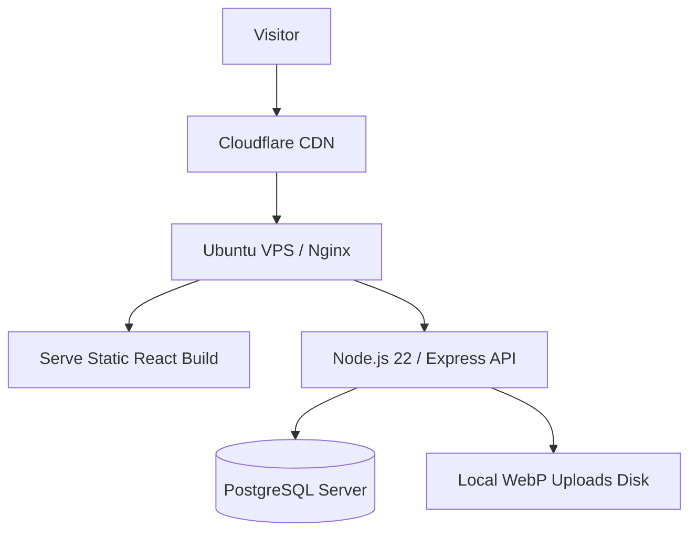
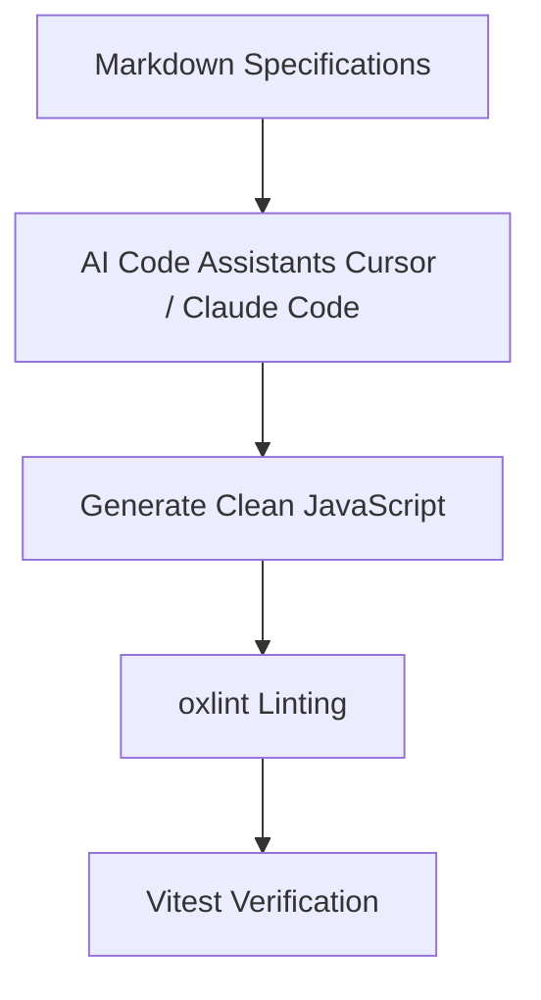

# Technology Stack Specification

## Project: Website Potensi Desa Karamatwangi
### Status: Approved
### Version: 2.0.0
### Date: 2026-07-25

---

## 1. Technology Philosophy

The selection of the technology stack for Website Potensi Desa Karamatwangi is guided by pragmatic architectural principles suited for rural digital initiatives:

- **Stability over Trend:** We favor mature, battle-tested tools with massive communities over experimental, fast-moving frameworks. This minimizes code churn and guarantees that security patches will be available for years to come.
- **Long-Term Maintainability:** The website must be easily maintained by village administrators, student groups, or local developers. Using standardized systems lowers the learning curve.
- **Documentation-First:** We prefer tools that encourage clear APIs, standard schemas, and explicit interfaces.
- **Open-Source Preference:** We prioritize free, open-source libraries to eliminate ongoing software licensing costs for the village government.
- **Scalability:** The stack is designed to scale horizontally in the future without requiring structural rewrites.

---

## 2. Frontend Stack

The frontend is a modern Single Page Application (SPA) built using the React ecosystem:

### 2.1. Core Frontend Tools
- **React (v19):** Selected as the component library. Provides high component reusability, a virtual DOM, and a rich ecosystem for map integration and UI layouts.
- **Vite 8:** Next-generation frontend build tool. Provides fast Hot Module Replacement (HMR) during development and highly optimized rollups for production.
- **Plain JavaScript (no TypeScript):** Keeps the build chain minimal and avoids compile step overhead for a small team. ACA metadata is validated at runtime via category schemas.

### 2.2. Styling & State Management
- **Tailwind CSS v4:** Utility-first CSS framework for maximum responsiveness and fast UI styling. Used via Vite plugin without PostCSS.
- **React Router (v7):** Client-side routing library supporting nested routes, parameter parsing, and route guards.
- **Axios:** Promise-based HTTP client for API fetches, configured with baseline header interceptors for JWT tokens.

### 2.3. Forms & Data Queries
- **React Hook Form:** Performs high-performance validation checks with minimal rendering cycles.
- **TanStack Query (React Query):** Manages API data fetching, automatic caching, caching invalidation, and synchronized background updates.

### 2.4. Specialized UI Components
- **Framer Motion (^12.42.2):** High-performance animation library. Powers transitions, slider animations, and card lifts based on the Motion Guidelines.
- **Leaflet & React Leaflet:** Lightweight, mobile-friendly interactive mapping library using OpenStreetMap tiles.
- **Chart.js & React-Chartjs-2:** Fast HTML5 canvas charting library for rendering dynamic statistics.
- **Lucide React:** Minimalist, consistent, outline-based stroke icons.

---

## 3. Backend Stack

The backend uses a clean, Service-Oriented pattern running on Node.js:

- **Express.js (v4):** The core web application framework. Lightweight, unopinionated, and widely adopted.
- **Prisma (v6):** Type-safe ORM for PostgreSQL. Provides auto-generated query client, migrations, and schema management.
  - *Alternatives considered:* Sequelize (less type-safe), Knex (rawer queries).
- **JWT (jsonwebtoken):** Stateless authentication using signed tokens. No server-side session storage required.
  - *Alternatives considered:* Passport.js (heavier), session-based auth (stateful overhead).
- **bcryptjs:** Password hashing for administrator credentials.
- **multer:** Multipart form data handling for file uploads.
- **sharp:** High-performance image processing. Converts uploads to WebP format and resizes dimensions.
- **xlsx:** Excel file parsing and generation for bulk import/export.
- **Prisma Client:** Auto-generated query client for database access.

---

## 4. Database Stack

- **PostgreSQL (v16):** Relational database. Selected for its transaction integrity (ACID), JSON column support, and advanced indexing capabilities.
  - *Alternatives considered:* MySQL (fewer JSON features), SQLite (not suitable for production).
- **JSON Column Properties:** Used to store polymorphic ACA metadata without triggering database schema migrations.
- **UUID Keys:** All records utilize UUID primary keys (UUID v4) to prevent resource enumeration attacks and support distributed data synchronization.
- **Soft Deletes:** Preserves deleted potential listings on disk using standard timestamp filters (`deleted_at`).

---

## 5. Development & AI Tools

### 5.1. Standard Development Environment
- **VS Code / Cursor:** Primary editors supporting extensions for JavaScript, Tailwind, and Git.
- **Git & GitHub:** Version control system and collaborative code repositories.
- **npm:** Package manager for JavaScript dependencies.
- **Bruno / Postman:** REST API clients for testing endpoint request-response payloads.
- **Figma:** Visual prototyping tool for checking design layouts.

### 5.2. AI Assistant Integrations
- **Cursor & Claude Code:** Auto-complete code blocks, perform codebase searches, and write unit tests directly from requirements documents.
- **GitHub Copilot:** Inline auto-complete helper.

---

## 6. Code Quality, Testing, & Builds

### 6.1. Code Quality
- **oxlint:** JavaScript linter that replaces ESLint. Provides fast linting with zero configuration for common JS patterns.
- **Prettier:** Code formatter for consistent JavaScript and CSS formatting.

### 6.2. Testing Strategy
- **Vitest:** Unit testing for React UI components, dynamic metadata rendering, and form rules.

### 6.3. Build Optimizations
- **Tree Shaking & Code Splitting:** Vite automatically splits bundles by page routes, only loading code blocks required for the active screen.
- **Asset Compression:** Production builds bundle assets into compressed, cached formats.

---

## 7. Deployment Stack

- **Ubuntu Linux (24.04 LTS):** Enterprise server OS.
- **Nginx:** High-performance web server, configured as a reverse proxy routing `/api/*` to the Node.js Express process, and serving static React build files directly.
- **Node.js (v22+):** JavaScript runtime for the Express backend.
- **PostgreSQL Server:** Local or cloud database instance.
- **SSL Certificates (Let's Encrypt):** Automates free, secure HTTPS connections.
- **Cloudflare:** Provides DNS management, edge caching, DDoS mitigation, and global CDN distribution.

---

## 8. Package Selection Principles

All dependencies added to the project must meet these verification rules:
1. **Active Maintenance:** Last update must be within the past 6 months.
2. **Community Support:** High count of stars and open issue responses on GitHub.
3. **Documentation Quality:** Comprehensive API references and usage guides.
4. **Compatibility:** Must support Node.js 22+ and React 19 explicitly.
5. **No Visual Bloat:** Libraries must not inject forced, unbranded CSS styling.

---

## 9. Future Stack Evolution

The current tech stack is structured to easily integrate future updates:
- **Redis:** Can be added as a cache layer between Express and PostgreSQL.
- **Meilisearch:** Full-text search can replace SQL `LIKE` queries without changing frontend visual designs.
- **Docker:** Can be introduced to containerize the Express backend with PostgreSQL.
- **Object Storage (Cloudflare R2 / S3):** File uploads transfer from local server disks to cloud object storage.

---

## 10. Mermaid Visualizations

### 10.1. Frontend Stack Layers

### 10.2. Backend Stack Layers

### 10.3. Development Workflow

### 10.4. Production Deployment Stack

### 10.5. AI Development Workflow

