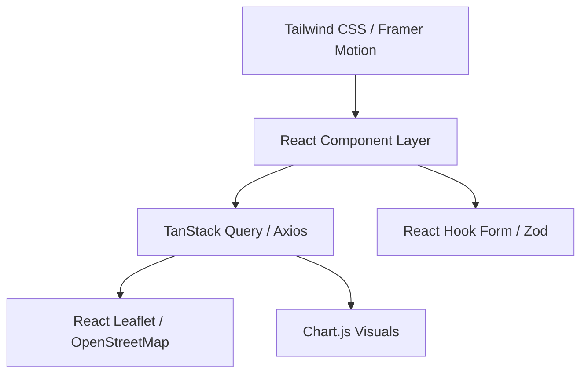
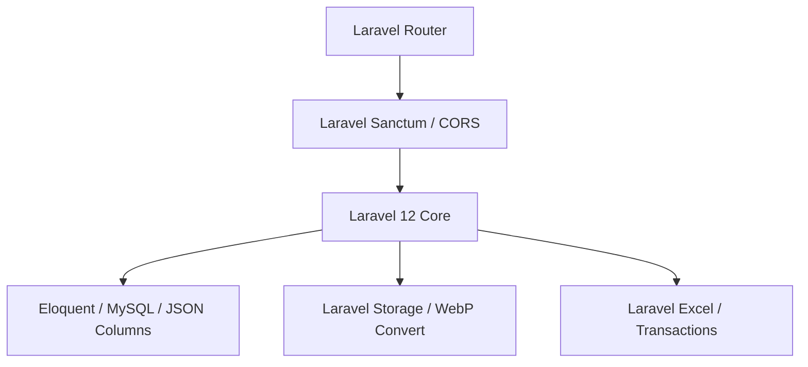
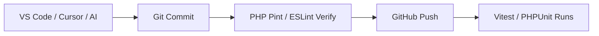
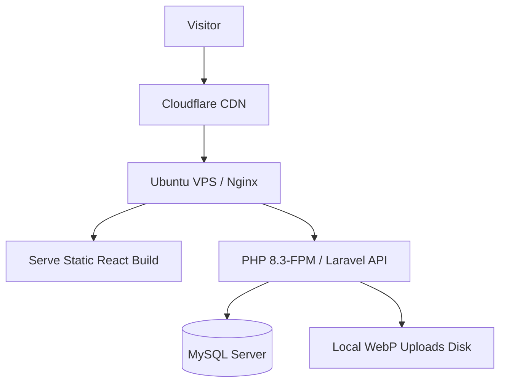
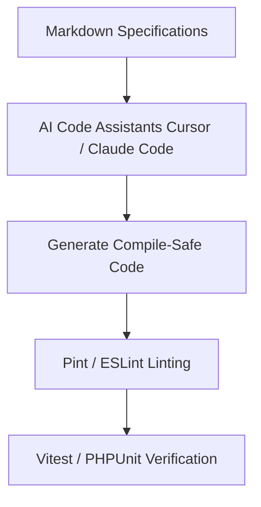

# Technology Stack Specification

## Project: Website Potensi Desa Karamatwangi
### Status: Approved
### Version: 1.0.0
### Date: 2026-07-10

---

## 1. Technology Philosophy

The selection of the technology stack for Website Potensi Desa Karamatwangi is guided by pragmatic architectural principles suited for rural digital initiatives:

- **Stability over Trend:** We favor mature, battle-tested tools with massive communities over experimental, fast-moving frameworks. This minimizes code churn and guarantees that security patches will be available for years to come.
- **Long-Term Maintainability:** The website must be easily maintained by village administrators, student groups, or local developers. Using standardized systems (like Laravel and standard React) lowers the learning curve.
- **AI-Friendly Stack:** Choosing technologies with extensive online documentation, strict typings, and clean separation patterns (e.g. TypeScript and Service Layer Laravel) ensures that AI coding assistants generate highly accurate, compile-safe code.
- **Documentation-First:** We prefer tools that encourage clear APIs, standard schemas, and explicit interfaces.
- **Open-Source Preference:** We prioritize free, open-source libraries to eliminate ongoing software licensing costs for the village government.
- **Scalability:** The stack is designed to scale horizontally in the future without requiring structural rewrites.

---

## 2. Frontend Stack

The frontend is a modern Single Page Application (SPA) built using the React ecosystem:

### 2.1. Core Frontend Tools
- **React (v18+):** Selected as the component library. It provides high component reusability, a virtual DOM, and a rich ecosystem for map integration and UI layouts.
  - *Alternatives considered:* Vue (smaller community for mapping packages), Svelte (less stable AI code generation patterns).
- **Vite:** Next-generation frontend build tool. Provides fast Hot Module Replacement (HMR) during development and highly optimized rollups for production.
  - *Alternatives considered:* Webpack/Create React App (deprecated, slower builds).
- **TypeScript:** Adds static typing to JavaScript, catching bugs at compile-time instead of runtime. This is critical for validating polymorphic ACA schemas.
  - *Alternatives considered:* Plain JavaScript (prone to metadata parsing runtime crashes).

### 2.2. Styling & State Management
- **Tailwind CSS:** Utility-first CSS framework for maximum responsiveness and fast UI styling.
  - *Alternatives considered:* Styled Components (extra runtime overhead), Bootstrap (harder to style for premium tourism aesthetics).
- **React Router (v6+):** Client-side routing library supporting nested routes, parameter parsing, and route guards.
- **Axios:** Promise-based HTTP client for API fetches, configured with baseline header interceptors for Sanctum tokens.

### 2.3. Forms & Data Queries
- **React Hook Form:** Performs high-performance validation checks with minimal rendering cycles.
- **Zod:** TypeScript-first schema validation library. Validates dynamic form fields against ACA category schemas client-side.
- **TanStack Query (React Query):** Manages API data fetching, automatic caching, caching invalidation, and synchronized background updates.

### 2.4. Specialized UI Components
- **Framer Motion:** High-performance animation library. Power transitions, slider animations, and card lifts based on the Motion Guidelines.
- **Leaflet & React Leaflet:** Lightweight, mobile-friendly interactive mapping library using OpenStreetMap tiles.
  - *Alternatives considered:* Google Maps API (requires paid credit card verification, costly at scale).
- **Chart.js & React-Chartjs-2:** Fast HTML5 canvas charting library for rendering dynamic statistics.
- **Lucide React:** Minimalist, consistent, outline-based stroke icons (`1.5px` weight).

---

## 3. Backend Stack

The backend uses a clean, Service-Oriented pattern running on PHP:

- **Laravel 12:** The core web application framework. Selected for its built-in security features, routing engine, Eloquent ORM, and comprehensive security policies.
- **Laravel Sanctum:** Lightweight authentication library providing cookie-based and token-based protection for the Admin CMS.
  - *Alternatives considered:* Laravel Passport (unnecessary overhead for a single-role V1 scope).
- **Laravel Excel (Maatwebsite):** Wrapper for PhpSpreadsheet. Enables efficient parsing and exporting of Excel templates.
- **Laravel Storage Facade:** Decoupled file manager abstraction. Handles local public storage linking and S3 compatibility.
- **Intervention Image:** High-performance PHP image handling library. Automates WebP conversion and dimensions scaling (BR-MED-01).
- **Laravel Queue & Scheduler:** Handles background jobs (Excel parse loops, email notifications, activity cleaning) to maintain responsive HTTP execution times.

---

## 4. Database Stack

- **MySQL (v8.0+):** Relational database. Selected for its transaction integrity (ACID), enterprise-grade query performance, and robust support for JSON data types.
- **JSON Column Properties:** Used to store polymorphic ACA metadata without triggering database schema migrations.
- **UUID Keys:** All records utilize UUID primary keys (UUID v4) to prevent resource enumeration attacks and support distributed data synchronization.
- **Soft Deletes:** Preserves deleted potential listings on disk using standard timestamp filters (`deleted_at`).

---

## 5. Development & AI Tools

### 5.1. Standard Development Environment
- **VS Code / Cursor:** Primary editors supporting extensions for PHP, TypeScript, Tailwind, and Git.
- **Git & GitHub:** Version control system and collaborative code repositories.
- **Composer & npm:** Package managers for PHP dependencies and JavaScript assets.
- **Bruno / Postman:** REST API clients for testing endpoint request-response payloads.
- **Figma:** Visual prototyping tool for checking design layouts.

### 5.2. AI Assistant Integrations
- **Cursor & Claude Code:** Auto-complete code blocks, perform codebase searches, and write unit tests directly from requirements documents.
- **GitHub Copilot:** Inline auto-complete helper.
- **Gemini / ChatGPT:** Solves logic puzzles, optimizes complex regex validations, and provides architectural refactoring patterns.

---

## 6. Code Quality, Testing, & Builds

### 6.1. Code Quality
- **ESLint & Prettier:** Standardize JavaScript/TypeScript coding syntax rules and formatting.
- **Laravel Pint & PHP CS Fixer:** Auto-formats PHP classes to meet the standard PSR-12 specification.
- **EditorConfig:** Standardizes indentation parameters (2 spaces for JS/TS, 4 spaces for PHP) across different IDEs.

### 6.2. Testing Strategy
- **PHPUnit / Pest:** Backend unit and feature testing for Eloquent models, validation requests, and import engines.
- **Vitest & React Testing Library:** Unit testing for React UI components, dynamic metadata rendering, and form rules.

### 6.3. Build Optimizations
- **Tree Shaking & Code Splitting:** Vite automatically splits bundles by page routes, only loading code blocks required for the active screen.
- **Asset Compression:** Production builds bundle assets into compressed, cached formats.

---

## 7. Deployment Stack

- **Ubuntu Linux (22.04 LTS):** Enterprise server OS.
- **Nginx:** High-performance web server, configured as a reverse proxy routing `/api/*` to PHP-FPM, and serving static React build files directly.
- **PHP-FPM (v8.3+):** Fast CGI process manager for handling Laravel requests.
- **MySQL Server:** Local or cloud database instance.
- **SSL Certificates (Let's Encrypt):** Automates free, secure HTTPS connections.
- **Cloudflare:** Provides DNS management, edge caching, DDoS mitigation, and global CDN distribution.

---

## 8. Package Selection Principles

All dependencies added to the project must meet these verification rules:
1. **Active Maintenance:** Last update must be within the past 6 months.
2. **Community Support:** High count of stars and open issue responses on GitHub.
3. **Documentation Quality:** Comprehensive API references and usage guides.
4. **Compatibility:** Must support PHP 8.2+ / Laravel 12 and React 18+ explicitly.
5. **No Visual Bloat:** Libraries must not inject forced, unbranded CSS styling.

---

## 9. Future Stack Evolution

The current tech stack is structured to easily integrate future updates:
- **Redis:** Can be added as a cache and queue driver by updating `config/cache.php`.
- **Meilisearch:** Scout search integrations can replace core SQL search routes without changing frontend visual designs.
- **Docker:** Can be introduced via Laravel Sail to containerize deployment boxes.
- **Object Storage (Amazon S3 / DigitalOcean Spaces):** File uploads transfer from local server disks to cloud object storage simply by changing the `.env` variable `FILESYSTEM_DISK=s3`.

---

## 10. Mermaid Visualizations

### 10.1. Frontend Stack Layers

### 10.2. Backend Stack Layers

### 10.3. Development Workflow

### 10.4. Production Deployment Stack

### 10.5. AI Development Workflow

