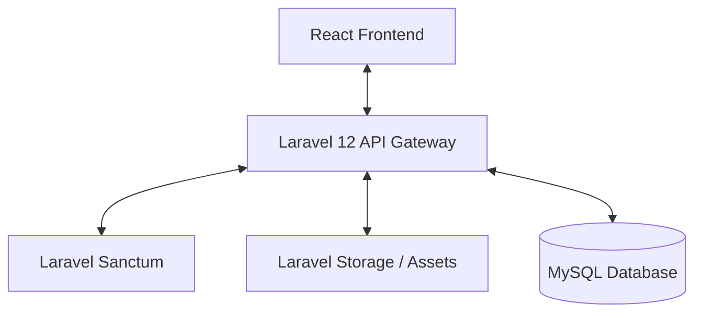
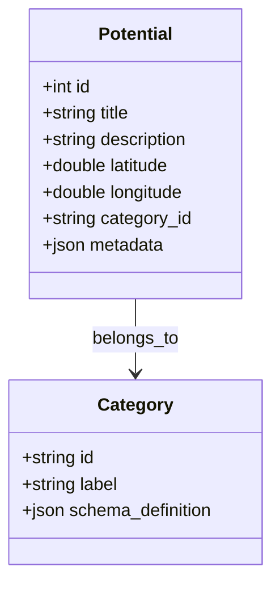

# Software Requirements Specification (SRS)

## Project: Website Potensi Desa Karamatwangi
### Category: Digital Village Showcase Platform
### Status: Approved
### Version: 1.0.0
### Date: 2026-07-10

---

## 1. Introduction

### 1.1. Purpose
This Software Requirements Specification (SRS) defines the functional and non-functional requirements for Version 1.0.0 of **Website Potensi Desa Karamatwangi**. It serves as the definitive reference for developers, designers, testers, and the village administration. All implementation tasks, component designs, database structures, and testing suites must align directly with the behavior defined in this document.

### 1.2. Scope
This platform is a digital village showcase designed to promote local potentials (economic, agricultural, and cultural) of Desa Karamatwangi. 
- **Version 1.0.0 (MVP) Focus:** Specifically implements the **UMKM (Micro, Small, and Medium Enterprises)** module. It features a public-facing website with interactive map exploration, a search directory, and a secure administration panel for content management.
- **Architectural Scalability:** The system implements an **Adaptive Content Architecture (ACA)**. Schema layouts and frontends are decoupled from category specificity to support future expansions (Tourism, Agriculture, Culture, statistics, news) without structural redesigns.

### 1.3. Definitions & Glossary
- **ACA (Adaptive Content Architecture):** A model where different showcase types are represented using a polymorphic base model and customizable metadata fields.
- **UMKM (Usaha Mikro, Kecil, dan Menengah):** Micro, Small, and Medium Enterprises representing local village businesses.
- **CMS (Content Management System):** The administrative dashboard enabling designated village staff to manage potential profiles and platform settings.
- **Adaptive Contact:** A communication system that directs users to a merchant's direct channels (e.g., WhatsApp) but seamlessly falls back to the village administration contact if merchant details are omitted.
- **Leaflet:** A lightweight open-source JavaScript library used to construct interactive mobile-friendly maps.
- **OSM (OpenStreetMap):** A collaborative project that provides free map data, used as the base tile server for the Leaflet component.

### 1.4. Intended Audience
- **Software Engineers:** To build the database models, backend API endpoints, and React frontend components.
- **UI/UX Designers:** To align component styles, states, and screen transitions with the specified behavior.
- **Quality Assurance (QA) Teams:** To build testing matrices, validating functional flows and business logic.
- **Village Administration Administrators:** To understand how data is managed, structured, and presented.

### 1.5. References
- Product Requirement Document (PRD) — *Website Potensi Desa Karamatwangi* [docs/product/PRD.md](file:///c:/KKN/POTENSIDESA/docs/product/PRD.md)
- IEEE Standard 830-1998 (Recommended Practice for Software Requirements Specifications)

---

## 2. Overall Description

### 2.1. Product Perspective
The platform is structured as a decoupled web application comprising:
1. **Public Web Interface:** Built using React + Vite + Tailwind CSS, consuming a REST API.
2. **Backend API Service:** Powered by Laravel 12, serving JSON payloads, securing admin routes via Laravel Sanctum, and managing assets using Laravel Storage.
3. **Database Engine:** MySQL to store system parameters, user credentials, category types, and potential entries.

### 2.2. Product Functions
- Explore village potentials geographically using an interactive map view.
- Search and filter UMKMs based on name, category, and location.
- Access detailed product/business catalogs.
- Redirect visitors to merchants via pre-filled WhatsApp templates (or default to village contacts).
- Bulk import/export merchant records via Excel files.
- Manage pages, potential listings, and site parameters securely.

### 2.3. User Classes & Characteristics
1. **Public Visitor / Tourist:** Unauthenticated users seeking to locate, filter, and learn about village assets. Requires high visual appeal, quick loading times, and intuitive mobile usability.
2. **Village Administrator:** Authenticated staff member. Single Administrator credential in Version 1. Responsible for creating, updating, and removing potentials, exporting listings, and updating site configurations. Requires clear form layouts and error-tolerant input handling.

### 2.4. Operating Environment
- **Client Side:** Modern web browsers (Chrome, Edge, Firefox, Safari) running on mobile (iOS, Android) and desktop OS.
- **Server Runtime:** PHP 8.2+ with MySQL 8.0+.
- **File System:** Standard filesystem directories mapped via Laravel Storage.

### 2.5. Constraints
- **Connectivity:** The target audience in rural settings may operate on high-latency mobile networks. Page sizes must be kept minimal, and image compression is mandatory.
- **Single-Language:** The initial version is restricted to Indonesian language support only.
- **Budgetary Constraints:** Mapping must use Leaflet + OSM tiles. Google Maps API is excluded due to usage costs.

### 2.6. Assumptions
- Local merchants use active WhatsApp numbers to process inquiries.
- Village staff can input coordinates (Latitude and Longitude) using decimal degrees (e.g., `-6.12345, 107.12345`).

### 2.7. Dependencies
- Availability of OpenStreetMap tiles.
- Active PHP hosting platform supporting Laravel 12 configurations.

---

## 3. Functional Requirements

### 3.1. Public Website

#### 3.1.1. Landing Page
- **Objective:** Introduce the village, display highlight stats, and provide paths to explore potentials.
- **Inputs:** User navigation triggers.
- **Outputs:** Visual showcase sections, hero banners, statistics summary, and direct links to the map.
- **Preconditions:** Server is online.
- **Main Flow:**
  1. Visitor enters the website URL.
  2. Platform displays the Hero section with promotion imagery and tagline.
  3. Displays a dynamic overview of village statistics (e.g., number of registered UMKMs).
  4. Provides call-to-action (CTA) buttons: "Mulai Menjelajahi Map" (Launch Map) and "Lihat UMKM" (Browse Catalog).
- **Alternative Flow:** None.
- **Exception Handling:** If API data fails to load, display cached stats or default fallback indicators.

#### 3.1.2. Village Profile
- **Objective:** Present the geographic and historic overview of Desa Karamatwangi.
- **Inputs:** User navigation triggers.
- **Outputs:** Interactive textual and visual description of the village.
- **Preconditions:** Web page loaded.
- **Main Flow:**
  1. Visitor clicks "Profil Desa" in navigation.
  2. Page displays village history, vision and mission, and organizational summaries.
- **Alternative Flow:** None.
- **Exception Handling:** None.

#### 3.1.3. Interactive Map (Leaflet + OSM)
- **Objective:** Provide visual geospatial navigation of village potentials.
- **Inputs:** Map zoom, pan, pin click, category selection.
- **Outputs:** Visual pins on Leaflet canvas, interactive sidebar/popup cards.
- **Preconditions:** Map tiles loaded successfully.
- **Main Flow:**
  1. Visitor accesses the Map Page.
  2. Leaflet renders the Karamatwangi coordinates centered on screen.
  3. Displays colored pins marking the location of village UMKMs.
  4. User clicks a pin: System renders a popup card containing the business name, category, cover photo, and a "Lihat Detail" (View Details) button.
  5. User filters by Category (e.g., Food, Craft): Map dynamically updates and re-clusters pins.
- **Alternative Flow (Offline Maps):** If OSM tile server is unreachable, display Leaflet grid with cached pins and warn user of offline map background.
- **Exception Handling:** Invalidate markers containing incorrect or empty latitude/longitude coordinate data.
- **Validation Rules:** Latitude range: `[-90, 90]`, Longitude range: `[-180, 180]`.

#### 3.1.4. Village Potentials Directory (UMKM Module)
- **Objective:** Present a structured directory of local businesses.
- **Inputs:** Category selection, pagination buttons.
- **Outputs:** Paginated grid of business cards.
- **Preconditions:** Database holds published listings.
- **Main Flow:**
  1. User navigates to "Daftar Potensi".
  2. System queries the database and renders published entries in a grid layout.
  3. User clicks on a listing: Website redirects to the Detail Page.
- **Alternative Flow:** If no items exist, display a message: *"Tidak ada potensi ditemukan."* (No potentials found).
- **Exception Handling:** None.

#### 3.1.5. Search & Filter
- **Objective:** Enable quick search queries.
- **Inputs:** Text query in search bar, category dropdown selection.
- **Outputs:** Filtered list of potentials.
- **Preconditions:** User is on directory or map screen.
- **Main Flow:**
  1. User types in "Madu" (Honey).
  2. System filters entries whose title, tags, or description match the keyword.
  3. Updates UI cards immediately.
- **Alternative Flow:** None.
- **Exception Handling:** Sanitize search input to prevent SQL injection or Cross-Site Scripting (XSS).
- **Validation Rules:** Maximum search length: 100 characters.

#### 3.1.6. Statistics Dashboard
- **Objective:** Render demographic or business count charts.
- **Inputs:** Page render event.
- **Outputs:** Chart.js graphs displaying count of potentials per category.
- **Preconditions:** Chart.js library loaded.
- **Main Flow:**
  1. User opens the Statistics page.
  2. React queries stats endpoint.
  3. Chart.js visualizes data as pie charts or bar graphs.
- **Alternative Flow:** None.
- **Exception Handling:** Render a simple HTML table fallback if Chart.js canvas rendering fails.

#### 3.1.7. Contact System (Adaptive Contact)
- **Objective:** Open a communications route to the merchant or fallback to the village office.
- **Inputs:** Click event on "Hubungi Penjual" (Contact Merchant) button.
- **Outputs:** Redirection to WhatsApp web/mobile application.
- **Preconditions:** Detail page loaded.
- **Main Flow:**
  1. User clicks the contact button.
  2. System checks if the merchant has a registered WhatsApp number.
  3. If present, opens `https://wa.me/[MerchantPhone]?text=[UrlEncodedPresetMessage]`.
- **Alternative Flow (Fallback):**
  1. System checks merchant data; phone field is null.
  2. System fetches official village phone contact from global settings.
  3. Opens `https://wa.me/[VillagePhone]?text=[UrlEncodedFallbackMessage]` (e.g., *"Halo, saya tertarik dengan UMKM [Nama UMKM]..."*).
- **Exception Handling:** If both merchant and village phone numbers are absent, display the contact button as disabled with a notice to contact via official email.
- **Validation Rules:** Phone numbers must contain country codes (e.g., starting with `62`).

---

### 3.2. CMS Dashboard (Back Office)

#### 3.2.1. Authentication
- **Objective:** Secure the administrative workspace.
- **Inputs:** Username, password.
- **Outputs:** Session token (Laravel Sanctum), access to Dashboard.
- **Preconditions:** Admin page loaded.
- **Main Flow:**
  1. User inputs credentials on login page.
  2. Laravel Sanctum validates credentials against the database.
  3. Returns a secure token, stored in client-side secure cookies.
  4. Client routes user to `/admin/dashboard`.
- **Alternative Flow:** None.
- **Exception Handling:** Displays *"Username atau password salah"* (Wrong username or password) upon auth mismatch. Lock login attempts for 60 seconds after 5 consecutive failures.
- **Validation Rules:** Username and password are required. Max length 50 characters.

#### 3.2.2. Media Management
- **Objective:** Store and compress images uploaded by admins.
- **Inputs:** File upload trigger (drag and drop/file dialog).
- **Outputs:** Compressed file stored in local storage, path saved to database.
- **Preconditions:** User is authenticated.
- **Main Flow:**
  1. Admin uploads an image (JPG/PNG).
  2. Laravel backend captures the upload.
  3. Backend applies compression, converts the image to WebP, and scales the width to a maximum of 1200px.
  4. Saves to storage and returns file URL.
- **Alternative Flow:** None.
- **Exception Handling:** Block uploads that exceed size limits or fail MIME type checks.
- **Validation Rules:** Maximum size: 5MB. Allowed MIME types: `image/jpeg`, `image/png`, `image/webp`.

#### 3.2.3. Excel Import & Export
- **Objective:** Bulk manage database entries.
- **Inputs:** Uploaded Excel sheet (Import); Click action (Export).
- **Outputs:** New potential database rows created (Import); Downloader trigger with `.xlsx` file (Export).
- **Preconditions:** Admin is authenticated.
- **Main Flow (Export):**
  1. Admin clicks "Ekspor Excel".
  2. Laravel Excel processes rows and creates spreadsheet.
  3. Browser downloads `potensi-desa.xlsx`.
- **Alternative Flow (Import):**
  1. Admin uploads formatting-compliant `.xlsx` file.
  2. Backend parses rows, validates coordinates/names.
  3. Saves entries to database.
- **Exception Handling:** Roll back all imports if any row fails validation rules, displaying line numbers of incorrect cells to the admin.
- **Validation Rules:** Uploaded file must be valid `.xlsx`. Columns must follow the exact preset template layout.

#### 3.2.4. Content Management (Potentials CRUD)
- **Objective:** Create, Read, Update, and Delete entries.
- **Inputs:** Admin forms, selection triggers.
- **Outputs:** Database state change, UI updates.
- **Preconditions:** Authenticated admin.
- **Main Flow:**
  1. Admin accesses listing table.
  2. Clicks "Tambah Potensi".
  3. Fills title, description, coordinates, category (UMKM), and custom metadata (e.g., opening hours).
  4. Clicks "Simpan". Row is added, map updates automatically.
- **Alternative Flow (Delete):**
  1. Admin clicks delete.
  2. Dialog prompts confirmation.
  3. Upon verification, deletes row and removes associated image assets from storage.
- **Exception Handling:** Show form validation inline error alerts.
- **Validation Rules:** Title required (max 150 chars), Description required, Latitude and Longitude required.

#### 3.2.5. Website Settings
- **Objective:** Configure global parameters.
- **Inputs:** Form data (Village Name, Default WhatsApp fallback number, Default Email, Social links).
- **Outputs:** Global setting update.
- **Preconditions:** Authenticated admin.
- **Main Flow:**
  1. Admin opens Settings page.
  2. Modifies fallback WhatsApp number.
  3. Clicks Save: System updates the values in the global settings database table.
- **Alternative Flow:** None.
- **Exception Handling:** None.
- **Validation Rules:** Fallback WhatsApp must start with `62` (country code format).

---

## 4. Non-Functional Requirements

### 4.1. Performance
- Core UI pages must load within **< 2.0 seconds** under average 3G connections.
- Image optimization must run asynchronously or during file upload to avoid UI freezes.
- Map markers must utilize clustering to ensure the frontend Leaflet map does not lag when displaying up to 500+ coordinates simultaneously.

### 4.2. Scalability
- The API payload design must separate core potential data from category-specific metadata, allowing future categories (Tourism, Agriculture) to scale without altering the underlying endpoint code.
- Database tables must use indexing on category types, search tags, and geographical coordinates.

### 4.3. Security
- Admin panel routes `/admin/*` must remain inaccessible without valid Sanctum tokens.
- All forms must carry CSRF protection.
- SQL inputs must be sanitized using Eloquent parameter binding.
- Password hashes must use secure algorithms (e.g., bcrypt with high work factor).

### 4.4. Availability & Reliability
- The application must target **99.9% uptime** on standard hosting systems.
- Database operations must utilize database transaction blocks during multi-row updates (e.g., during Excel import) to ensure database integrity is preserved if errors occur.

### 4.5. Maintainability
- Separation of concerns: Laravel handles business logic, database queries, and exports, while React handles map manipulation, UI routes, and search queries.
- Clean code architecture: Avoid inline styles; utilize structured CSS utility classes (Tailwind).

### 4.6. Accessibility (WCAG 2.1 AA)
- Contrast ratio between text and background must meet minimum **4.5:1** ratios.
- Interactive controls must support keyboard navigation (focus states must be visually distinct).
- Screen readers must be supported through semantic HTML tags (`<header>`, `<main>`, `<section>`, `<nav>`, `<footer>`) and ARIA labels on buttons.

### 4.7. Search Engine Optimization (SEO)
- Server-rendered metadata configurations (e.g., standard SEO title, description, open graph tags) must update dynamically on listing details.
- Clean routing URLs (e.g., `/potensi/umkm/madu-karamatwangi`) instead of raw ID parameter URLs (e.g., `/potensi?id=51`).

### 4.8. Responsiveness & Browser Compatibility
- Mobile-first approach: The interface must render correctly on screen sizes starting from `320px` width up to ultra-wide desktop monitors.
- Supported browsers: Google Chrome, Apple Safari, Mozilla Firefox, and Microsoft Edge (last 3 major versions).

### 4.9. Usability
- Zero learning curve: Visitor workflows (exploring maps, filtering, contacting sellers) must not require onboarding instructions.
- CMS interfaces must use clear, descriptive labels, avoiding developer console terminology.

---

## 5. Business Rules
The following business rules form the baseline behavior of the system and cannot be bypassed:

1. **Adaptive Contact Fallback Rule:**
   $$\text{Contact Action} = \begin{cases} 
      \text{Redirect to Merchant WhatsApp}, & \text{if Merchant Phone exists} \\
      \text{Redirect to Village Official WhatsApp}, & \text{if Merchant Phone is empty} 
   \end{cases}$$
   The redirection preset text template must explicitly state the item name being queried.
2. **CMS Role Boundary Rule:**
   Version 1 only authenticates and authorizes a single Administrator account. The frontend and backend must restrict access to the `/admin` workspace to this single token holder.
3. **Draft Status Isolation Rule:**
   Any potential marked as `Draft` status in the CMS must be excluded from public-facing database queries, search results, map visualizations, and SEO indexing.
4. **Localization Restriction Rule:**
   The client-side UI and all system messages must default to Indonesian. Internationalization hooks must be written into components (`t('label')`), but translation dictionary setups remain deferred.

---

## 6. Future Expansion (ACA Layout)
The core design pattern supporting future categories (Tourism, Agriculture, Livestock, Culture, News, etc.) uses an **Adaptive Content Architecture (ACA)**.

- **Entity Model Polymorphism:**
  The main schema maps core columns that apply universally. Dynamic attributes are categorized through a linked `attributes` JSON field or dynamic metadata table, defined as:

- **Frontend Dynamic Rendering:**
  The frontend reads the `metadata` JSON object from the API. Based on the selected category, the UI dynamically changes the detail component rendered (e.g., displaying a "Musim Panen" / Harvest Season indicator for Agriculture, or "Jam Buka" / Working Hours for Tourism) without requiring code deployments.
