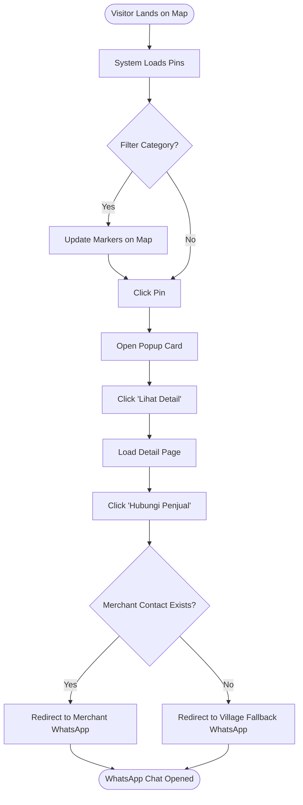
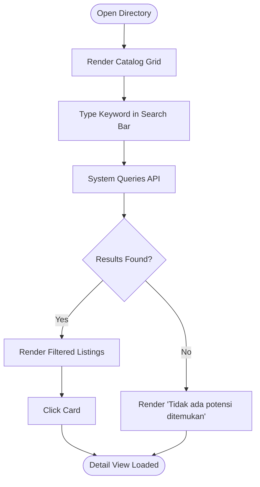
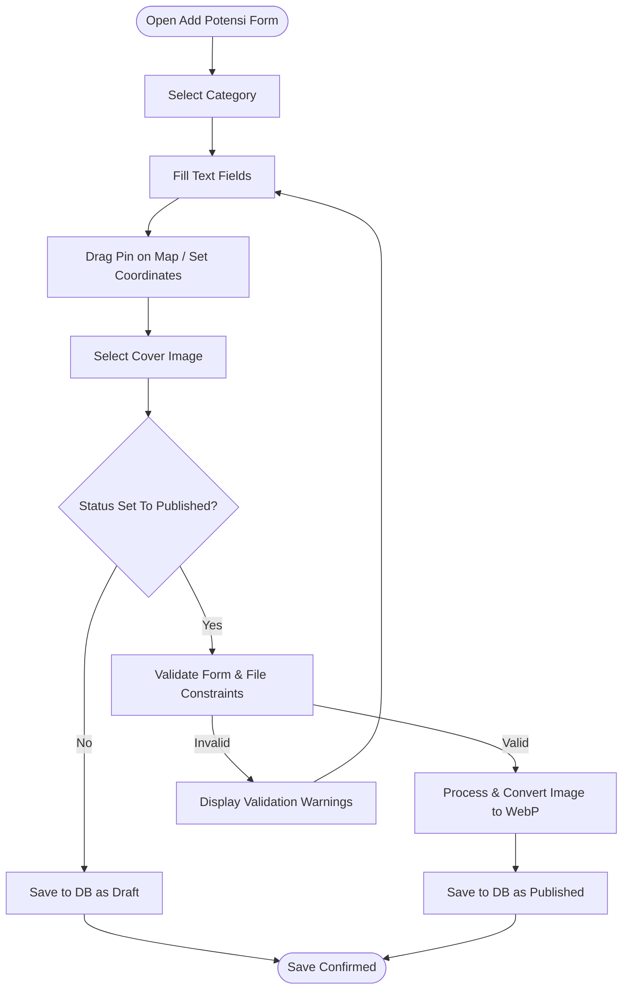
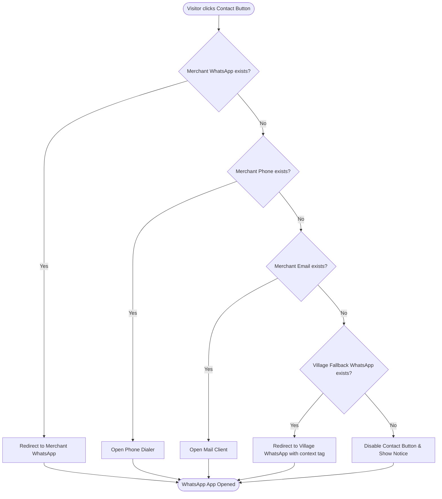

# User Flow Documentation

## Project: Website Potensi Desa Karamatwangi
### Status: Approved
### Version: 1.0.0
### Date: 2026-07-10

---

## 1. Visitor Journey Flows

### UF-VIS-01: Explore Map & Contact Merchant (Primary Flow)
- **Actor:** Public Visitor / Tourist
- **Goal:** Locate a local UMKM on the map and initiate contact via WhatsApp.
- **Trigger:** Navigates to `/map` page.
- **Preconditions:** At least one published UMKM with valid coordinates exists in the database.
- **Main Flow:**
  1. Visitor lands on Map Explorer page.
  2. Leaflet pulls coordinates of published potentials from the API.
  3. Renders markers on OpenStreetMap canvas.
  4. Visitor filters by category "Kuliner". Map pins update.
  5. Visitor clicks a specific pin. Popup card opens.
  6. Visitor clicks "Lihat Detail". Renders detailed profile page.
  7. Visitor clicks "Hubungi Penjual".
  8. System evaluates contact availability, finds merchant WhatsApp, and redirects to WhatsApp.
- **Decision Points:**
  - *Does merchant have WhatsApp?*
    - **Yes:** Route to merchant WhatsApp link (Main Flow).
    - **No:** Route to village fallback WhatsApp link (Alternative Flow).
- **Alternative Flow (Fallback Contact):**
  1. System checks merchant contact, fields are null.
  2. System resolves official village fallback contact.
  3. Opens WhatsApp redirect with prefix text matching the merchant name.
- **Exception Flow (No Map Tiles):**
  - If OSM tiles fail to load, display empty grid with pins. Visitor can click pins and navigate to detail pages as normal.
- **Postconditions:** Visitor leaves the platform and enters WhatsApp communication with the seller.
- **Related Features:** F-PUB-04 (Map), F-PUB-12 (Adaptive Contact)
- **Related Business Rules:** BR-CON-01 (Fallback Hierarchy), BR-MAP-01 (Map Marker Status)

### UF-VIS-02: Search & Browse Directory
- **Actor:** Public Visitor
- **Goal:** Search catalog by keyword, browse results, and return.
- **Trigger:** Navigates to `/potensi` page.
- **Preconditions:** Potential listings exist in database.
- **Main Flow:**
  1. Visitor opens Potential Explorer directory.
  2. System renders listing grid of published potentials.
  3. Visitor inputs search text (e.g., "Kopi").
  4. React client debounces input and queries database.
  5. UI updates grid to show matching business cards.
  6. Visitor clicks card to open Detail Page.
- **Decision Points:**
  - *Are matching listings found?*
    - **Yes:** Render matching cards.
    - **No:** Display empty state message.
- **Alternative Flow:** None.
- **Exception Flow:** Database offline: Shows standard API error card.
- **Postconditions:** Visitor reads details of a specific matching potential.
- **Related Features:** F-PUB-05 (Explorer), F-PUB-08 (Search)
- **Related Business Rules:** BR-GEN-01 (Public Visibility), BR-SRCH-01 (Case-Insensitive Search)

---

## 2. Administrator Journey Flows

### UF-ADM-01: Create & Publish Content (CRUD)
- **Actor:** Village Administrator
- **Goal:** Create a new local potential entry, pin its location on the map, upload a product image, and publish it.
- **Trigger:** Clicks "Tambah Potensi" inside Admin Dashboard.
- **Preconditions:** Administrator is authenticated.
- **Main Flow:**
  1. Admin opens creation form.
  2. Selects category "UMKM".
  3. Fills title, description, and contact info.
  4. Places location marker using map click tool (lat/long auto-populates).
  5. Selects cover image.
  6. Toggles status to "Published".
  7. Clicks "Simpan". Backend validates, processes image, saves row.
- **Decision Points:**
  - *Does input pass validation rules?*
    - **Yes:** Save record and redirect to listings table (Main Flow).
    - **No:** Keep form open, highlighting invalid input fields (Exception Flow).
- **Alternative Flow (Save Draft):**
  - Toggles status to "Draft". Item is saved to DB but is excluded from public views.
- **Exception Flow:** Image file validation fails (e.g., exceeds 5MB size limit): Abort save, display error warning.
- **Postconditions:** New potential is added to the database. If published, it immediately appears on the Leaflet map and directory.
- **Related Features:** F-CMS-03 (Content Mgmt), F-CMS-05 (UMKM CRUD), F-CMS-08 (Image Upload)
- **Related Business Rules:** BR-GEN-01, BR-POT-01, BR-MED-01

### UF-ADM-02: Bulk Import via Excel
- **Actor:** Village Administrator
- **Goal:** Upload an Excel spreadsheet to batch-populate merchant records.
- **Trigger:** Navigates to `/admin/import` in dashboard.
- **Preconditions:** Admin holds active session, Excel file matches structural template rules.
- **Main Flow:**
  1. Admin uploads `.xlsx` spreadsheet.
  2. Clicks "Mulai Impor".
  3. System initiates database transaction.
  4. System parses rows, validating fields and coordinates.
  5. Records written to DB.
  6. Transaction commits, dashboard displays success summary.
- **Decision Points:**
  - *Do all spreadsheet rows pass data rules?*
    - **Yes:** Commit transaction (Main Flow).
    - **No:** Roll back all database edits, abort import (Exception Flow).
- **Exception Flow:** Validation fails on row 14: System cancels transaction, database state is unchanged, and CMS displays error message: *"Baris 14: Koordinat tidak valid. Proses impor dibatalkan."*
- **Postconditions:** Batch records successfully persisted.
- **Related Features:** F-CMS-09 (Excel Import)
- **Related Business Rules:** BR-CMS-01 (Excel Batch Integrity)

---

## 3. System Flows

### UF-SYS-01: Adaptive Contact Redirection Decision Flow
- **Actor:** System Engine
- **Goal:** Determine the correct communication link to bind to the client button.
- **Trigger:** Detail page render event.
- **Preconditions:** Potential detail data successfully fetched.
- **Main Flow:**
  1. API endpoint serves JSON payload for the requested potential.
  2. Frontend parsing intercepts contact channels.
  3. System evaluates fallback fields:
     - Check `whatsapp`. If valid, generate `wa.me` URL. Exit.
     - Check `phone`. If valid, generate `tel:` dialer string. Exit.
     - Check `email`. If valid, generate `mailto:` email string. Exit.
     - Check `website`. If valid, generate HTTP hyperlink. Exit.
     - Check `fallback_whatsapp` configured in settings. Generate official village WhatsApp redirect link with context prefix string. Exit.
- **Exception Flow:** System settings lack official fallback number: Button renders as disabled text.
- **Related Features:** F-PUB-12, F-CMS-11
- **Related Business Rules:** BR-CON-01 (Fallback Hierarchy)

